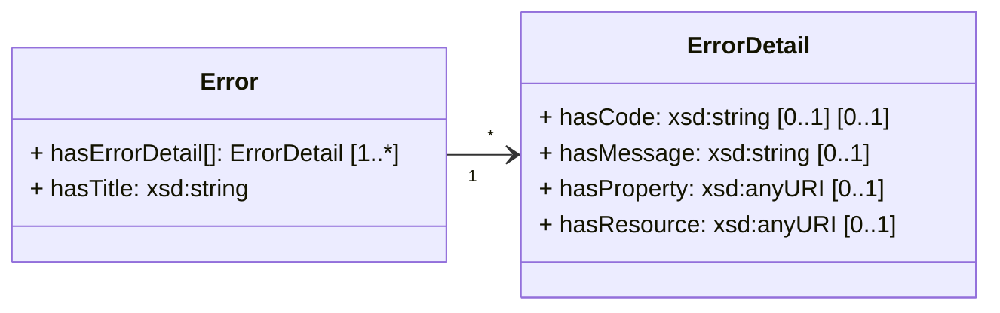

This section lists general principles and best practices for the implementation of a ONE Record API.
The lists are inspired by other API principles (e.g. [SBB](https://schweizerischebundesbahnen.github.io/api-principles/),
[Zalando](https://opensource.zalando.com/restful-api-guidelines/), [adidas](https://adidas.gitbook.io/api-guidelines/))

This section provides guidelines that MUST be followed by an implementer of the ONE Record API to ensure maximum compatibility with other ONE Record servers and clients on the ONE Record network.
These principles MUST be followed in order to be compliant to the ONE Record standard, when implementing and publishing a ONE Record server.

This section provides also common knowledge and best practices for the implementation of REST APIs in general and the ONE Record API in particular.
When implementing a ONE Record server and publishing a ONE Record API, it is RECOMMENDED to follow these best practices.

# URI Structure
REST APIs use [Uniform Resource Identifiers](https://en.wikipedia.org/wiki/Uniform_Resource_Identifier) (URIs) to reference resources. REST API should use URIs that convey the resource model of a REST API to API consumers. When resources are well named, an API is intuitive and easy to use. If they are poorly named, the same API can be difficult to use and understand.

The following are some rules and guidelines that SHOULD be followed:

- URIs SHOULD include nouns, not verbs.
- Use plural nouns for consistency (no singular nouns)
- Use HTTP methods (HTTP/1.1) to operate on resources
- Use HTTP response codes to communicate the outcome of operations on resources

For the context of ONE Record, this means:

- A Logistics Object URI SHOULD be URL friendly, i.e. avoid unsafe characters that include blank/empty spaces and/or " < > # % { } \| \ ^ ~ [ ] `.
- It is RECOMMENDED to avoid characters that require URL encoding.
- For better compatibility, a kebab-case URL naming convention SHOULD be used for the URI components , i.e. only use lower case letters, numbers, forward slashes, and dashes.
For example, use [https://1r.example.com/logistics-object/waybill-020-12345678](https://1r.example.com/logistics-object/waybill-020-12345678) instead of [https://1r.example.com/logistics-object/Waybill_020-12345678](https://1r.example.com/logistics-object/Waybill_020-12345678)

# Serialization and Data Formats

**JSON-LD Document Forms**

Every ONE Record server (and every compliant ONE Record client) MUST support at least the expanded document form, the compacted document form, and the flattened document form (see [https://w3c.github.io/json-ld-api/](https://w3c.github.io/json-ld-api/))

Furthermore, the following requirements MUST be fulfilled:

- Every JSON-LD document that is returned from a ONE Record API MUST include `@id` property
- A JSON-LD document MAY include an `@context` that contains namespaces, vocabularies and more that facilitate the remainder of the data elements. In this context, there is a specification of two ontologies: the ONE Record cargo ontology (`cargo`) and the ONE Record API ontology (`api`).
- A JSON-LD document MUST include an `@type` property that specifies the type of the data object, i.e. the ONE Record Logistics Object class (https://onerecord.iata.org/ns/cargo#Sensor in the previous example 1 and example 2).
- A JSON-LD document MUST include an `@language` property in the `@context` property that specifies the language of the returned data object, if the language differs from the default language `en-US`.

During the implementation phase, it is highly recommended to utilize a JSON-LD library. Below is a compilation of libraries for the most commonly used programming languages:

- JavaScript: 
    - [https://rdf.js.org](https://rdf.js.org)
    - [jsonld.js](https://github.com/digitalbazaar/jsonld.js)
- Java 
    - [https://rdf4j.org](https://rdf4j.org)
    - [https://jena.apache.org](https://jena.apache.org)
- Python 
    - [https://wiki.python.org/moin/RdfLibraries](https://wiki.python.org/moin/RdfLibraries)

!!! note

    The [OpenAPI specification](assets/ONE-Record-API-OpenAPI.yaml) includes only schemas that can be used to generate the expanded JSON-LD document form.
    Nevertheless, every ONE Record server and ONE Record client MUST support at least all three JSON-LD document forms.

**Blank Nodes and Embedded Objects**

Blank node (bNode) is a concept used in the Resource Description Framework (RDF) data model. 
They are used to represent resources that do not have a URI (Uniform Resource Identifier) associated with them.
The resource represented by a bNode is also called an anonymous resource. 

In RDF, a triple consists of a subject, a predicate, and an object. 
According to the RDF standard, a bNode can only be used as the subject or object of an RDF triple.
When the object of a triple is a bNode, it means that the resource represented by the object has no URI, but still exists as a node in the RDF graph.

bNodes are useful in creating RDF data that represents complex relationships between resources.
bNodes are typically represented in RDF syntax with an identifier starting with an `_:` (underscore colon) followed by a unique identifier. For example: _:ded2e183. This allows to reference this bNode in several triples of the same RDF graph.

In addition to logistics object types, the ONE Record data model ontology also specifies data classes that can be linked to logistics objects but do not have a publicly accessible URI (cf. [Logistics Object URI](concepts.md#logistics-object-uri)).

For the purpose of serialization, it MUST be ensured that those embedded objects also have a unique id that can be referenced in other requests.
In this document, the ids of this embedded objects are called `embedded object ids` and can differ from Logistics Object URI.
The structure of this embedded object id is up to the implementor of the ONE Record server.
Nevertheless, it is RECOMMENDED to use the following structure for embedded object ids:

`internal:<uuid5 using the data class name>`, e.g. `internal:7fc81d1d-6c75-568b-9e47-48c947ed2a07` as a result of uuid5("8efaab7c-cfd5-11ed-9abe-325096b39f47", "value")

!!! note 
    It MUST be ensured that these embedded object IDs, similar to logistics object URIs, MUST be unique within the domain of the ONE Record server and MUST NOT change during the lifecycle of an embedded object or its parent objects. Not even if the database is exported as an RDF graph and imported into another RDF store. Otherwise, references to these ids could be corrupted, e.g. in ChangeRequests in the AuditTrail of a logistics object.

In the context of ONE Record, only logistics objects have public accessible URIs, while other objects, e.g., [Value](https://onerecord.iata.org/ns/cargo#Value), do not have public accessible URIs but must be linked.
Nevertheless, in ONE Record each node MUST have a unique `@id` within the document that does not change. 
If stored in an RDF database/store, this `@id` MUST also have a global unique identifier within a graph.
Therefore, in ONE Record, a ONE Record server MUST convert bNodes to named resources with proper URIs (i.e. embedded object ids) if those blank nodes represent entities that have a stable identity and are likely to be references in other datasets, applications, or documents.

```json
{
  "@context": {
    "cargo": "https://onerecord.iata.org/ns/cargo#"
  },
  "@type": "cargo:Piece",
  "@id": "https://1r.example.com/logistics-objects/1a8ded38-1804-467c-a369-81a411416b7c",
  "cargo:grossWeight": {
    "@type": "cargo:Value",
    "@id": "internal:7fc81d1d-6c75-568b-9e47-48c947ed2a07",
    "cargo:value": "20.0",
    "cargo:unit": "KGM"
  }
}
```

Explanations:

- [https://1r.example.com/logistics-objects/1a8ded38-1804-467c-a369-81a411416b7c](https://1r.example.com/logistics-objects/1a8ded38-1804-467c-a369-81a411416b7c) is the @id of the parent Logistics Object of type Piece
- `internal::7fc81d1d-6c75-568b-9e47-48c947ed2a07` is the `@id` of the embedded object of type Value which can only exist along the parent Logistics Object

This is particularly relevant for the [updating of Logistics Objects](logistics-objects.md#update-a-logistics-object) when
changes to the logistics object affect embedded objects and MUST be identifier during processing using their embedded object id.
Thus, unlike bNodes in RDF syntaxes,embedded objet ids MUST NOT be recreated each time the document is serialized.

**Content Encoding**

For maximum compatibility, every request body that is returned from a ONE Record server as well as the HTTP request and response bodies MUST use `UTF-8 encoding` and MUST consist of valid Unicode strings, i.e. MUST NOT contain non-characters or surrogates.

It is RECOMMENDED to implement content compression for the ONE Record API, because it improves the data transfer speed and bandwidth utilization.
A list of supported content compressions MUST be provided to ONE Record clients via the [Server Information](server-information.md) endpoint.

**Date and Time**

Date and time formats MUST follow [RFC 3339](https://www.rfc-editor.org/rfc/rfc3339#section-5.6).

| Type     | Description             | Example                   |
| -------- |  --- ---------------- | ------------------------- |
| date     | Dates used in JSON-LD MUST follow YYYY-MM-DD. Dates used in HTTP query parameters MUST follow: YYYYMMDD | 2023-03-01                |
| datetime | Always UTC              | 2023-03-031T10:38:01.000Z |

Time durations and intervals MUST be conform to ISO 8601. However, whenever possible, explicit expiry dates SHOULD be used in favor of durations and intervals.

**Airline, Airport, Country, Currency, Language Codes**

The following standards MUST be used:

| Type     | Description                                        | Example |
| -------- | -------------------------------------------------- | ------- |
| Airline  | IATA Two Letter Codes                              | LH      |
| Airport  | IATA Three Letter Codes                            | FRA     |
| Country  | Two letter country codes. Follow ISO 3166 alpha-2  | CH      |
| Currency | Follow ISO 4217                                    | EUR     |
| Language | Follow IETF BCP 47 language tag                    | en-US   |

**Collections**

Since there MAY be a semantic difference between an empty collection and the absence of a collection property, this difference MUST also be explicitly apparent in the response body.
For example, [handlingInstructions](https://onerecord.iata.org/ns/cargo#handlingInstructions) = [] (explicit empty list) differs from an unset [handlingInstructions](https://onerecord.iata.org/ns/cargo#handlingInstructions) property.

**Null values**

To safe bandwidth, null valued properties SHOULD not be part of the JSON-LD bodies.

# Versioning

## API Versioning

API versioning is an important part of any API design, as it addresses the key challenge of maintaining APIs while dealing with changes over time. 
Furthermore, it supports the communication between a client and a server by knowing which API version is supported and has to be used for interaction. 
It is reasonable to assume that in practice an API will never be feature complete and it is accordingly important to manage these changes. 
This is also true for the ONE Record API. 

Proper API versioning ensures that the ONE Record API specification can evolve without affecting existing applications that implement older ONE Record API versions.

Some possible changes to the ONE Record API specification COULD be:

- Request/Response bodies changes due to the constant review of the ONE Record API specifications
- ONE Record ontology changes, which reflect on the request/response bodies
- Addition of new API endpoint
- Removal of an existing API endpoint

Because the URI of a Logistics Object MUST NOT be changed (cf. [Logistics Object URI](concepts.md#logistics-object-uri)), 
an API versioning via URI Path is **not** possible, e.g. 
[http://1r.example.com/v1/logistics-objects/e17502db-9b2d-46cc-a06c-efb24aeca49b](http://1r.example.com/v1/logistics-objects/e17502db-9b2d-46cc-a06c-efb24aeca49b)

Instead, API versioning through content negotiation SHOULD be used. 
More precisely, the `Accept` HTTP request header SHOULD be used by a ONE Record client to communicate the expected API version, 
so that a ONE Record server can select one of the proposals:

```http
Accept: application/ld+json; version=2.0.0-dev
```

The ONE Record server MUST inform the ONE Record client about the selected version using the `Content-Type` response header:
```http
Content-Type: application/ld+json; version=2.0.0-dev
```

If no version is specified in the `Accept` request header by the ONE Record client, the ONE Record server SHOULD use the highest supported API version (see [supportedApiVersion](https://onerecord.iata.org/ns/api#supportedApiVersion) in [ServerInformation](https://onerecord.iata.org/ns/api#ServerInformation)).

Every ONE Record server MUST provide information about the supported API versions. (see [Get Server Information](server-information.md))

## Data Model Versioning

With the introduction of ONE Record to the industry and subsequent adoption and dissemination, 
it is likely that the ONE Record data model will be modified, refined, and expanded over time.
To support this evolution of the ONE Record data model, appropriate data model versioning is required.

Some examples for possible changes to the ONE Record data models (ontology):

- Addition/Removal of classes and/or properties
- Updates of cardinality or data types
- Updates of comments or labels

The ONE Record Server MUST be independent of the version of the data model and MUST NOT require versioning. 
This means that serialization, e.g. using the JSON-LD format, MUST NOT use versioned IRIs, e.g. https://onerecord.iata.org/ns/cargo#Piece for the property "@type" and
https://onerecord.iata.org./ns/cargo#hasGrossWeight for the property name.
The ONE Record Server MUST use the latest cargo Ontology provided by IATA for data validation. Any data class and property defined in the latest Cargo Ontology is valid.
If a ONE Record client submits a request with a request body containing invalid data according to the ontology, the ONE Record server MUST return a `400 Bad Request` HTTP error.
For example, if a ONE Record client requests a LogisticsObject created with an ontology that contains IRIs that are not part of the current ontology, the ONE Record server MUST ignore the data classes and properties for serialization.

Every ONE Record server MUST provide information about the supported data model / ontologies using [hasSupportedOntology](https://onerecord.iata.org/ns/api#supportedOntology) (see [Get Server Information](#get-server-information)).
This [hasSupportedOntology](https://onerecord.iata.org/ns/api#hasSupportedOntology) property MUST be a list of non-versioned IRIs, e.g. https://onerecord.iata.org/ns/cargo

Because it might be possible that a ONE Record server caches a copy of the ontologies and is not up-to-date, every ONE Record server MUST provide information about the latest supported data model / ontologies using [hasSupportedOntologyVersion](https://onerecord.iata.org/ns/api#hasSupportedOntologyVersion) (see [Get Server Information](server-information.md)).
This [hasSupportedOntologyVersion](https://onerecord.iata.org/ns/api#supportedOntologyVersion) property MUST be a list of versioned ontology IRIs which MUST includes the version of the data model, e.g. https://onerecord.iata.org/ns/cargo/3.0.0

This supports debugging because the ONE Record client knows if there is a difference in the data model version.

## Data Versioning

Whenever a change request is accepted, the data within a Logistic Object undergoes alterations. Nevertheless, clients might require access to the content of a Logistic Object at a precise moment in time. To address this need, ONE Record servers must incorporate a data versioning system.

More information about data versioning can be found in the section [Historical Logistics Object](./logistics-objects.md#retrieve-a-historical-logistics-object)

# Validation

ONE Record server must implement two type of validations:

- API validation : the payload and the headers must respect the API specification issues by IATA.
- Model validation : during the creation of a new object, the data provided within the request body should be complaint with the ONE Record cargo ontology.

If an API request is malformed, the ONE Record server is expected to respond with an error.
IATA strongly recommends validating each object against the ONE Record cargo ontology before creating it. This validation helps prevent the creation of malformed objects that could potentially hinder interoperability across the ONE Record server network. However, ONE Record servers have the option to accept additional properties for each object.

# Error Handling

When a ONE Record client interacts with a ONE Record server, the ONE record server MUST inform the ONE Record client if the interaction was successful or not.
With this information, the ONE Record client can proceed accordingly.

The ONE Record API specifies two classes of errors, namely: (1) as a direct response to a synchronous request, or (2) as an asynchronous response submitted after a submitted request has been processed.

This section describes the general Error data type definition used for error handling within the ONE Record API, and examples for both types of errors.

**Error data model**

Class diagram:



The Error object has the following properties:

| Property       | Description                      | Required     | Class       |
| ----------- |  ------------------------------- | ------------ | ----------- |
| **hasTitle**            | a short summary of the problem. A short, human-readable summary of the problem that SHOULD NOT change from occurrence to occurrence of the problem, except for purposes of localization.    | yes           | w3c:String  |
| **hasErrorDetail**          | details of the error              | no            | api:ErrorDetail |
| - hasCode               | a ONE Record application-specific error code expressed as a string value. | no            | w3c:String  |
| - hasMessage            | Explanation specific to this problem                  | no            | w3c:String  |
| - hasProperty          | data element to which the error applies               | no            | w3c:String  |
| - hasResource           | URI of the object concerned       | no            | w3c:String   |

[ErrorDetail](https://onerecord.iata.org/ns/api#ErrorDetail) SHOULD contain a human-readable error message that is expected to be read and understood by users. (see below examples)
For example, set the property [hasMessage](https://onerecord.iata.org/ns/api#hasMessage) to `"Authenticated client could not be found in ACL for the Logistics Object"` instead of just `"Error"`.

## Synchronous Error Handling

For interaction with ONE Record endpoints, the ONE Record API specification defines a an error handling as a direct response to a failed synchronous request.
In this scenario, the property [hasCode](https://onerecord.iata.org/ns/api#hasCode) MUST be same as the HTTP status code (see below).

**Error HTTP Status Codes**

The following table contains a non-exhaustive list of HTTP error statuses that require an Error response:

| Code  | Description                | Response body |
| --- | -----                        | --- |
| 400 | Bad request | Error       |
| 401 | Not authenticated or expired token | Error       |
| 403 | Not authorized to perform action | Error       |
| 404 | Not Found | Error       |
| 405 | Method not allowed | Error       |
| 415 | Unsupported content type | Error       |
| 500 | Internal Server Error | Error       |

There is a list of non-exhaustive JSON-LD syntax error types (relative to 400 Bad Request error family) on the official [JSON-LD API specifications website](https://www.w3.org/TR/json-ld-api/#error-handling).


**Example**

A ONE Record client requests a Logistics Object without having sufficient access and a ONE Record server responses with a HTTP error code: `403 Forbidden`. The http response body contains the Error including the error code.

Response to a failed synchronous API GET Request:

```bash
HTTP/1.1 403 Forbidden
Content-Language: en-US
Content-Type: application/ld+json

--8<-- "examples/Error_403.json"
```
_([examples/Error_403.json](examples/Error_403.json))_

## Asynchronous Error Handling

Errors which occur when business logic is applied to process a request, for example, while processing a ChangeRequest, a SubscriptionRequest, or a DelegationRequest.

**Cargo Error Codes**

See CargoXML error codes.

**Example**

A ONE Record client sends a ChangeRequest that refers to an outdated version of a Logistics Object. After the ONE Record server has processed the ChangeRequest and detected the error, the ONE Record server logs the error in the ChangeRequest on the ONE Record server and sends a Notification of the error to the ONE Record client.

Because asynchronous errors are always part of another data object, below is an example of a [ChangeRequest](https://onerecord.iata.org/ns/api#ChangeRequest) that contains errors.
Note that the [errors](https://onerecord.iata.org/ns/api#errors) property is a list and there can be multiple errors.

```json
{
    "@context": {
        "cargo": "https://onerecord.iata.org/ns/cargo#",
        "api": "https://onerecord.iata.org/ns/api#",
        "@language": "en-US"
    },
    "@type": "api:ChangeRequest",
    "@id": "https://1r.example.com/action-requests/f74ae62b-0af3-52ca-8a83-fa756fc3fab9",
    "api#hasError": [{
        "@type": "api:Error",
        "@id": "https://1r.example.com/action-requests/f74ae62b-0af3-52ca-8a83-fa756fc3fab9/errors/0da27144-fa78-5201-be5f-0f9ab3d3b3d8",
        "api:hasTitle": "Conflict with Logistics Object revision number",
        "api:hasErrorDetail": [{
            "@type": "api:ErrorDetail",
            "@id": "_:b1",            
            "api:hasCode": "409",
            "api:hasMessage": "The provided revision number is invalid or lower than the current Logistics Object revision",
            "api:hasResource": "http://1r.example.com/logistics-objects/11ccfb7c-3643-41db-8098-740fccd97c93"
        }]
    }]
}
```
*(The properties of the actual ChangeRequest are omitted for clarity. See [here](action-requests.md) for complete examples.)*

# Internationalization (i18n)

Internationalization (abbreviated i18n) enables ONE Record clients and ONE Record servers to request and return data in a given language.

This i18n support is helpful exchanging of data using different languages. For example, if a shipper provides information only in Chinese characters, an English-speaking organization may not be able to use this information without preprocessing. Therefore, it is necessary to specify the language in which the data will be transmitted and SHOULD be returned.

Every ONE Record server MUST provided the supported languages in the [ServerInformation](server-information.md) using the [hasSupportedLanguages](https://onerecord.iata.org/ns/api#hasSupportedLanguages) property.

To ensure global interoperability, each ONE Record server MUST implement American English as a supported language (i.e. en-US).
The request HTTP header `Accept-Language` SHOULD be used by the ONE Record client to specify the language of the response.

In order to retrieve data in a desired language, the following HTTP header parameter MUST be present in the request:

| Request Header      | Description                             | Examples |
| ------------------- |    ----------------------------------------------- | -------- |
| **Accept-Language** | Standard language tag. If no language is set, the ONE Record server MUST assume that the default language is requested, i.e. American English (en-US). See https://datatracker.ietf.org/doc/html/rfc5646 | <ul><li>en-US</li><li>de-DE</li><li>zh-HK</li></ul>    |

The following HTTP headers parameters MUST be present for every response:

| Response Header      | Description                     | Example |
| -------------------- |  ----------------------------- | ------- |
| **Content-Language** | Describes the language(s) for which the requested resource is intended. | en-US   |

Furthermore, in JSON-LD, the language can be set in the [context](https://www.w3.org/TR/json-ld11/#dfn-context) using the `@language` key whose value must be a [string](https://infra.spec.whatwg.org/#javascript-string) representing a [BCP47](https://www.w3.org/TR/json-ld11/#bib-bcp47) region language tag.

**Example of a translated error**

Request:

```http
GET /logistics-objects/1a8ded38-1804-467c-a369-81a411416b7c HTTP/1.1
Host: 1r.example.com
Accept-Language: de-DE
Accept: application/ld+json
```

Response:

```bash
HTTP/1.1 404 Not Found
Content-Language: de-DE
Content-Type: application/ld+json

--8<-- "examples/Error_404.de-DE.json"
```
_([examples/Error_404.de-DE.json](examples/Error_404.de-DE.json))_

# Caching

Caching MAY be useful to inform a ONE Record client that a response can be cached locally and does not need to be requested again before a Time to Live (TTL) expires. `Subscription` information are an example.

It is RECOMMENDED to provide caching information via response HTTP header [Cache-Control](https://developer.mozilla.org/en-US/docs/Web/HTTP/Headers/Cache-Control).
For example, setting the `"Cache-Control: max-age=86400"` header in a HTTP response to indicate that the requested resource has a time to live of 86400 seconds (= 24 hours).

Decisions about architecture, technology as well as its implementation are up to the implementor of the ONE Record server.

# Monitoring

In general, API monitoring helps to detect failures and performance issues with API calls and gain insights into API usage.
In particular, it MAY also help identify ONE Record clients that interact with functions and data model components that are marked as deprecated.

Decisions about architecture, technology as well as its implementation are up to the implementor of the ONE Record server.

# API Documentation

It is RECOMMENDED to provide a technical documentation of the implemented and released API endpoints. One way is to publish an OpenAPI specification and grant partners access to it. See [ONE-Record-API-OpenAPI.yaml](assets/ONE-Record-API-OpenAPI.yaml) as an example.

# Security

The ONE Record API specification prescribes only the minimum security requirements that enable secure communication in the IONE Record network. 
This involves securing the communication channel, authentication (verifying the identity of a requestor) and authorization (checking the access right of the requestor). 
More information on authentication and authorization in the ONE Record context is described in the [Security section](security/security-overview.md).

Although ONE Record is intended for use in a secured environment only, this cannot be guaranteed. Therefore, it is RECOMMENDED to follow best practices for Web API security. For example, topics include rate limiting/throttling, web application firewalls (WAF), security scanning, data exposure in HTTP headers, logging, etc.

# Asynchronous Job Processing

To enable scalability of the ONE Record server, it is RECOMMENDED to use job queue systems to process asynchronous workloads that result from incoming ChangeRequests, DelegationRequests, or SubscriptionRequests.
For example, it can be useful to decouple Notification queuing and actual sending of Notifications.

Decisions about architecture, technology as well as its implementation are up to the implementor of the ONE Record server.
