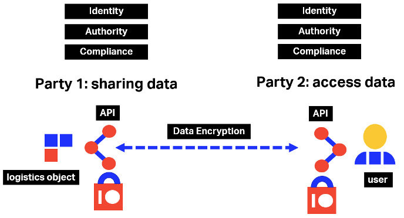

This section describes the mechanisms and guidelines for securing the ONE Record API, 
which enables the connection between ONE Record clients and servers on the ONE Record network.

# Background

When exchanging data, each party needs to know with certainty the true identity of the other party and that they have the authority to receive or share the data. 
They also need to be certain that the data being shared is private, secured, and confidential and cannot be intercepted or changed by any unauthorized third party. 
The ONE Record security framework works globally and for all stakeholders in the full logistics and transport supply chain, 
and in compliance with corporate and local data security requirements.

<figure markdown>
  
  <figcaption>Security overview</figcaption>
</figure>

IT and business experts from the industry from ONE Record Task Force have explored and discussed the different connectivity configurations within the ONE Record network and two models – possibly complementary – were retained. 

ONE Record Security specifications are built around two concepts: mutual TLS (short for Transport Layer Security) and OAuth2 (an authorization protocol). 
Mutual TLS secures all the Node-to-Node channels whereas OAuth2 adds an extra security layer for identification and authentication.

IATA has conceptualized a first practical implementation, which is promoted as the official security model for ONE Record. This implementation is split in two modules:
•	TLS authentication support, including the definition of certificate profiles and practical use of digital certificates for client and server certificates;
•	Token-based authentication support, including a practical implementation using OIDC as authentication protocol, based on the concept of a “Trusted Identity Provider”.
The next sections provide more detailed descriptions on the chosen security models and common use cases.

This section presents these models and showcases the implications and benefits that they bring to the air cargo industry.

- Authentication (authn) has to do with identity: are you who you’re claiming to be?
- Authorization (authz) has to do with policy: are you allowed to do the thing you’re trying to do?
