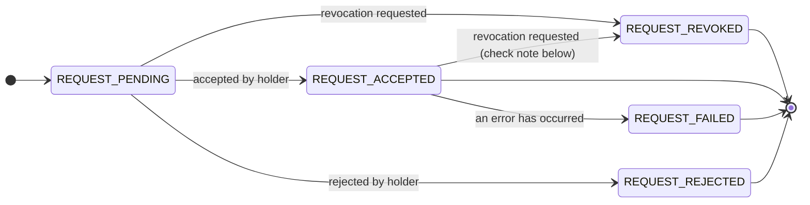
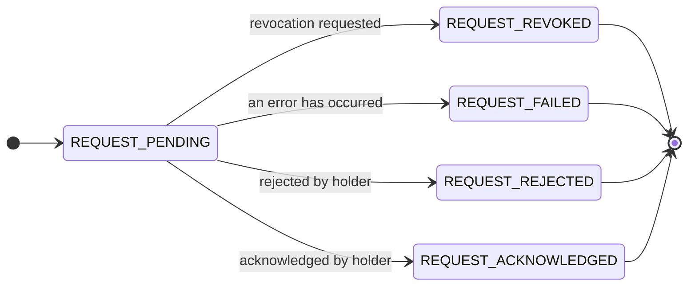
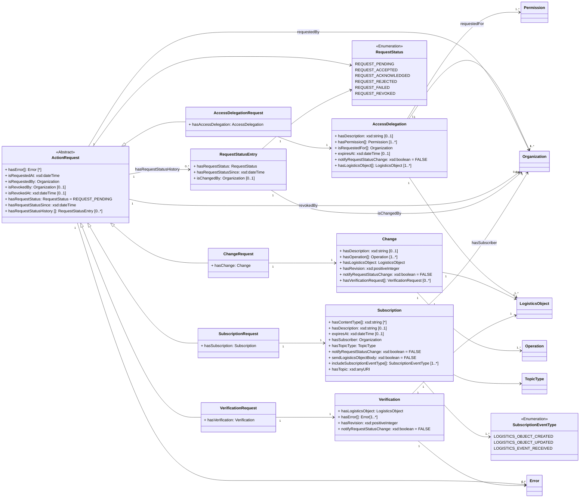

ONE Record uses a generic action request pattern to support the process of one organization requesting an action that must be approved by another organization. 
Examples include [SubscriptionRequest](https://onerecord.iata.org/ns/api#SubscriptionRequest), where the subscriber asks the publisher to subscribe him/her on a LogisticsObject; or the [ChangeRequest](https://onerecord.iata.org/ns/api#ChangeRequest), 
where a `User of a LogisticsObject` submits a [Change](https://onerecord.iata.org/ns/api#Change) of a LogisticsObject that must be approved and applied by the [`Holder of the LogisticsObject`](./concepts.md#holder-of-a-logistics-object).

While the creation of Action Requests by submitting Change, Subscription, Verification or Access Delegation objects is described in the previous sections, this section describes the managing of Action Requests.
This enables users and holders to view and revoke action requests, and enables holders to change the status of an ActionRequest, i.e. to accept or reject.

**Guidelines for Action Requests in ONE Record:**

- An [ActionRequest](https://onerecord.iata.org/ns/api#ActionRequest) MUST be accessible via the URI of the [ActionRequest](https://onerecord.iata.org/ns/api#ActionRequest) (requires sufficient permissions)

- An [ActionRequest](https://onerecord.iata.org/ns/api#ActionRequest) MUST only be accepted or reject by the [`Holder of the LogisticsObject`](./concepts.md#holder-of-a-logistics-object)

- A [VerificationRequest](https://onerecord.iata.org/ns/api#VerificationRequest) MUST only be acknowledged by the [`Holder of the LogisticsObject`](./concepts.md#holder-of-a-logistics-object)

- An [ActionRequest](https://onerecord.iata.org/ns/api#ActionRequest) where [isRequestedBy](https://onerecord.iata.org/ns/api#requestedBy) is the [`Holder of the LogisticsObject`](./concepts.md#holder-of-a-logistics-object) SHOULD be accepted and processed directly.

- [ChangeRequest](https://onerecord.iata.org/ns/api#ChangeRequest) and [VerificationRequest](https://onerecord.iata.org/ns/api#VerificationRequest) MUST only be revoked as long as it is in `REQUEST_PENDING` status.

- [AccessDelegationRequest](https://onerecord.iata.org/ns/api#AccessDelegationRequest) and [SubscriptionRequest](https://onerecord.iata.org/ns/api#SubscriptionRequest) can be revoked as long as they are in `REQUEST_PENDING` or `REQUEST_ACCEPTED` status.

- An [AccessDelegationRequest](https://onerecord.iata.org/ns/api#AccessDelegationRequest) MUST only be revoked by the `Delegator` or the `Delegate`

- A [SubscriptionRequest](https://onerecord.iata.org/ns/api#SubscriptionRequest) MUST only be revoked by the `Requestor`/`Subscriber` or the `Publisher`

- A [VerificationRequest](https://onerecord.iata.org/ns/api#VerificationRequest) or a [ChangeRequest](https://onerecord.iata.org/ns/api#ChangeRequest) MUST only be revoked by the `Requestor` or the [`Holder of the LogisticsObject`](./concepts.md#holder-of-a-logistics-object)

- The `hasRequestStatus` property MUST represent the current status of the [ActionRequest](https://onerecord.iata.org/ns/api#ActionRequest).

- The `hasRequestStatusSince` property MUST indicate the date and time from which the current `hasRequestStatus` applies.

- The `hasRequestStatusHistory` property MAY be used to expose previous request statuses. It MUST NOT contain the current status of the ActionRequest.

- Whenever `hasRequestStatus` changes, the previous value of `hasRequestStatus` and its corresponding `hasRequestStatusSince` value SHOULD be appended as a `RequestStatusEntry` to `hasRequestStatusHistory`. 

- In a `RequestStatusEntry`, the property `isChangedBy` records the Organization that approved or performed the transition from the status represented by that entry to the next request status.

- `RequestStatusEntry` records SHOULD be treated as immutable, except for correction of invalid data.

- If errors occur while processing an accepted [ActionRequest](https://onerecord.iata.org/ns/api#ActionRequest), the [hasRequestStatus](https://onerecord.iata.org/ns/api#hasRequestStatus) of this [ActionRequest](https://onerecord.iata.org/ns/api#ActionRequest) MUST be changed to [REQUEST_FAILED](https://onerecord.iata.org/ns/api#REQUEST_FAILED), and `hasRequestStatusSince` MUST be set to the date and time from which the failed status applies.


**ActionRequest state diagram for AccessDelegationRequest, ChangeRequest, and SubscriptionRequest**


!!! note 
    [AccessDelegationRequest](https://onerecord.iata.org/ns/api#AccessDelegationRequest) and [SubscriptionRequest](https://onerecord.iata.org/ns/api#SubscriptionRequest) may be revoked while in the `REQUEST_ACCEPTED` status. In contrast, once [ChangeRequest](https://onerecord.iata.org/ns/api#ChangeRequest) and [VerificationRequest](https://onerecord.iata.org/ns/api#VerificationRequest) are accepted, they cannot be revoked; a new action request must be submitted instead.

**ActionRequest state diagram for VerificationRequest**



For a Verification Request, the request may result in REQUEST_FAILED if the version is not the latest or if the property is not defined in the logistics object as per the data model.

**ActionRequest data model**

The [ActionRequest](https://onerecord.iata.org/ns/api#ActionRequest) is a data class of the [ONE Record API ontology](assets/ONE-Record-API-Ontology.ttl).
The properties and relationships to other data classes are visualized in the following class diagram.




## Using Action Requests

An `ActionRequest` represents a request from one Organization to another Organization to perform, approve, reject, acknowledge, revoke, or otherwise process an action in the ONE Record network. Action Requests are used as a generic pattern for several API processes, including `ChangeRequest`, `SubscriptionRequest`, `AccessDelegationRequest`, and `VerificationRequest`. For example, a `ChangeRequest` is used when a party proposes a change to a Logistics Object that must be approved and applied by the Holder, while a `SubscriptionRequest` is used when a party requests to subscribe to updates for a Logistics Object. The `ActionRequest` object allows both the requestor and the holder to track the lifecycle of the request through its current status, its timestamps, and any errors that occurred during processing.

The `isRequestedAt` property records the date and time at which the ActionRequest was created. The `isRequestedBy` property identifies the Organization that submitted the request. The `hasRequestStatus` property represents the current status of the ActionRequest, for example `REQUEST_PENDING`, `REQUEST_ACCEPTED`, `REQUEST_REJECTED`, `REQUEST_FAILED`, `REQUEST_REVOKED`, or `REQUEST_ACKNOWLEDGED`. When the current status changes, the `hasRequestStatusSince` property MUST be updated to indicate the date and time from which the current `hasRequestStatus` applies. This allows clients to determine not only the current status of the request, but also when that status became valid. For example, if a `ChangeRequest` has `hasRequestStatus` set to `REQUEST_ACCEPTED`, then `hasRequestStatusSince` indicates when the request was accepted.

The optional `hasRequestStatusHistory` property contains previous status values of the ActionRequest. It is used to preserve the historical lifecycle of the request without duplicating the current status, which is already represented directly by `hasRequestStatus` and `hasRequestStatusSince` on the ActionRequest itself. Each item in `hasRequestStatusHistory` is a `RequestStatusEntry`. A `RequestStatusEntry` records a previous `hasRequestStatus`, the `hasRequestStatusSince` timestamp from which that previous status applied, and optionally the `isChangedBy` Organization that approved or performed the transition from that historical status to the next request status. Whenever the status of an ActionRequest changes, the previous value of `hasRequestStatus` and its corresponding `hasRequestStatusSince` SHOULD be appended to `hasRequestStatusHistory` as a `RequestStatusEntry`, before the ActionRequest is updated with the new current status.

If the ActionRequest is revoked, the `hasRequestStatus` property MUST be set to `REQUEST_REVOKED`, and `isRevokedAt` records the date and time at which the revocation occurred. The `isRevokedBy` property identifies the Organization that revoked the request. Revocation rules depend on the concrete type of ActionRequest. For example, `ChangeRequest` and `VerificationRequest` can only be revoked while they are in `REQUEST_PENDING` status, while `AccessDelegationRequest` and `SubscriptionRequest` can be revoked while they are in either `REQUEST_PENDING` or `REQUEST_ACCEPTED` status. If an error occurs while processing an accepted ActionRequest, the `hasRequestStatus` MUST be changed to `REQUEST_FAILED`, `hasRequestStatusSince` MUST be updated accordingly, and one or more `Error` objects MAY be provided through `hasError` to describe the failure.

Concrete subclasses of `ActionRequest` carry the business object that is being requested. An `AccessDelegationRequest` contains an `AccessDelegation` through `hasAccessDelegation`; a `ChangeRequest` contains a `Change` through `hasChange`; a `SubscriptionRequest` contains a `Subscription` through `hasSubscription`; and a `VerificationRequest` contains a `Verification` through `hasVerification`. Clients SHOULD use the generic ActionRequest properties to understand and monitor the lifecycle of the request, and the subclass-specific property to understand the requested business action.

# Get Action Request Details

## Endpoint

``` 
 GET {{baseURL}}/action-requests/{{actionRequestId}}

```
## Request

The following HTTP header parameters MUST be present in the request:

| Header    | Description                                  | Examples                |
| ----------------- |    -------------------------------- |   ------------- |
| **Accept**        | The content type that a ONE Record client wants the HTTP response to be formatted in. This SHOULD include the version of the ONE Record API, otherwise the latest supported ONE Record API MAY be applied. | <ul><li>application/ld+json</li><li>application/ld+json; version=2.2.0</li><li>application/ld+json; version=1.2</li></ul> |

## Response

A successful request MUST return a `HTTP/1.1 200 OK` status code. 
The body of the response includes the Action Request in the RDF serialization format that has been requested in the `Accept` header of the request.

The following HTTP headers parameters MUST be present in the response:

| Header                | Description                                  | Example   |
| -------------------- |    ---------- | ----------------------------- |
| **Content-Type**     | The content type that is contained with the HTTP body.                               | application/ld+json           |
| **Content-Language** | Describes the language(s) for which the requested resource is intended.              | en-US     |
| **Type**  | The type of the Action Request as a URI                     | https://onerecord.iata.org/ns/api#SubscriptionRequest         |
| **Last-Modified**    | he date and time of the most recent change to the Action Request. Syntax: `Last-Modified: <day-name>, <day> <month> <year> <hour>:<minute>:<second> GMT`. See https://developer.mozilla.org/en-US/docs/Web/               | Tue, 21 Feb 2023 07:28:00 GMT |

The following HTTP status codes MUST be supported:

| Code    | Description              | Response body    |
| ------- |  ---------------------- | ---------------- |
| **200** | The request to retrieve the Action Request has been successful       | Action Request   |
| **301** | The URI of the Action Request has permanently changed.               | No response body |
| **302** | The URI of the Action Request has temporarily moved.                 | No response body |
| **401** | Not authenticated                                                    | Error            |
| **403** | Not authorized to retrieve the Action Request                        | Error            |
| **404** | Action Request not found                                             | Error            |
| **415** | Unsupported Content Type                                             | Error            |
| **500** | Internal Server Error                                                | Error            |


## Security
To engage with the "Get Action Request Details" endpoint, a client needs proper authentication and authorization to access the designated resource. If requests lack proper authentication, the ONE Record server should respond with a `401 "Not Authenticated"` status. Conversely, for requests without proper authorization, a `403 "Not Authorized"` response should be provided.


## Example A1

Each [SubscriptionRequest](https://onerecord.iata.org/ns/api#SubscriptionRequest) MUST have a URI that can be accessed by the requestor (subscriber) 
and the publisher to obtain the current status of the request and subscription details.

Request:

```http
GET /action-requests/599fea49-7287-42af-b441-1fa618d2aaed HTTP/1.1
Host: 1r.example.com
Accept: application/ld+json; version=2.2.0
```

Response:

```bash
HTTP/1.1 200 OK
Content-Type: application/ld+json; version=2.2.0
Content-Language: en-US
Location: https://1r.example.com/action-requests/599fea49-7287-42af-b441-1fa618d2aaed
Type: https://onerecord.iata.org/ns/api#SubscriptionRequest
Last-Modified: Tue, 21 Feb 2023 07:28:00 GMT

--8<-- "API-Security/examples/SubscriptionRequest_example2.json"
```
_([SubscriptionRequest_example2.json](./examples/SubscriptionRequest_example2.json))_


## Example A2
After requesting a [Verification](https://onerecord.iata.org/ns/api#Verification) of a LogisticsObject (see [Example A1 in Verifications](./verifications.md#example-a1)), the requestor can retrieve the [VerificationRequest](https://onerecord.iata.org/ns/api#VerificationRequest) to check the status.

Request:
```http
GET /action-requests/e4cf1ea5-96fc-4025-be21-159b779e3200 HTTP/1.1
Host: 1r.example.com
Accept: application/ld+json; version=2.2.0
```

Response:

```bash
HTTP/1.1 200 OK
Content-Type: application/ld+json; version=2.2.0
Content-Language: en-US
Location: https://1r.example.com/action-requests/e4cf1ea5-96fc-4025-be21-159b779e3200
Type: https://onerecord.iata.org/ns/api#VerificationRequest
Last-Modified: Tue, 02 Jul 2024 10:45:00 GMT

--8<-- "API-Security/examples/VerificationRequest.json"
```
_([VerificationRequest.json](./examples/VerificationRequest.json))_

# Update an Action Request

This API action can be used the holder/publisher of a Logistics Object to approve or reject a pending [ActionRequest](https://onerecord.iata.org/ns/api#ActionRequest).

For example, as a publisher, this API action is used to change the status of a received Subscription Request on a ONE Record server using the PATCH HTTP method. 

!!! note 
    Although the updating the state of of a Subscription Request is specified in the ONE Record API specification, it is not required to expose an API endpoint for this API action to be compliant with the ONE Record standard. 
    The reason for this is that _only the holder of the logistics object_ MAY accept or reject a subscription request with any business logic or technology.         

    Nevertheless, this API action specification is included for reference, because in many cases, the use of HTTP PATCH is the preferred solution to update resources with REST APIs.


## Endpoint

``` 
 PATCH {{baseURL}}/action-requests/{{actionRequestId}}

```
## Request

The following query parameters MUST be supported:

| Query parameter   | Description                         | Valid values        |
| ----------------- |    -------------------------------- |   ------------- |
| **status**      | A parameter used to configure the status of an Action request. This operation modifies the status of the Action Request based on the value specified in the status parameter.  | <ul><li>https://onerecord.iata.org/ns/api#REQUEST_ACCEPTED or REQUEST_ACCEPTED</li><li>https://onerecord.iata.org/ns/api#REQUEST_REJECTED or REQUEST_REJECTED</li><li>https://onerecord.iata.org/ns/api#REQUEST_REVOKED or REQUEST_REVOKED</li></ul> |

The following HTTP header parameters MUST be present in the request:

| Header    | Description                                  | Examples                |
| ----------------- |    -------------------------------- |   ------------- |
| **Accept**        | The content type that a ONE Record client wants the HTTP response to be formatted in. This SHOULD include the version of the ONE Record API, otherwise the latest supported ONE Record API MAY be applied. | <ul><li>application/ld+json</li><li>application/ld+json; version=2.2.0</li><li>application/ld+json; version=1.2</li></ul> |
| **Content-Type** | The content type that is contained with the HTTP body.               | <ul><li>application/ld+json</li><li>application/ld+json; version=2.2.0</li><li>application/ld+json; version=1.2</li></ul> |

## Response

A successful request MUST return a `HTTP/1.1 204 No Content` status code and the following HTTP headers parameters MUST be present in the response:

| Header | Description                 | Example                |
| -------------------- |  ----- |   -------------------------------- |
| **Location**         | The URI of the Action Request          | https://1r.example.com/action-requests/6b948f9b-b812-46ed-be39-4501453da99b |
| **Type**             | The type of the Action Request as a URI | https://onerecord.iata.org/ns/api#ChangeRequest                   |

Otherwise, an `Error` object with `ErrorDetail` as response body MUST be returned with the following HTTP headers:

| Header | Description                     | Example             |
| -------------------- |  ----------------------------- | ------------------- |
| **Content-Type**     | The content type that is contained with the HTTP body.                  | application/ld+json |
| **Content-Language** | Describes the language(s) for which the requested resource is intended. | en-US               |

The following HTTP status codes MUST be supported:

| Code    | Description | Response body    |
| ------- | ----------- | ---------------- |
| **204** | The Action Request was successfully updated                     | No body required |
| **400** | The update request body is invalid                              | Error            |
| **401** | Not authenticated                                               | Error            |
| **403** | Not authorized to update the Action Request                     | Error            |
| **404** | Action Request not found                                        | Error            |
| **415** | Unsupported Content Type, response when the client sends a PATCH document format that the server does not support for the resource identified by the Request-URI.            | Error            |
| **422** | Unprocessable request, when the server understands the PATCH document and the syntax of the PATCH document appears to be valid, but the server is incapable of processing the request. | Error            |
| **500** | Internal Server Error                                           | Error            |


## Security

Access to the Action Request update endpoint should be restricted to internal usage only, and it must not be made available to external entities.


## Example B1

Request:

```http
PATCH /action-requests/733ed391-ad11-4c02-a2bf-c77ee7997c28?status=https://onerecord.iata.org/ns/api#REQUEST_ACCEPTED HTTP/1.1
Host: 1r.example.com
Content-Type: application/ld+json; version=2.2.0
Accept: application/ld+json; version=2.2.0

```


Response:

```bash
HTTP/1.1 204 No Content
Content-Type: application/ld+json; version=2.2.0
Type: https://onerecord.iata.org/ns/api#SubscriptionRequest
Location: https://1r.example.com/action-requests/733ed391-ad11-4c02-a2bf-c77ee7997c28
```

# Revoke Action Request

This API action must be used to revoke an Action Request, which can only be done by the original requester of the ActionRequest or by the holder/publisher of the Logistics Object.

## Endpoint

``` 
 DELETE {{baseURL}}/action-requests/{{actionRequestId}}

```
## Request

Revoking an Action Request does not require any mandatory HTTP headers.

## Response

A successful request MUST return a `HTTP/1.1 204 No Content` status code. 

The following HTTP status codes MUST be supported:

| Code    | Description | Response body    |
| ------- | ----------- | ---------------- |
| **204** | The Action Request was successfully deleted                 | No body required |
| **401** | Not authenticated                                           | Error            |
| **403** | Not authorized to update the Action Request                 | Error            |
| **404** | Action Request not found                                    | Error            |
| **422** | Unprocessable request, when the server understands the revoke request but cannot process it because the action request is not in a revocable state. | Error            |
| **500** | Internal Server Error                                       | Error            |


## Security

To engage with the "Revoke Action Request" endpoint, a client needs proper authentication and authorization to access the designated resource. If requests lack proper authentication, the ONE Record server should respond with a `401 "Not Authenticated"` status. Conversely, for requests without proper authorization, a `403 "Not Authorized"` response should be provided.

## Example C1

Request:
```http
DELETE /action-requests/449661ee-fecf-465d-8eae-15bdaccb7080 HTTP/1.1
Host: 1r.example.com
```


Response:
```bash
HTTP/1.1 204 No Content
```

# Get Action Request Metadata

After successfully retrieving an action request with a `GET` request, clients can use the `HEAD` method to request the same resource's metadata without transferring the response body. This allows applications to assess headers such as Last-Modified efficiently, optimizing bandwidth usage and supporting features like cache validation.

The HTTP `HEAD` method is used to retrieve the headers of a resource without transferring the response body. It functions similarly to a `GET` request, but returns only the metadata, making it ideal for scenarios where downloading the full content is unnecessary.
Benefits:
- Efficiency: Reduces bandwidth usage and improves performance by omitting the response body.
- Availability Checks: Verifies whether a resource exists or has been modified using headers like Last-Modified.
- Link Validation: Enables automated tools to check link health without fetching entire pages.

This method allows applications to inspect content attributes in a lightweight manner, analogous to reading a package label without opening the box.

!!! note 
    Any update in an action request of any type MUST trigger a change in the `Last-Modified`

## Endpoint

``` 
 HEAD {{baseURL}}/action-requests/{{actionRequestId}}

```
## Request

The following HTTP header parameters MUST be present in the request:

| Header    | Description                                  | Examples                |
| ----------------- |    -------------------------------- |   ------------- |
| **Accept**        | The content type that a ONE Record client wants the HTTP response to be formatted in. This SHOULD include the version of the ONE Record API, otherwise the latest supported ONE Record API MAY be applied. | <ul><li>application/ld+json</li><li>application/ld+json; version=2.2.0</li><li>application/ld+json; version=1.2</li></ul> |

## Response

A successful request MUST return a `HTTP/1.1 200 OK` status code. 

The following HTTP headers parameters MUST be present in the response:

| Header                | Description                                  | Example   |
| -------------------- |    ---------- | ----------------------------- |
| **Content-Type**     | The content type that is contained with the HTTP body.                               | application/ld+json           |
| **Content-Language** | Describes the language(s) for which the requested resource is intended.              | en-US     |
| **Type**  | The type of the Action Request as a URI                     | https://onerecord.iata.org/ns/api#SubscriptionRequest         |
| **Last-Modified**    | he date and time of the most recent change to the Action Request. Syntax: `Last-Modified: <day-name>, <day> <month> <year> <hour>:<minute>:<second> GMT`. See https://developer.mozilla.org/en-US/docs/Web/               | Tue, 21 Feb 2023 07:28:00 GMT |

The following HTTP status codes MUST be supported:

| Code    | Description              | Response body    |
| ------- |  ---------------------- | ---------------- |
| **200** | The request to retrieve the Action Request has been successful       | Action Request   |
| **301** | The URI of the Action Request has permanently changed.               | No response body |
| **302** | The URI of the Action Request has temporarily moved.                 | No response body |
| **401** | Not authenticated                                                    | Error            |
| **403** | Not authorized to retrieve the Action Request                        | Error            |
| **404** | Action Request not found                                             | Error            |
| **415** | Unsupported Content Type                                             | Error            |
| **500** | Internal Server Error                                                | Error            |


## Security
To engage with the "Get Action Request Metadata" endpoint, a client needs proper authentication and authorization to access the designated resource (same as the HTTP GET method). If requests lack proper authentication, the ONE Record server should respond with a `401 "Not Authenticated"` status. Conversely, for requests without proper authorization, a `403 "Not Authorized"` response should be provided.


## Example D1

Request:

```http
HEAD /action-requests/599fea49-7287-42af-b441-1fa618d2aaed HTTP/1.1
Host: 1r.example.com
Accept: application/ld+json; version=2.2.0
```

Response:

```bash
HTTP/1.1 200 OK
Content-Type: application/ld+json; version=2.2.0
Content-Language: en-US
Location: https://1r.example.com/action-requests/599fea49-7287-42af-b441-1fa618d2aaed
Type: https://onerecord.iata.org/ns/api#SubscriptionRequest
Last-Modified: Tue, 21 Feb 2023 07:28:00 GMT
```


