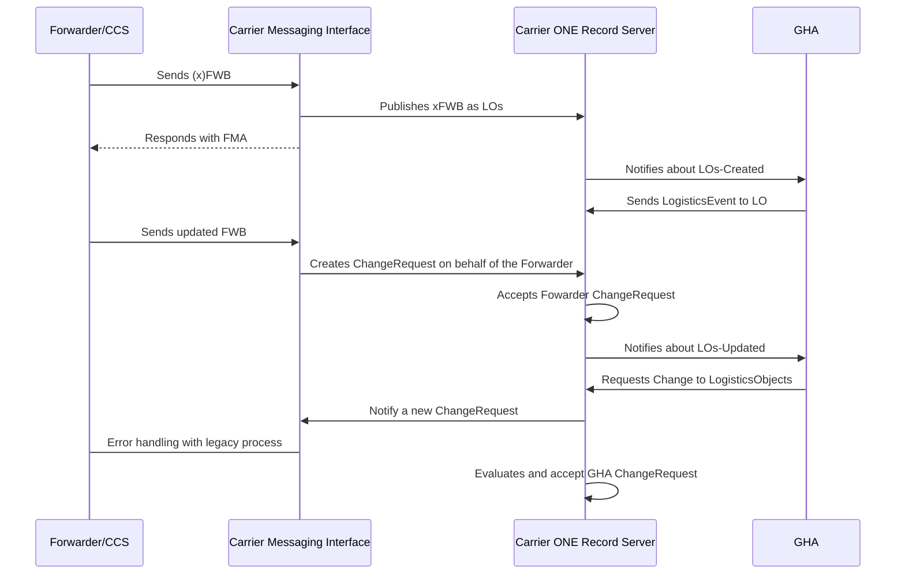

!!! note
    This page is a Draft and it's not approved by the COTB

ONE Record serves as a data sharing standard, establishing a unified view of shipments through a singular record. This standard outlines a common data model for information exchange, facilitated by standardized and secure web APIs. 

Despite the prevalence of existing EDI messaging systems such as Cargo XML or Cargo IMP in the air cargo industry, this document seeks to articulate a high-level architecture to seamlessly integrate ONE Record with these established EDI messaging standards. 

This page does not explore the specifics of information mapping between the various standards but provides an overview of how to integrate EDI messages and ONE Record.

## Architecture 

In aiming to align ONE Record with EDI messaging systems, we consider a scenario where an airline, adopting the ONE Record standard, seeks to communicate with a forwarder still reliant on EDI messaging systems. 

The high-level architecture is delineated by three distinct components: 
1) The ONE Record Server for Airlines 
2) The EDI Messaging Server for Forwarders 
3) The intermediary connector facilitating communication between the ONE Record Server and the EDI messaging system 

The central component of the architecture is the connector linking the ONE Record API-based systems with the EDI messaging realm. 

To streamline the scenario, the airline establishes a connector for each third-party company seeking to connect with EDI messages. Nevertheless, there is no restriction preventing a company from configuring a connector capable of managing connections with multiple third-party companies. 

The connector must possess the capability to: 
1) Receive EDI messages and based on the content of the message:
		- Generate Change Requests
		- Add Logistics Objects 
		- Create Logistics Events
2) Receive ONE Record notifications and generate a corresponding EDI message 
 
From the ONE Record perspective, the connector serves as a proxy for the third-party company, representing it within the ONE Record network. It executes ONE Record API calls defined by the company through the transmission of EDI messages. Conversely, when seen from the EDI perspective, the connector represents the airline EDI messages endpoint and is triggered by notifications sent by the ONE Record server of the airline.

It's important to emphasize that a company still using EDI messages can be represented multiple times in ONE Record. Each ONE Record-enabled company that interacts with a company via legacy EDI messaging will have a separate ONE Record representation of that company.

## Hybrid Scenarios

The following tables present a list of possible scenarios and the corresponding approaches:

| **Scenario** | **Forwarder** | **Airline** | **GHA**    | **Approach**|
| ------------ | ------------- | ----------- | ---------- | ----------- |
| 1 | Legacy        | Legacy      | ONE Record | 100% legacy  |
| 2 | Legacy        | ONE Record  | Legacy     | 100% legacy  |
| 3 | Legacy        | ONE Record  | ONE Record | ONE Record possible only with GHA |
| 4 | ONE Record    | Legacy      | Legacy     | 100% legacy |
| 5 | ONE Record    | Legacy      | ONE Record | Legacy between Airline and GHA; Better data via ONE Record between FF and GHA might possible (e.g. via QR-labels), but can bring problems due to Airline´s constrains. |
| 6 | ONE Record    | ONE Record  | Legacy     | ONE Record between FF and Airline, then downgrade to GHA |

## Sequence Diagram

The following sequence diagram represent the communication in case of scenario 3 of the previous table.

