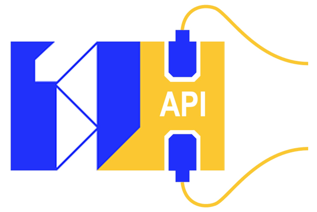

# Purpose

This ONE Record API specification is part of the ONE Record standard.
It defines a standard, programming language-agnostic interface for the interaction with the ONE Record Web API.
This ONE Record API specification supports the effective implementation of ONE Record compliant APIs.
It aims to provide detailed realistic use cases and examples for the various API features while maintaining the necessary technical depth for implementers.

# Prerequisites

It is assumed that the reader is familiar with the ONE Record data model, REST APIs (also known as RESTful APIs), and JSON-LD.

# Supporting Documents

- [Changelog](changelog.md) contains a list of all notable changes for each version of the ONE Record API specification.
- [ONE Record API ontology](assets/ONE-Record-API-Ontology.ttl) provides the vocabulary and data classes for the data model used in the ONE Record API.
- [Tabular overview of ONE Record API ontology](assets/ONE-Record-API-Ontology.csv) is a tabular representation of the ONE Record API ontology and describes the ONE Record API data classes, their properties as attributes, descriptions and valid values.
- [ONE Record API class diagram](assets/ONE-Record-API-Class-Diagram.md) is a visual representation of the ONE Record API ontology and describes the ONE Record API data classes, their properties as attributes, and the relationship that can exist between the classes.
- [OpenAPI specification](assets/ONE-Record-API-OpenAPI.yaml) describes the prescribed API endpoint structure of a ONE Record server implementation. 
- [Postman collection](assets/ONE-Record-API-Collections.postman_collection) contains demo HTTP requests that demonstrate how to interact with the various ONE Record API endpoints and can be used to playback the examples provided in this document.

# Document Version

**Version:** 2.0.0

**Status:** Endorsed by COTB on December 2023

!!! note
    Discussion on this specification is highly encouraged and please contact [onerecord@iata.org](mailto:onerecord@iata.org) with any comments or suggested improvements. 
    The version of the ONE Record API specification is incremented when the API specifications are endorsed by the IATA Cargo Operations Technology Board (COTB).

## Dependencies

The ontology of the ONE Record API uses data classes defined in the ONE Record cargo ontology. 
Therefore, this ONE Record API version 2.0.0 requires the ONE Record cargo ontology 3.0.0 or later.

# Conventions

The key words "MUST", "MUST NOT", "REQUIRED", "SHALL", "SHALL NOT", "SHOULD", "SHOULD NOT", "RECOMMENDED", "NOT RECOMMENDED", "MAY", and "OPTIONAL" in this document are to be interpreted as described in [RFC 2119](https://www.rfc-editor.org/rfc/rfc2119).

# License

This document is licensed under MIT license (see [License](license.md) for details).
