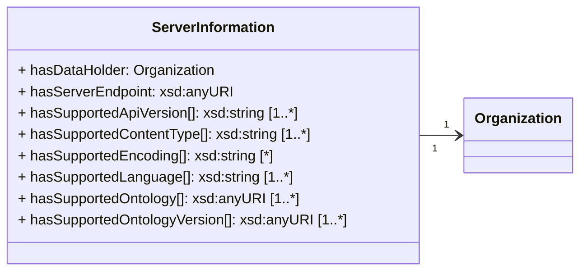

# Get Server Information

As a ONE Record client, it is helpful to know the capabilities of a ONE Record server and to be able to retrieve this information in a systematic way.
Therefore, every ONE Record server MUST provide an endpoint that can be used to retrieve this technical server information.
This `ServerInformation` include details about the ONE Record server's ONE Record capabilities, the data holder (as a link to an [Organization](https://onerecord.iata.org/ns/cargo#Organization) using the [Organization URI](concepts.md#organization-uri)), the supported Logistics Object types (incl. data model versions) and the supported serialization formats.

The [ServerInformation](https://onerecord.iata.org/ns/api#ServerInformation) is a data class of the ONE Record API ontology. The properties and relationships to other data classes are visualized in the following class diagram.



## Endpoint 
``` 
 GET {{baseURL}}/
```

## Request

The following HTTP header parameters MUST be present in the request:

| Request Header | Description                  | Examples            |
| -------------- |  -------------------------- | ------------------- |
| **Accept**     | The content type that you want the HTTP response to be formatted in. | application/ld+json |

## Response

One of the following HTTP status codes MUST be present in the response:

| Code    | Description               | Response body     |
| ------- |  ----------------------- | ----------------- |
| **200** |     The request to retrieve the ServerInformation has been successful | ServerInformation |
| **301** | 	Indicate that the server has moved permanently to a new location  | No response body      |
| **401** | 	Not authenticated or expired token | Error       |
| **403** | 	Not authorized to perform action | Error       |
| **404** | 	Resource Not Found | Error       |
| **405** | 	Method not allowed | Error       |
| **415** | 	Unsupported content type | Error       |
| **500** |     Internal Server Error | Error       |

A successful request MUST return a `HTTP/1.1 200 OK` status code and the following HTTP headers parameters MUST be present in the response:

| Response Header      | Description                    | Example   |
| -------------------- |  -------------------------- | ----------------------------- |
| **Content-Type**     | The content type that is contained with the HTTP body.                 | application/ld+json           |
| **Content-Language** | Describes the language(s) for which the requested resource is intended.                    | en-US     |
| **Last-Modified**    | The date and time of the most recent change to the server information. See https://developer.mozilla.org/en-US/docs/Web/ | Tue, 21 Feb 2023 07:28:00 GMT |

The HTTP body must contain a valid [ServerInformation](https://onerecord.iata.org/ns/api#ServerInformation) object in the format as specified by the Content-Type in the header.

## Security

Any authenticated ONE Record client that is aware of this endpoint should have the capability to request Server Information from the ONE Record server. Therefore, access control should not be applied to this endpoint, and authentication alone should suffice.

## Example A1

Request:

```http

GET / HTTP/1.1
Host: 1r.example.com
Content-Type: application/ld+json; version=2.0.0-dev
Accept: application/ld+json; version=2.0.0-dev
```

Response:

```bash
HTTP/1.1 200 OK
Content-Type: application/ld+json; version=2.0.0-dev

--8<-- "examples/ServerInformation.json"
```
_([examples/ServerInformation.json](examples/ServerInformation.json))_

## Example A2

Request:

```http
GET / HTTP/1.1
Host: 1r.example.com
Accept: application/ld+json; version=2.0.0-dev
```

Response:

```http
HTTP/1.1 301 Moved Permanently
Location: https://1r.example.org/
```


