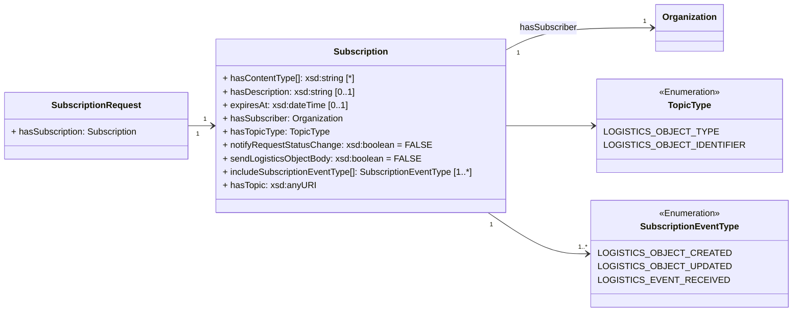
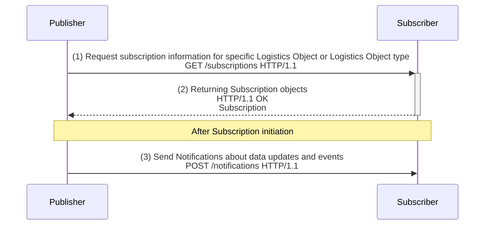
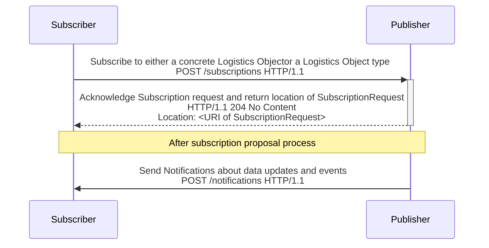

# Publish & Subscribe in ONE Record

ONE Record utilizes a publish & subscribe pattern to enable exchanging data updates in a distributed network of ONE Record nodes.
More precisely, In ONE Record, so-called [Notification](https://onerecord.iata.org/ns/api#Notification) data objects are exchanged 
between applications to inform other ONE Record nodes about data updates. 

This chapter describes the publish & subscribe concept and how it MUST be implemented in ONE Record.

!!! note 
    Receiving data updates (via notifications) from other ONE Record nodes requires implementation of the Notifications API endpoint 
    (see [Notifications](notifications.md))

**Guidelines for Subscriptions in ONE Record:**

- A [Subscription](https://onerecord.iata.org/ns/api#Subscription) MUST be immutable (unchangeable object), i.e. a [Subscription](https://onerecord.iata.org/ns/api#Subscription) cannot be changed after it is created and published.
- Updating a [Subscription](https://onerecord.iata.org/ns/api#Subscription) requires to delete/revoke the active [Subscription](https://onerecord.iata.org/ns/api#Subscription) and create a new [Subscription](https://onerecord.iata.org/ns/api#Subscription) that MUST be communicated to other ONE Record nodes.
- The publisher of a [Notification](https://onerecord.iata.org/ns/api#Notification) MUST ensure the guaranteed delivery.
- It is RECOMMENDED to implement for each subscriber and each topic a message queue that is maintained by the publisher. While in transit, data is kept in message queues that ensure integrity and availability of the system. If a subscribing application is unavailable, messages are safely retained until the subscribing application returns to be available.
- The publisher MUST ensure the guaranteed delivery. That means keeping data until the subscriber confirms it has received a particular [Notification](https://onerecord.iata.org/ns/api#Notification). 

**Subscription Data Model**

The [Subscription](https://onerecord.iata.org/ns/api#Subscription) and [SubscriptionRequest](https://onerecord.iata.org/ns/api#SubscriptionRequest) are data classes of the [ONE Record API ontology](assets/ONE-Record-API-Ontology.ttl).
The properties and relationships to other data classes are visualized in the following class diagram.



Two scenarios were identified for initiating the publish/subscribe process:

1) [Publisher initiates Subscription](#get-subscription-information-as-publisher): 
After creating and publishing an Logistics Object, the publisher wants to subscribe another organization to receive Notifications about the newly created Logistics Object.

2) [Subscriber initiates Subscription](#subscribe-to-logistics-objects): 
An organization wants to receive Notifications about a specific Logistics Object or a type of Logistics Objects.

Both scenarios are described with examples below. For simplicity reasons, the security part was not detailed in the following diagrams.

# Get Subscription information as Publisher

If the publisher of a Logistics Object - also called `Holder of the Logistics Object` - wants to subscribe a user of a Logistics Object - also called `Subscriber` in this scenario  - to send [Notifications](https://onerecord.iata.org/ns/api#Notification) about data updates and/or Logistics Events, the publisher can request the potential subscriber to provide subscription information. 

There are two different forms of this scenario:

- The publisher wants to notify the subscriber about changes to Logistics Objects of a certain type (e.g. [Waybill](https://onerecord.iata.org/ns/cargo#Waybill) or [Piece](https://onerecord.iata.org/ns/cargo#Piece))
- The publisher wants to notify the subscriber about changes to a specific Logistics Object, e.g. [https://1r.example.com/logistics-objects/1a8ded38-1804-467c-a369-81a411416b7c](https://1r.example.com/logistics-objects/1a8ded38-1804-467c-a369-81a411416b7c)


**Workflow**

As result, for both scenarios the interaction between two ONE Record participants follows the following workflow:



**(Optional) Step 0 - Create and Publish a Logistics Object**

This step is optional, because a subscription MUST also be possible for already existing Logistics Objects.

**Step 1 - Retrieve Subscription information**

The publisher MAY propose a Subscription to a subscriber by requesting the Subscription information from the potential subscriber. 
The publisher sends a GET request to the subscriptions endpoint of a Subscriber with the proposed Logistics Object type or a specific Logistics Object URI using the query parameters `topicType` and `topic`. If the subscription proposal targets a specific Logistics Object, the subscribers MUST set the topicType=[LOGISTICS_OBJECT_IDENTIFIER](https://onerecord.iata.org/ns/api#LOGISTICS_OBJECT_IDENTIFIER) and provide an accessible Logistics Object URI as `topic` parameter. Example:

```http
GET /subscriptions?topicType=https://onerecord.iata.org/ns/api%23LOGISTICS_OBJECT_IDENTIFIER&topic=https://1r.example.com/logistics-objects/1a8ded38-1804-467c-a369-81a411416b7c HTTP/1.1
Host: 1r.example.com
Accept: application/ld+json; version=2.0.0-dev
```

**Step 2 - Acknowledge Subscription request**
In order to acknowledge a proposal the subscriber response to the request with the Subscription information. Example:
```bash
HTTP/1.1 200 OK 
Content-Type: application/ld+json; version=2.0.0-dev
Content-Language: en-US

--8<-- "examples/Subscriptions_example1.json"
```

_([examples/Subscriptions_example1.json](examples/Subscriptions_example1.json))_

It is the responsibility of the publisher to check the response, i.e. to compare the requested topic/topicType with the topic/topicType in the returned [Subscription](https://onerecord.iata.org/ns/api#Subscription) data object.

The publisher uses the response to store it in a [SubscriptionRequest](https://onerecord.iata.org/ns/api#SubscriptionRequest), which can later be referenced in Notifications (cf. [isTriggeredBy](https://onerecord.iata.org/ns/api#isTriggeredBy) property in [Notification](https://onerecord.iata.org/ns/api#Notification)) and used to revoke the subscription.
For example, the URI of the newly created SubscriptionRequest could be [https://1r.example.com/action-requests/599fea49-7287-42af-b441-1fa618d2aaee](https://1r.example.com/action-requests/599fea49-7287-42af-b441-1fa618d2aaee)

The publisher MUST ensure that the subscriber gets sufficient access to the resulted [SubscriptionRequest](https://onerecord.iata.org/ns/api#SubscriptionRequest) to request the status of the [SubscriptionRequest](https://onerecord.iata.org/ns/api#SubscriptionRequest) and can revoke [AccessDelegationRequest](https://onerecord.iata.org/ns/api#SubscriptionRequest) (see also section about [revoking Action Requests](./action-requests.md#revoke-action-request)

Here an example of a [SubscriptionRequest](https://onerecord.iata.org/ns/api#SubscriptionRequest):

```bash
--8<-- "examples/SubscriptionRequest_example.json"
```

_([examples/SubscriptionRequest_example.json](examples/SubscriptionRequest_example.json))_

!!! note
    The **@id** found in the subscription details provided by the Subscriber is not mandatory, but it can serve as a means for the Subscriber to manage various subscriptions. The Subscriber has the freedom to determine the format of this identifier. To access the SubscriptionRequest, both the Subscriber and the Publisher must utilize the id assigned by the Publisher for the SubscriptionRequest ([https://1r.example.com/action-requests/599fea49-7287-42af-b441-1fa618d2aaee](https://1r.example.com/action-requests/599fea49-7287-42af-b441-1fa618d2aaee) in the example), rather than the id of the Subscription.

**Step 3 - Send Notification to Subscribers**

Once the subscription information is received the publisher sends notifications to the subscriber using the details provided. 
If a subscriber was not available at the time, then the publisher MUST need to queue and retry to notify the Subscriber.
Example:

```http
POST /notifications HTTP/1.1
Host: 1r.example.com
Content-Type: application/ld+json; version=2.0.0-dev
Accept: application/ld+json; version=2.0.0-dev

--8<-- "examples/Notification_example1.json"
```
_([examples/Notification_example1.json](examples/Notification_example1.json))_

!!! note
    Notifications will be triggered for the creation of a new Logistics Event on a Logistics Object solely when the subscription property ['includeSubscriptionEventType'](https://onerecord.iata.org/ns/api#includeSubscriptionEventType) contains the value ['LOGISTICS_EVENT_RECEIVED'](https://onerecord.iata.org/ns/api#LOGISTICS_EVENT_RECEIVED). On the contrary, this notification will be omitted.

## Endpoint 

``` 
 GET {{baseURL}}/subscriptions?topicType={{topicType}}&topic={dataclass/logisticObjectURI}}

```

## Request

The following HTTP query parameters MUST be supported:

| Query parameter | Description | Valid values / Examples |
| --------------- | ----------- | ------------ |
| **topicType**       | Used by the publisher to specify if Subscription information for a specific Logistics Object or a data class should be in the response body. When passed in a URL, the **topicType** must be URL encoded (i.e `#` becomes `%23` or can be replaced with `/`) | <ul><li>[https://onerecord.iata.org/ns/api#LOGISTICS_OBJECT_TYPE](https://onerecord.iata.org/ns/api#LOGISTICS_OBJECT_TYPE)</li><li>[https://onerecord.iata.org/ns/api#LOGISTICS_OBJECT_IDENTIFIER](https://onerecord.iata.org/ns/api#LOGISTICS_OBJECT_IDENTIFIER)</li></ul> |
| **topic**       | Used by the publisher to specify the data class or Logistics Object URI the Subscription information should be related to. **topic** MUST be a valid URI | <ul><li>https://onerecord.iata.org/ns/cargo#Piece</li><li>https://1r.example.com/logistics-objects/1a8ded38-1804-467c-a369-81a411416b7c</li></ul> |

The following HTTP header parameters MUST be present in the request:

| Header    | Description                                  | Examples                |
| ----------------- |    -------------------------------- |   ------------- |
| **Accept**        | The content type that a ONE Record client wants the HTTP response to be formatted in. This SHOULD include the version of the ONE Record API, otherwise the latest supported ONE Record API MAY be applied. | <ul><li>application/ld+json</li><li>application/ld+json; version=2.0.0-dev</li><li>application/ld+json; version=1.2</li></ul> |

## Response

A successful request MUST return a `HTTP/1.1 200 OK` status code. 
The body of the response includes the list of subscriptions in the RDF serialization format that has been requested in the `Accept` header of the request.
This list of subscriptions MAY also be empty.

The following HTTP headers parameters MUST be present in the response:

| Header                | Description                                  | Example   |
| -------------------- |    ---------- | ----------------------------- |
| **Content-Type**     | The content type that is contained with the HTTP body.                               | application/ld+json           |
| **Content-Language** | Describes the language(s) for which the requested resource is intended.              | en-US     |

The following HTTP status codes MUST be supported:


| Code     | Description                    | Response body     |
| -------- | ------------------------------ | ----------------- |
| **200**  | The request to retrieve the Subscription Information has been successful | Subscriptions |
| **400**  | The request is invalid	                                                  | Error |
| **401**  | Not authenticated                                                        | Error |
| **403**  | Not authorized to retrieve the Subscription Information                  | Error |
| **500**  | Internal Server Error                                                    | Error |


## Security

To engage with the "Get Subscription" endpoint, a client needs proper authentication. If requests lack proper authentication, the ONE Record server should respond with a `401 "Not Authenticated"` status.

## Example A1

Request subscription information for specific Logistics Object URI.


Request:

```http
GET /subscriptions?topicType=https://onerecord.iata.org/ns/api%23LOGISTICS_OBJECT_IDENTIFIER&topic=https://1r.example.com/logistics-objects/1a8ded38-1804-467c-a369-81a411416b7c HTTP/1.1
Host: 1r.example.com
Accept: application/ld+json; version=2.0.0-dev
```

Response:

```bash
HTTP/1.1 200 OK 
Content-Type: application/ld+json; version=2.0.0-dev
Content-Language: en-US

--8<-- "examples/Subscriptions_example1.json"
```

_([examples/Subscriptions_example1.json](examples/Subscriptions_example1.json))_

## Example A2

Request subscription information for a Logistics Object type

Request:

```http
GET /subscriptions?topicType=https://onerecord.iata.org/ns/api%23LOGISTICS_OBJECT_TYPE&topic=https://onerecord.iata.org/ns/cargo#Shipment
Host: 1r.example.com
Content-Type: application/ld+json; version=2.0.0-dev
```

Response:

```bash
HTTP/1.1 200 OK 
Content-Type: application/ld+json; version=2.0.0-dev
Content-Language: en-US

--8<-- "examples/Subscriptions_example2.json"
```

_([examples/Subscriptions_example2.json](examples/Subscriptions_example2.json))_

## Example A3

Request subscription information for a not supported Logistics Object type

Request:

```http
GET /subscriptions?topicType=https://onerecord.iata.org/ns/api%23LOGISTICS_OBJECT_TYPE&topic=https://onerecord.iata.org/ns/cargo#ForkLift
Host: 1r.example.com
Accept: application/ld+json
```

Response:

```bash
HTTP/1.1 400 Bad Request 
Content-Type: application/ld+json; version=2.0.0-dev
Content-Language: en-US

--8<-- "examples/Subscriptions_example3_Error_400.json"
```
_([examples/Subscriptions_example3_Error_400.json](examples/Subscriptions_example3_Error_400.json))_


## Example A4
Required parameter `topic=` is missing in the HTTP query parameters.

Request:

```http
GET /subscriptions?topicType=https://onerecord.iata.org/ns/api%23LOGISTICS_OBJECT_TYPE
Host: 1r.example.com
Accept: application/ld+json
```

Response:

```bash
HTTP/1.1 400 Bad Request 
Content-Type: application/ld+json; version=2.0.0-dev
Content-Language: en-US

--8<-- "examples/Subscriptions_example3_Error_400_example2.json"
```
_([examples/Subscriptions_example3_Error_400_example2.json](examples/Subscriptions_example3_Error_400_example2.json))_

# Subscribe to Logistics Objects

In the second scenario, the subscriber initiates the subscription process by actively sending subscription information to the publisher. 
The subscription information can either specify a type of Logistics Object or a specific Logistics Object.
The publisher creates a [SubscriptionRequest](https://onerecord.iata.org/ns/api#SubscriptionRequest) from the submitted [Subscription](https://onerecord.iata.org/ns/api#Subscription).



The ONE Record server must validate that :
- the `topicType` is one of the types described in the ONE Record API ontology
- the `topic` is a valid Logistics Object (i.e. https://1r.example.com/logistics-objects/1a8ded38-1804-467c-a369-81a411416b7c)or a supported Logistics Objects type (i.e https://onerecord.iata.org/ns/cargo#Shipment)

The Callback URL can be derived from the Organization IRI provided in the `hasSubscriber` property of the body request.


## Endpoint 

``` 
 POST {{baseURL}}/subscriptions

```

## Request

The following HTTP header parameters MUST be present in the request:

| Header   | Description                         | Examples            |
| ---------------- |  --------------------------------- | ------------------- |
| **Accept**        | The content type that a ONE Record client wants the HTTP response to be formatted in. This SHOULD include the version of the ONE Record API, otherwise the latest supported ONE Record API MAY be applied. | <ul><li>application/ld+json</li><li>application/ld+json; version=2.0.0-dev</li><li>application/ld+json; version=1.2</li></ul> |
| **Content-Type** | The content type that is contained with the HTTP body. Valid content types. | application/ld+json |

The HTTP body must contain a valid [Subscription](https://onerecord.iata.org/ns/api#Subscription) object in the format as specified by the Content-Type in the header.

## Response

A successful request MUST return a `HTTP/1.1 201 Created` status code and the following HTTP headers parameters MUST be present in the response:

| Header | Description     | Examples          |
| --------------- |  ------------- |  ----------------------------------- |
| **Location**    | The URI of the newly created Logistics Object           | https://1r.example.com/action-requests/599fea49-7287-42af-b441-1fa618d2aaed |
| **Type**        | The type of the newly created Logistics Object as a URI | https://onerecord.iata.org/ns/api#SubscriptionRequest                     |

The following HTTP status codes MUST be supported:

| Code    | Description                                                  | Response body    |
| ------- | ------------------------------------------------------------ | ---------------- |
| **201** | Subscription Request has been created                        | No response body |
| **400** | Bad Request                                                  | Error            |
| **401** | Not authenticated                                            | Error            |
| **403** | Not authorized                                               | Error            |
| **415** | Unsupported Content Type                                     | Error            |
| **500** | Internal Server Error                                        | Error            |

## Security

To engage with the "Get Subscription" endpoint, a client needs proper authentication. If requests lack proper authentication, the ONE Record server should respond with a `401 "Not Authenticated"` status.

## Example B1

Request subscription for a specific Logistics Object URI.

Request:

```http
POST /subscriptions HTTP/1.1
Host: 1r.example.com
Accept: application/ld+json; version=2.0.0-dev
Content-Type: application/ld+json; version=2.0.0-dev

--8<-- "examples/Subscription_example1.json"
```
_([examples/Subscription_example1.json](examples/Subscription_example1.json))_

Response:

```bash
HTTP/1.1 201 Created
Location: https://1r.example.com/action-requests/599fea49-7287-42af-b441-1fa618d2aaed
Content-Type: application/ld+json; version=2.0.0-dev
Type: https://onerecord.iata.org/ns/api#SubscriptionRequest
```

# Subscriptions with 3rd parties

It is feasible to initiate a subscription on behalf of a third party. In such instances, the individual making the request will differ from the individual intended to receive the notifications.

The entity responsible for implementing the ONE Record Server is obligated to establish a mechanism to verify the legitimacy of the intended recipient for receiving these notifications. There are scenarios where the implementor might choose to disallow this capability and verify that the authenticated user matches the intended receiver.


!!! note
    Notifications are sent to the subscriber's Notification endpoint. It MUST be assumed that the subscriber performs the internal forwarding of the received notifications to the backend systems or third parties for further processing.

# Unsubscribe

Due to changing information needs, a subscribed user of a logistics object may no longer wish to receive notifications of logistics object updates. 
To unscribe, an active Subscriber MUST revoke a SubscriptionRequest. 
This is explained in the [Revoke Action Request](./action-requests.md#revoke-action-request) section.

The  [ActionRequest](https://onerecord.iata.org/ns/api#ActionRequest) URI required for the Revocation is 
provided to the User with the [isTriggeredBy](https://onerecord.iata.org/ns/api#isTriggeredBy) 
property in the [Notification](https://onerecord.iata.org/ns/api#Notification)) data object.
Or it is given to the user in the HTTP response header `Location` to the subscription request.
