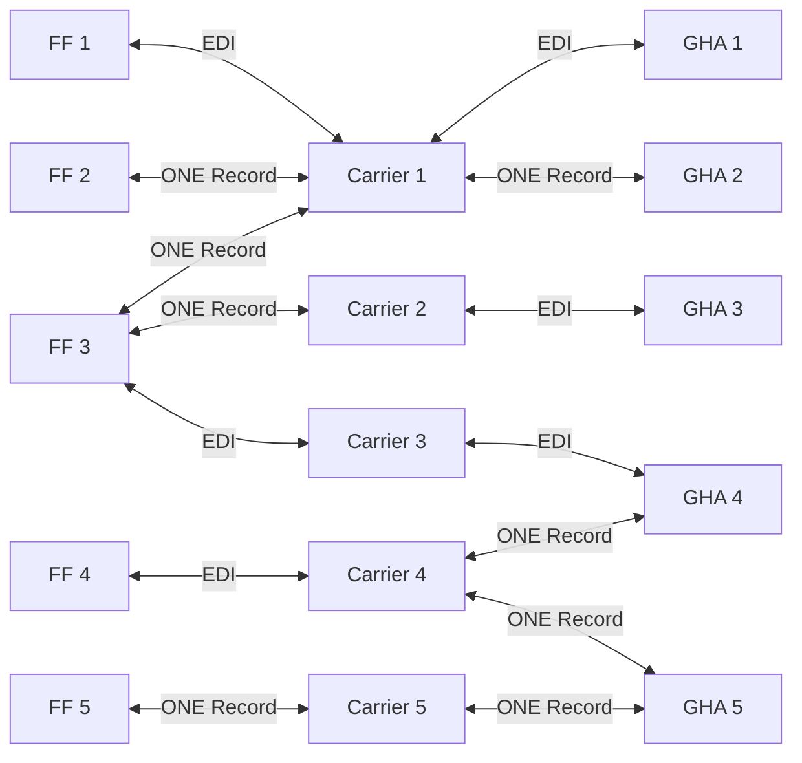
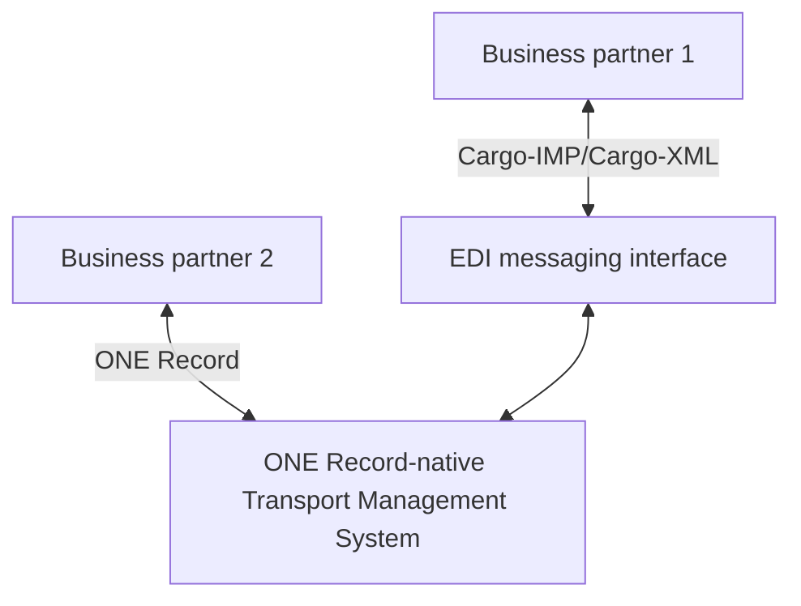
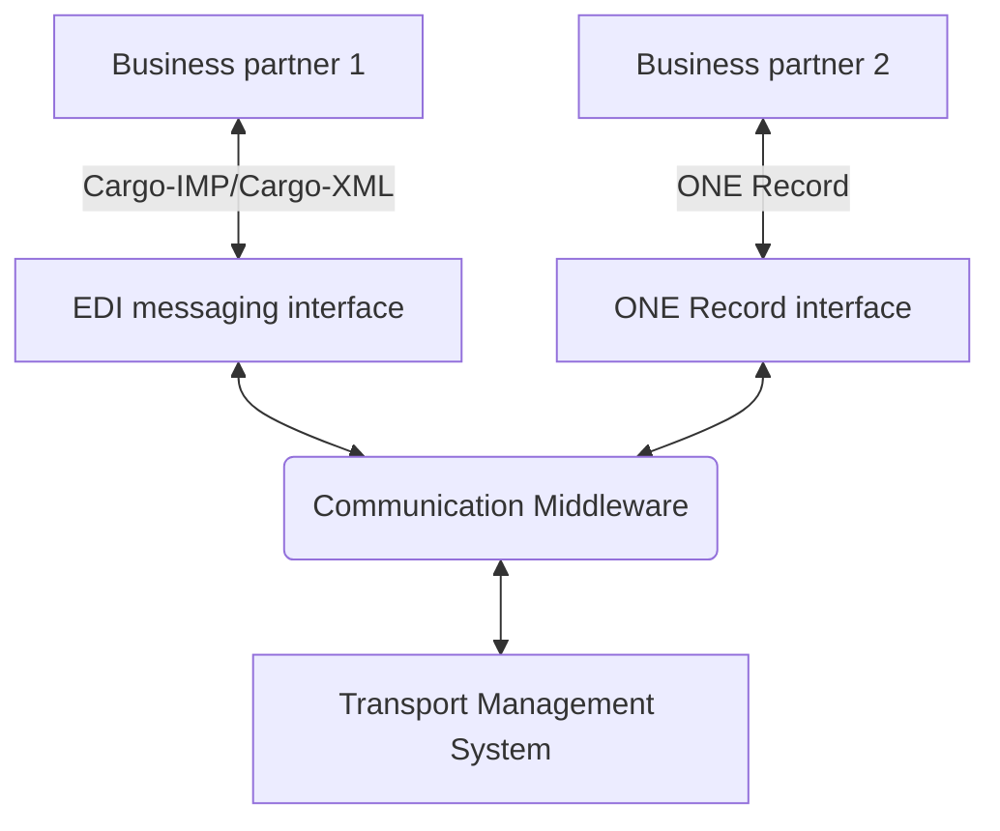
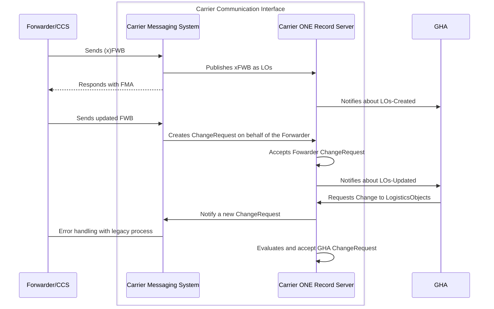

!!! note
    This page is a Draft and it's not approved by the COTB

Accepting the coexistence and integration of various communication channels between stakeholders along the supply chain, 
this section provides an overview of integrating legacy EDI messages (e.g., Cargo-IMP / Cargo-XML) and ONE Record Web APIs.

While both technologies offer data exchange capabilities, APIs and EDI operate quite differently. 
However, by adopting a data-centric approach, companies can effectively integrate ONE Record with legacy EDI messaging systems. 
This enables efficient data exchange and collaboration not only in the air cargo industry but along the global supply chain.

This document does not delve into the specifics of information mapping between the various standards, nor does it compare the benefits and limitations of each technology. 
Instead, we exemplify the communication of stakeholders - airlines, freight forwarders, and ground handling agents - 
via legacy EDI messaging systems and ONE Record Web APIs with a high-level architecture.

## Electronic Data Interchange (EDI) and Cargo-IMP/Cargo-XML

Electronic Data Interchange (EDI) is the electronic exchange of business documents between trading partners using a standardized format. 
EDI facilitates the automated exchange of information, such as purchase orders, invoices, and shipping notices, streamlining business processes and reducing manual data entry.

In the air cargo industry, EDI messaging systems are employed to exchange information among stakeholders, including airlines, freight forwarders, and ground handling agents. 
These systems define standards for message formats and data elements to facilitate seamless data exchange.

Two common EDI standards in the air cargo industry are Cargo-IMP and Cargo-XML:

- **Cargo-IMP** (Cargo Interchange Message Procedures): An older standard for EDI messages in air freight, defining a series of message formats and data elements for electronic data interchange.
- **Cargo-XML**: A newer standard based on XML, designed to replace Cargo-IMP. Cargo-XML is more flexible and extensible, supporting a wider range of data elements and overcoming limitations of Cargo-IMP, such as size constraints, character sets, and data types.

In general, EDI messaging systems and ONE Record both serve as data exchange standards in the air cargo industry, but they differ significantly in structure, format, and approach to data exchange.

**EDI Messaging Systems:** EDI is based on a set of standards that define the structure and format of messages exchanged between trading partners. 
These standards are typically industry-specific and are designed to facilitate the electronic exchange of business documents. 
EDI systems follow a document-centric approach and typically operate on a data-pushing model, where messages are sent (pushed) to trading partners.
In most cases, the message itself contains the business documents, such as purchase orders, invoices, and shipping notices.

**ONE Record:** ONE Record serves as a data-sharing standard, establishing a unified view of shipments through a singular record and a single source of truth (SOT). 
This standard outlines a common, extensible data model for the exchange of information, which is facilitated by standardized and secure web APIs. 
Unlike EDI, ONE Record operates on a data-centric approach and follows a data-sharing model, where information is accessed and shared as needed.
In many scenarions, so called ONE Record Notifiactions are sent, informing the data consumer that data is available has been changed and notify about the location of the data.
(cf. [Notifications](./../notifications.md))

**Key Differences**

- **Document-Centric vs. Data-Centric:** EDI systems are document-centric, focusing on the exchange of structured documents. In contrast, ONE Record is data-centric, focusing on the seamless sharing of single data objects with properties and are linked each other.
- **Data Pushing vs. Data Sharing:** EDI relies on pushing data through messages to trading partners, while ONE Record promotes sharing data via web APIs, enabling real-time access and updates.

This distinction is crucial when considering the integration of ONE Record with EDI messaging systems. Understanding these differences ensures a more effective integration, leveraging the strengths of both approaches.

## Integration Alternatives

The integration of ONE Record with EDI messaging systems can be approached in various ways, depending on the specific requirements of the stakeholders involved. The following scenarios outline potential integration approaches:

1. **Legacy Integration**: In this scenario, both the forwarder and the airline rely on legacy EDI messaging systems. There is no integration with ONE Record, and communication is solely based on existing EDI standards.

2. **ONE Record Integration**: In this scenario, ONE Record integrates with legacy EDI messaging systems. The airline and the forwarder use the ONE Record API to communicate with each other.

3. **Hybrid Integration**: In this scenario, a combination of ONE Record and legacy EDI messaging systems is used. For example, the forwarder may use ONE Record to communicate with the airline, while the airline communicates with the ground handling agent (GHA) using legacy EDI messaging systems. This might be the most common scenario in the air cargo industry for the next years.

The following tables present a list of possible scenarios and the corresponding approaches:

| **Scenario** | **Forwarder** | **Airline** | **GHA**    | **Approach**                                                                                                                                                                       |
| ------------ | ------------- | ----------- | ---------- | ---------------------------------------------------------------------------------------------------------------------------------------------------------------------------------- |
| 1            | ONE Record    | Legacy      | Legacy     | 100% legacy                                                                                                                                                                        |
| 2            | Legacy        | ONE Record  | Legacy     | 100% legacy                                                                                                                                                                        |
| 3            | Legacy        | Legacy      | ONE Record | 100% legacy                                                                                                                                                                        |
| 4            | ONE Record    | ONE Record  | Legacy     | ONE Record between FF and Airline, then downgrade to EDI for GHA.                                                                                                                  |
| 5            | Legacy        | ONE Record  | ONE Record | ONE Record possible only with GHA. Airline upgrades from EDI to ONE Record.                                                                                                        |
| 6            | ONE Record    | Legacy      | ONE Record | Legacy between Airline and GHA; Data exchange between FF and GHA might possible using ONE Record (e.g. via physicalQR-labels), but can bring problems due to Airline´s constrains. |

The following visualizaion shows the various data exchange scenarios examplified by the integration of 
Freight Forwarders (FF), Carrier (Airline) and Ground Handling Agents (GHA) using EDI and ONE Record.

| Freight Forwarder | Capability       | Carrier   | Capability       | GHA   | Capability       |
| ----------------- | ---------------- | --------- | ---------------- | ----- | ---------------- |
| FF 1              | EDI              | Carrier 1 | EDI + ONE Record | GHA 1 | EDI              |
| FF 2              | ONE Record       | Carrier 2 | EDI + ONE Record | GHA 2 | ONE Record       |
| FF 3              | EDI + ONE Record | Carrier 3 | EDI              | GHA 3 | EDI              |
| FF 4              | EDI              | Carrier 4 | EDI + ONE Record | GHA 4 | EDI + ONE Record |
| FF 5              | ONE Record       | Carrier 5 | ONE Record       | GHA 5 | ONE Record       |

## Implementation Approaches

The integration of ONE Record with EDI messaging systems can be implemented using various approaches, depending on the specific requirements of the stakeholders involved. 
The following implementation approaches outline potential strategies for integrating ONE Record with EDI messaging systems:

**Native ONE Record Support**: In this approach, ONE Record is integrated directly with the Transport Management System / Cargo Handling Information System. 
This approach eliminates the need for a middleware connector and streamlines the integration process.

The Transport Management System is extended to support the ONE Record standard natively. 
This approach eliminates the need for a middleware connector and streamlines the integration process.

**Middleware Integration**: In this approach, middleware platforms are used to integrate ONE Record with EDI messaging systems. These platforms provide data transformation, routing, and orchestration capabilities to facilitate seamless data exchange between the systems.

!!! info "Middleware/Mediator Design Pattern"
    The middleware/mediator design pattern is a software architectural pattern that provides a centralized mechanism to facilitate communication and manage interactions between multiple components or systems. Instead of components communicating directly with each other, they communicate through the mediator, which coordinates the interactions and ensures that components remain loosely coupled. This pattern is particularly useful in scenarios where complex interactions need to be managed and where reducing direct dependencies between components enhances modularity and maintainability.

    **Key Characteristics:**

    - Centralized Communication: All interactions between components are routed through the mediator, simplifying the communication process.
    - Loose Coupling: Components do not need to be aware of each other; they only need to know the mediator. This reduces dependencies and enhances flexibility.
    - Simplified Interactions: The mediator encapsulates the logic for communication and coordination, making the system easier to manage and modify.
    - Enhanced Scalability: Adding or removing components becomes easier as changes are managed through the mediator rather than through multiple direct connections.
     
    **Applications:**

    - Integration Systems: Facilitating communication between different systems or services (e.g., integrating EDI messaging systems with ONE Record).
    - UI Components: Managing interactions between various user interface elements.
    - Event Handling: Centralizing event management in applications with complex event interactions.
    
    By employing the middleware/mediator design pattern, systems can achieve better organization, reduced complexity, and improved maintainability.

The communication layer that already exists in the EDI messaging system is extended to support the integration of ONE Record.
The logic to interact is abstracted in a Communication Middleware. This middleware is responsible for handling the communication between the EDI messaging system and the ONE Record server.

## Example: Interaction in hybrid scenario

The following sequence diagram represent an example of communication in case of scenario 5 of the previous table, i.e.
we consider a scenario where an airline, adopting the ONE Record standard, seeks to communicate with a forwarder still reliant on EDI messaging systems. 

The central component of the architecture is the carrier communication interface that serves as a bridge between the ONE Record server and the EDI messaging system. 
The connector is responsible for translating data between the ONE Record data model and the EDI message format, ensuring seamless data exchange between the systems.

For the sake of simplicity, we assume that the airline establishes a connector for each third-party company seeking to connect with EDI messages. 
However, it is also possible and more efficient to use a single reusable/configurable connector component.

The communication interface provides the following capabilities:

**Receive EDI Messages:**   
   
- Create logistics objects (`createLogisticsObject`)
- Update logistics objects (`createChangeRequest`)     
- Create logistics events (`createLogisticsEvent`)

**Receive ONE Record Notifications:**

 - Retrieve logistics objects (`getLogisticsObject`)
 - Generate corresponding EDI messages

From the ONE Record perspective, the connector acts as a proxy for the third-party company, representing it within the ONE Record network by executing ONE Record API calls based on the received EDI messages.

From the EDI perspective, the connector represents the airline's EDI message endpoint, triggered by notifications from the airline's ONE Record server.

This setup ensures efficient and seamless data exchange between ONE Record and EDI messaging systems, maintaining compatibility with legacy systems while leveraging modern data standards. 
By implementing a versatile connector capable of managing multiple connections, the integration process becomes more scalable and flexible, accommodating evolving business needs.

The following sequence diagram illustrates the interaction between the forwarder, carrier communication interface, carrier messaging system, ONE Record server, and ground handling agent in a hybrid scenario.

## Implementation Guidelines

When integrating ONE Record with EDI messaging systems, several guidelines should be considered to ensure a successful integration.

### Single Source of Truth (SOT)

A key consideration when integrating ONE Record with EDI messaging systems is maintaining a Single Source of Truth (SOT).

SOT is a fundamental principle in data exchange via ONE Record, stating that every data object should exist only once within the ONE Record data network. 
This ensures data consistency, accuracy, and integrity across the system.

In cases where the original data source is not available within ONE Record, the necessary data should be retrieved from EDI messaging systems. 
This data must then be hosted and published as soon as possible by other ONE Record-ready parties to maintain the SOT principle.

### Best Practices

When integrating ONE Record with EDI messaging systems, consider the following best practices and integration considerations to ensure a seamless and efficient data exchange process:

1. **Understand the Differences**: Recognize the distinctions between the document-centric approach of EDI systems and the data-centric approach of ONE Record. This understanding is crucial for effective integration.

2. **Mapping Data Elements**: Develop a comprehensive mapping of data elements between EDI message formats (Cargo-IMP/Cargo-XML) and the ONE Record data model. Ensure all necessary data is accurately translated between the two systems to maintain data consistency and integrity.

3. **Message Transformation**: Implement message transformation mechanisms to convert data between the ONE Record data model and the EDI message format. These mechanisms facilitate the exchange of information and ensure accurate data representation.

4. **Leverage Web APIs**: Utilize ONE Record's standardized and secure web APIs to facilitate data exchange. Ensure your systems can interact with these APIs efficiently and effectively.

5. **Ensure Data Consistency**: Implement validation checks, error handling procedures, and regular data reconciliation to maintain data consistency and accuracy during the exchange process.

6. **Security Measures**: Prioritize data security during integration. Use encryption, secure authentication methods, and other best practices to protect sensitive information exchanged between systems. Secure communication channels, data encryption, and access control mechanisms are essential to safeguard data.

7. **Compliance**: Ensure compliance with industry standards and regulations. Adherence to relevant standards and guidelines is critical for seamless integration and maintaining industry best practices.

8. **Scalability and Flexibility**: Design the integration with scalability and flexibility in mind. The system should accommodate future growth and changes in business needs without requiring significant rework.

9. **Interoperability**: Ensure interoperability between ONE Record and EDI messaging systems. Effective communication and data exchange without loss or corruption are essential for successful integration.

10. **Monitoring and Logging**: Implement monitoring and logging mechanisms to track data exchange between ONE Record and EDI messaging systems. These mechanisms provide visibility into the data flow and help identify and resolve issues promptly.

11. **Performance**: Consider performance aspects to ensure efficient and timely data exchange. Maintaining operational efficiency and meeting business requirements depends on the performance of the integration.

12. **Testing**: Conduct comprehensive testing of the integration between ONE Record and EDI messaging systems. Testing should cover data mapping, message transformation, error handling, security, compliance, scalability, interoperability, monitoring, and performance to ensure a robust integration solution.

By following these best practices and addressing these integration considerations, organizations can achieve a seamless integration of EDI messaging systems with the ONE Record WebAPI, enhancing data exchange efficiency and accuracy in the air cargo industry.