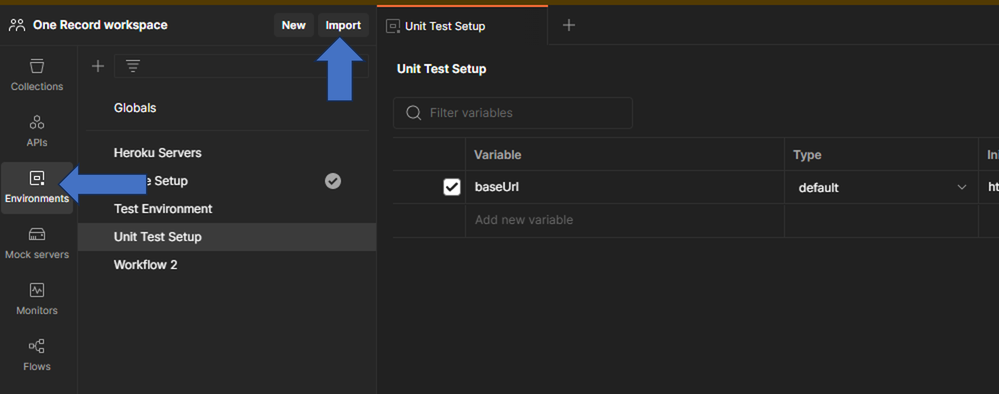
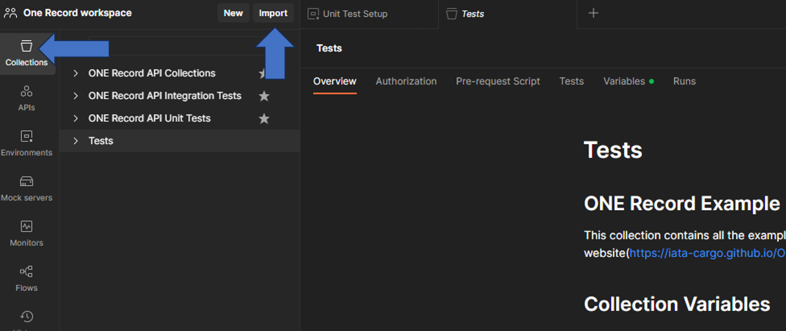
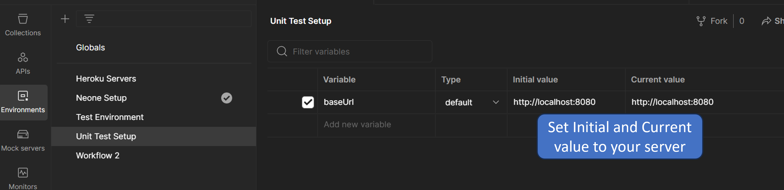
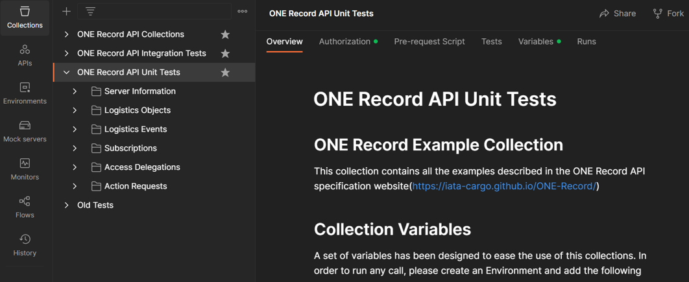
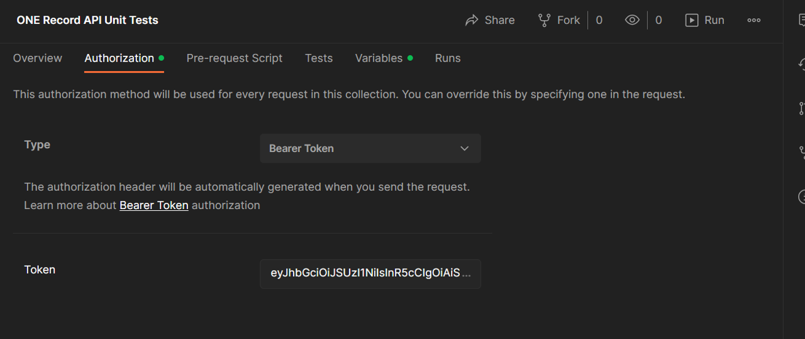

# ONE Record API Unit Test suite

ONE Record is the new IATA standard for data sharing and creates a single record view of the shipment.

The ONE Record standard is highly technical and there is a risk that different parties interpret the specifications differently, which would lead to data quality issues and disruption of connectivity between different network players. 

Due to this rationale, we construct a unit test suite with the aim of verifying that any implementation aligns with the API specifications.
The unit test suite is freely available for self testing and can be run locally using Postman or any software compatible with Postman collections.

## Suite structure

The Unit Test suite is divided in several sections:

- Server Information

- Logistics Objects

- Logistics Events

- Subscriptions

- Access Delegations

- Action Requests

Every section is crafted to assess a distinct segment of the ONE Record API, operating autonomously from the other sections. Within each section, calls must be carried out sequentially. For instance, within the Logistics Events section, the prerequisite folder generates all necessary logistics objects for the test. The Create folder performs tests related to the creation of Logistics Events, while the Get folder attempts to fetch the Logistics Events generated by the preceding calls.

## How to run the Unit Tests suite

As a prerequisite for utilizing the Unit Test suite, it is necessary to install Postman or a compatible software.
Once Postman is installed, please adhere to the subsequent steps to execute the Unit Tests suite.

- [Download the Postman Collection here.](../assets/unit-tests/1R_Unit_Tests.postman_collection) 

- [Download the Postman Environment here](../assets/unit-tests/Unit_Test_Setup.postman_environment)  

- Import the Unit Test Step Environment in Postman

- Import the Collection in Postman

- Navigate to the Environments tab, choose the **Unit Test Setup** environment, and configure the baseUrl to point to the API server under test.

- Access the Collections in the right menu and open the previously imported **ONE Record API Unit Tests** collection.

- Utilize the Authorization tab to configure the authorization method implemented in your server.

- Once the authorization is configured, you have the option to either execute the calls individually or employ the Collection Run feature. 

Each call comprises a set of tests that will be applied to both the response payload and response headers during execution. It's crucial to emphasize that the presentation of test results may vary depending on the tool being used.

In case of issues with the Unit Test Suite, please contact the IATA Digital Cargo team (see [Community page](../community.md)).