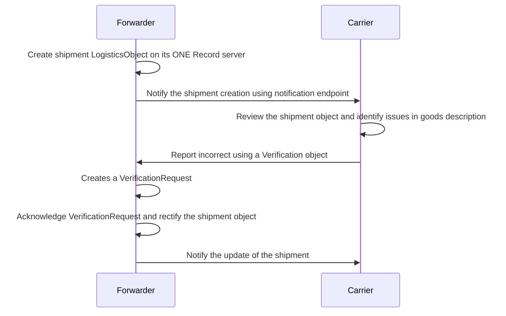
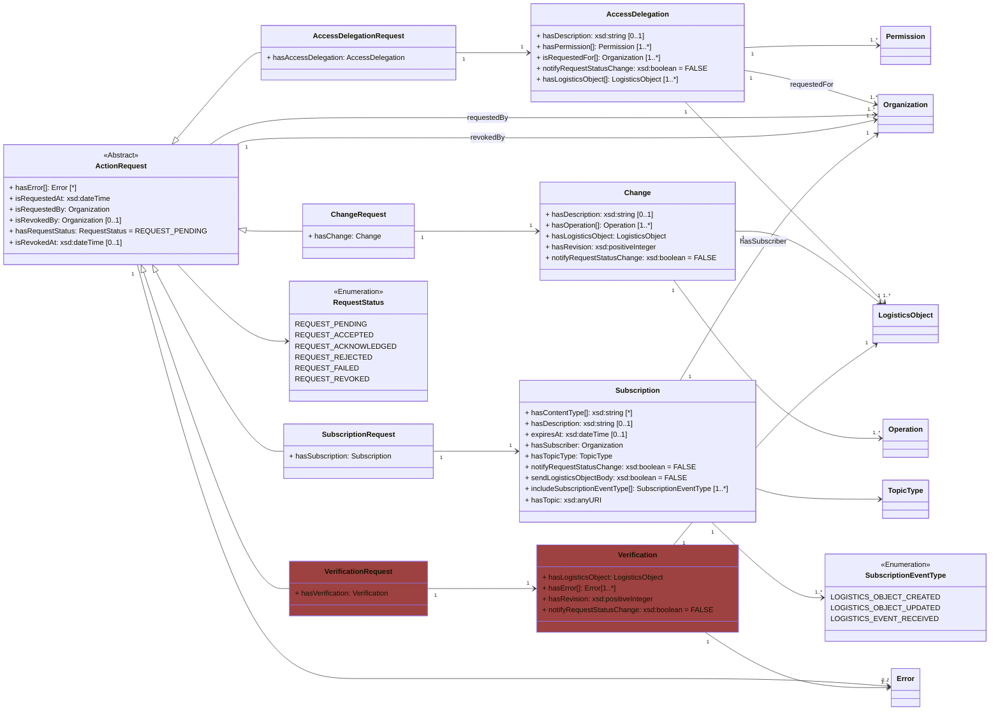
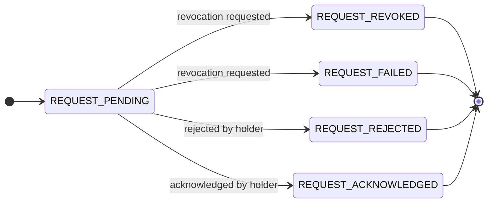

!!! note
    This page is a Draft and it's not approved by the COTB

Presently, the ONE Record standard enables third parties to suggest modifications to specific properties within logistics objects ([See Update a Logistics Object](https://iata-cargo.github.io/ONE-Record/logistics-objects/#update-a-logistics-object)). However, when it comes to flagging anomalies or errors within these objects, the update procedure is inadequate. For this specific use case, the ONE Record standard outlines a procedure known as the **Verification Request**.


## Error Handling with Verification Request

The following diagram illustrates a basic data exchange process between a forwarder and a carrier, focusing on error handling using **Verification Request**. The forwarder creates a shipment logistics object and notifies the carrier. Upon receiving the shipment, the carrier identifies any discrepancies in the goods description and reports these issues back to the forwarder using by sending a [Verification](https://onerecord.iata.org/ns/api#Verification)  object. The forwarder creates a [Verification Request](https://onerecord.iata.org/ns/api#VerificationRequest) linking the [Verification](https://onerecord.iata.org/ns/api#Verification) object sent by the carrier. Depending on the case, the forwarder acknowledges or rejects the Verification Request.



## Verification Request object

The [Verification Request](https://onerecord.iata.org/ns/api#VerificationRequest) is a subclass of the [Action Request](https://onerecord.iata.org/ns/api#ActionRequest), inheriting all properties except for *hasVerification*, which connects to the [Verification](https://onerecord.iata.org/ns/api#Verification) object.\


## Verification object

The [Verification](https://onerecord.iata.org/ns/api#Verification) contains details regarding anomalies detected within a particular Logistics Object.
It has four properties:
	- *hasError*
	- *hasLogisticsObject*
	- *hasRevision*
	- *notifyRequestStatusChange*

The *hasLogisticsObject* and the *hasRevision* allows the party to target a specific version of a logistics object while the *hasError* is an array of *Error* objects. As in all other Action Requests, *notifyRequestStatusChange* allows to receive notification on status change.

Each issue or anomaly on a specific logistics object will be incapsulated into a [Error](https://onerecord.iata.org/ns/api#Error) object which contains two attributes: *HasTitle* and *HasErrorDetail*. Should users need to convey a specific message, indicate a particular property, or transmit an error code, they can utilize the [ErrorDetail](https://onerecord.iata.org/ns/api#ErrorDetail) object for this purpose.

## Verification and Verification Request data model

[Verification](https://onerecord.iata.org/ns/api#Verification) and [Verification Request](https://onerecord.iata.org/ns/api#VerificationRequest) are data classes of the [ONE Record API ontology](assets/ONE-Record-API-Ontology.ttl).
The properties and relationships to other data classes are visualized in the following class diagram.



## Verification Request State Diagram: 




 - REQUEST_ACKNOWLEDGED : The holder acknowledges receipt of a Verification from a third party.
 - REQUEST_FAILED: A Verification has been assigned to a prior version of the logistics object, or the properties requiring verification are absent.
 - REQUEST_REVOKED: The third party who initiated the Verification chooses to withdraw the request.
 - REQUEST_REJECTED: The holder of the logistics object discard the Verification.


## Post a Verification

### EndPoint

``` 
POST {{baseURL}}/logistics-objects/{{logisticsObjectId}}
``` 

### Request

The following HTTP header parameters MUST be present in the POST request:

| Request Header   | Description                  | Examples            |
| ---------------- |  -------------------------- | ------------------- |
| **Accept**       | The content type that you want the HTTP response to be formatted in. | application/ld+json |
| **Content-Type** | The content type that is contained with the HTTP body.               | application/ld+json |

The HTTP request body must contain a valid [Verification](https://onerecord.iata.org/ns/api#Verification) object in the format as specified by the Content-Type in the header.

### Response

A successful request MUST return a ``HTTP/1.1 201 Created` status code and the following HTTP headers parameters MUST be present in the response:

| Header | Description                 | Example                |
| -------------------- |  ----- |   -------------------------------- |
| **Location**         | The URI of the newly created VerificationRequest | https://1r.example.com/action-requests/6b948f9b-b812-46ed-be39-4501453da99b |
| **Type**             | The type of the newly created resource as a URI | https://onerecord.iata.org/ns/api#VerificationRequest |

Otherwise, an `Error` object with `ErrorDetail` as response body MUST be returned with the following HTTP headers:

| Header | Description                     | Example             |
| -------------------- |  ----------------------------- | ------------------- |
| **Content-Type**     | The content type that is contained with the HTTP body.                  | application/ld+json |
| **Content-Language** | Describes the language(s) for which the requested resource is intended. | en-US               |

The following HTTP status codes MUST be supported:

| Code    | Description | Response body    |
| ------- | ----------- | ---------------- |
| **201** | The change request was correctly created | No body required |
| **400** | The verification request body is invalid                             | Error            |
| **401** | Not authenticated                          | Error            |
| **403** | Not authorized to update the Logistics Object                  | Error            |
| **404** | Logistics Object not found                 | Error            |
| **415** | Unsupported Content Type, response when the client sends a POST document format that the server does not support for the resource identified by the Request-URI.  | Error            |
| **422** | Unprocessable request, when the server understands the POST document and the syntax of the POST document appears to be valid, but the server is incapable of processing the request. | Error            |


## Security

To engage with the "Verification" endpoint, a client needs proper authentication. If requests lack proper authentication, the ONE Record server should respond with a `401 "Not Authenticated"` status.

## Examples A1: 

A carrier identifies an issue on a Piece with the URI https://1r.example.com/logistics-objects/1a8ded38-1804-467c-a369-81a411416b7c

Request: 

```http
POST /logistics-objects/1a8ded38-1804-467c-a369-81a411416b7c HTTP/1.1
Host: 1r.example.com
Content-Type: application/ld+json; version=2.0.0-dev
Accept: application/ld+json; version=2.0.0-dev

--8<-- "API-Security/examples/Verification.json"
```
_([Verification.json](./examples/Verification.json))_

Response:
```bash
HTTP/1.1 201 Created
Location: https://1r.example.com/action-requests/e4cf1ea5-96fc-4025-be21-159b779e3200
Content-Type: application/ld+json; version=2.0.0-dev
Type: https://onerecord.iata.org/ns/api#VerificationRequest
```

The response server replies with the *location* of a Verification Request which is built as following:

```http

--8<-- "API-Security/examples/VerificationRequest.json"
```
_([VerificationRequest.json](./examples/VerificationRequest.json))_


## Audit Trail update (under discussion)

All **Verification Requests** objects should be saved into the audit trail together with the **Change Requests** objects. For this reason the *hasChangeRequest* in the audit trail should be renamed into *hasActionRequest* and it should contains both **Verification Requests** and **Change Requests**.


## ChangeRequest update (under discussion)

In order to link a VerificationRequest with a ChangeRequest we would like to add a new optional parameter in the Change objected :
- *hasVerificationRequest* : link to the VerificationRequest that induced the change.


