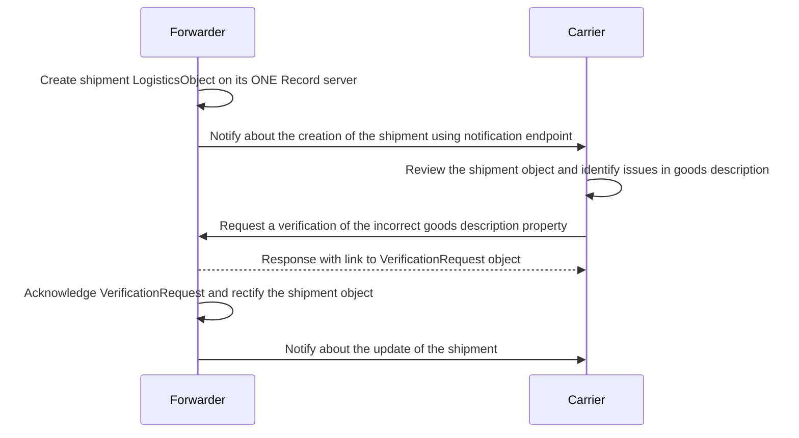
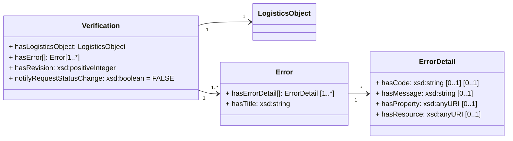

!!! note
    This page is a Draft and it's not approved by the COTB

In addition to allowing third parties to propose modifications to specific properties of a LogisticsObject 
([See Update a Logistics Object](https://iata-cargo.github.io/ONE-Record/logistics-objects/#update-a-logistics-object)), 
the ONE Record standard provides a solution for flagging anomalies, missing properties, or errors within these objects 
through a procedure called `VerificationRequest`.


**Error Handling with Verification Request**

The following diagram illustrates a basic data exchange process between a forwarder and a carrier, focusing on error handling using a **Verification Request**. 
The forwarder creates a [LogisticsObject](https://onerecord.iata.org/ns/cargo#LogisticsObject) of type [Shipment](https://onerecord.iata.org/ns/cargo#Shipment) and 
notifies the carrier. Upon receiving the shipment, the carrier identifies any discrepancies in the goods description and reports these issues back to the forwarder 
using by sending a [Verification](https://onerecord.iata.org/ns/api#Verification)  object. The forwarder creates a 
[VerificationRequest](https://onerecord.iata.org/ns/api#VerificationRequest) linking the [Verification](https://onerecord.iata.org/ns/api#Verification) object sent 
by the carrier. Depending on the case, the forwarder acknowledges or rejects the Verification Request.



**Guidelines for Verifications in ONE Record:**

- The *hasLogisticsObject* and the *hasRevision* allows the party to target a specific version of a logistics object
- The *hasError* property is an array of *Error* objects. As in all other Action Requests, *notifyRequestStatusChange* allows to receive notification on status change.
- Each issue or anomaly on a specific logistics object will be incapsulated into a [Error](https://onerecord.iata.org/ns/api#Error) object which contains two attributes: *HasTitle* and *HasErrorDetail*. 
- Should users need to convey a specific message, indicate a particular property, or transmit an error code, they can utilize the [ErrorDetail](https://onerecord.iata.org/ns/api#ErrorDetail) object for this purpose.

# Request a Verification

## Endpoint

``` 
POST {{baseURL}}/logistics-objects/{{logisticsObjectId}}
``` 

## Request

The following HTTP header parameters MUST be present in the POST request:

| Request Header   | Description                  | Examples            |
| ---------------- |  -------------------------- | ------------------- |
| **Accept**       | The content type that you want the HTTP response to be formatted in. | application/ld+json |
| **Content-Type** | The content type that is contained with the HTTP body.               | application/ld+json |

The HTTP request body must contain a valid [Verification](https://onerecord.iata.org/ns/api#Verification) object in the format as specified by the Content-Type in the header.

The [Verification](https://onerecord.iata.org/ns/api#Verification) is a data classes of the [ONE Record API ontology](assets/ONE-Record-API-Ontology.ttl).
The properties and relationships to other data classes are visualized in the following class diagram.



## Response

A successful request MUST return a ``HTTP/1.1 201 Created` status code and the following HTTP headers parameters MUST be present in the response:

| Header | Description                 | Example                |
| -------------------- |  ----- |   -------------------------------- |
| **Location**         | The URI of the newly created VerificationRequest | https://1r.example.com/action-requests/6b948f9b-b812-46ed-be39-4501453da99b |
| **Type**             | The type of the newly created resource as a URI | https://onerecord.iata.org/ns/api#VerificationRequest |

Otherwise, an `Error` object with `ErrorDetail` as response body MUST be returned with the following HTTP headers:

| Header | Description                     | Example             |
| -------------------- |  ----------------------------- | ------------------- |
| **Content-Type**     | The content type that is contained with the HTTP body.                  | application/ld+json |
| **Content-Language** | Describes the language(s) for which the requested resource is intended. | en-US               |

The following HTTP status codes MUST be supported:

| Code    | Description | Response body    |
| ------- | ----------- | ---------------- |
| **201** | The change request was correctly created | No body required |
| **400** | The verification request body is invalid                             | Error            |
| **401** | Not authenticated                          | Error            |
| **403** | Not authorized to update the Logistics Object                  | Error            |
| **404** | Logistics Object not found                 | Error            |
| **415** | Unsupported Content Type, response when the client sends a POST document format that the server does not support for the resource identified by the Request-URI.  | Error            |
| **422** | Unprocessable request, when the server understands the POST document and the syntax of the POST document appears to be valid, but the server is incapable of processing the request. | Error            |


## Security

To engage with the "Verification" endpoint, a client needs proper authentication. If requests lack proper authentication, the ONE Record server should respond with a `401 "Not Authenticated"` status.

## Example A1

A carrier identifies an issue on a Piece with the URI https://1r.example.com/logistics-objects/1a8ded38-1804-467c-a369-81a411416b7c

Request: 

```http
POST /logistics-objects/1a8ded38-1804-467c-a369-81a411416b7c HTTP/1.1
Host: 1r.example.com
Content-Type: application/ld+json; version=2.1.0
Accept: application/ld+json; version=2.1.0

--8<-- "API-Security/examples/Verification.json"
```
_([Verification.json](./examples/Verification.json))_

Response:
```bash
HTTP/1.1 201 Created
Location: https://1r.example.com/action-requests/e4cf1ea5-96fc-4025-be21-159b779e3200
Content-Type: application/ld+json; version=2.1.0
Type: https://onerecord.iata.org/ns/api#VerificationRequest
```

see also [Example A2 in Action Requests](./action-requests.md#example-a2) for an example of a Verification Request.


# VerificationRequest in Audit Trail 

To ensure full transparency, all [VerificationRequest](https://onerecord.iata.org/ns/api#VerificationRequest) objects MUST be linked in the [AuditTrail](https://onerecord.iata.org/ns/api#AuditTrail) under the *hasActionRequest* object property.


# Link a VerificationRequest within a Change

To reference a [VerificationRequest](https://onerecord.iata.org/ns/api#VerificationRequest) while requesting a Change (see [Update a Logistics Object](./logistics-objects.md#update-a-logistics-object), the party can use the optional property *hasVerificationRequest* present in the [Change](https://onerecord.iata.org/ns/api#Change) object.


