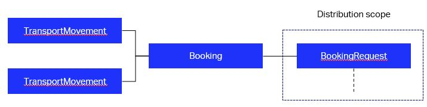
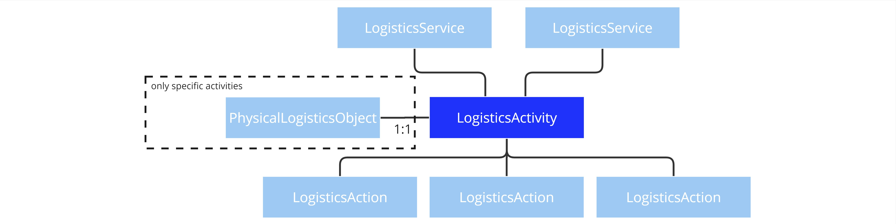
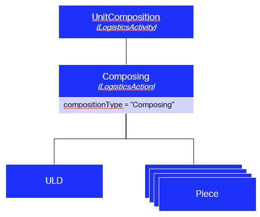
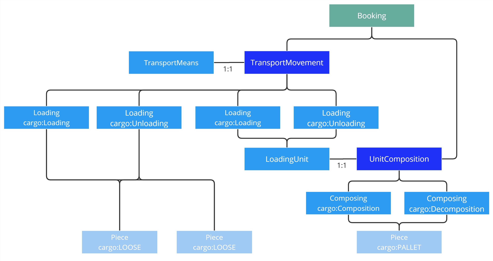

ONE Record data model 3.0 introduced an activity model. It is built on the superclasses [LogisticsService](https://onerecord.iata.org/ns/cargo#LogisticsService), [LogisticsActivity](https://onerecord.iata.org/ns/cargo#LogisticsActivity), [LogisticsAction](https://onerecord.iata.org/ns/cargo#LogisticsAction), and [PhysicalLogisticsObject](https://onerecord.iata.org/ns/cargo#PhysicalLogisticsObject).
The activity model is developed based the design principles Single Source of Truth and Physics-orientation. Further emphasis lays on practicality over abstractation.
This page details the core concepts including examples.

# LogisticsServices

A `LogisticsService` (a subtype of `LogisticsObject`) describes a set of scheduled and sequenced `LogisticsActivities` provided by one party to another.

The properties are described [here](https://onerecord.iata.org/ns/cargo#LogisticsService).

<figure markdown>
  
  <figcaption>LogisticsService and connected objects</figcaption>
</figure>

## Booking

`Booking` is the first and main `LogisticsService` in Air Cargo context. It represents the Transportation service between a carrier and its customer (usually the Freight forwarder) and is the main outcome of Distribution scope.

The main `LogisticsActivity` linked to the `Booking` will be the `TransportMovement`(s) representing the flight legs and potential truck movements, warehouse movements or other kinds of movements.

<figure markdown>
  
  <figcaption>Booking object and connection to Distribution scope and TransportMovements</figcaption>
</figure>

# LogisticsActivities

A `LogisticsActivity` (a subtype of `LogisticsObject`) describes an activity or process state which is scheduled and executed by an orchestrating party.
It involves a set of dedicated tasks in the form of specific `LogisticsActions` to be performed on `PhysicalLogisticsObjects`.
Some activities are directly bound to a specific `PhysicalLogisticsObject`.
It can be part of one or multiple `LogisticsServices`.
It has an execution status that is actively maintained.

The properties are described [here](https://onerecord.iata.org/ns/cargo#LogisticsActivity).

<figure markdown>
  
  <figcaption>LogisticsActivity and connected objects</figcaption>
</figure>

## UnitComposition

An `UnitComposition` (a subtype of `LogisticsActivity`) describes the process state of a packed/loaded LoadingUnit (Container, ULD, Pallet, ...).
It requires a 1:1 connection to a `LoadingUnit` as long as its execution status is Active.
Composing (a `LogisticsAction`) is used to model the tasks of composing (cargo:Composition) or decomposing (cargo:Decomposition) Pieces for the UnitComposition.
An `UnitComposition` typically begins with a Composition at one location (eg. warehouse of origin) and ends with a Decomposition at another location (eg. warehouse of departure).

The properties are described [here](https://onerecord.iata.org/ns/cargo#UnitComposition).

<figure markdown>
  
  <figcaption>UnitComposition and connected objects</figcaption>
</figure>

The Buildup and Breakdown of a ULD will be represented by a `UnitComposition` activity and Composing/Decomposing actions that link the ULD and the Pieces.

<figure markdown>
  
  <figcaption>Buildup of a ULD using Composing action</figcaption>
</figure>

## TransportMovement

A `TransportMovement` (subtype of `LogisticsActivity`) describes a physical movement in which some object can be transported.
It is operated by a `Party` (Organization or a Person such as a Pilot or Driver) and uses a `TransportMeans` (Aircraft, Truck, ...).
It contains various information relevant to operations such as departure and arrival locations and `MovementTimes` that include Scheduled, Planned and Actual times.

The properties are described [here](https://onerecord.iata.org/ns/cargo#TransportMovement).

<figure markdown>
  
  <figcaption>TransportMovement</figcaption>
</figure>

## Storage

- TBD

# LogisticsActions

A `LogisticsAction` (a subtype of `LogisticsObject`) describes a specific task performed on one or a set of `PhysicalLogisticsObjects` in the context of a `LogisticsActivity`.
`LogisticsActions` serve the purpose of connecting different `PhysicalLogisticsObjects` to each other and to an `LogisticsActivity`.
It is set at a specific point in time. This can also be a time frame (start and end time). The time type can be either requested, planned or actual.

The properties are described [here](https://onerecord.iata.org/ns/cargo#LogisticsAction).

<figure markdown>
  
  <figcaption>LogisticsAction and connected objects</figcaption>
</figure>

## Composing

`Composing` action describes the operation of buildup and breakdown of a loading unit. Much common case in Air Cargo will be the buildup and breakdown of a ULD or a Pallet with some Pieces. It has then some restrictions on its properties as it needs to be linked to a `LoadingUnit` and some `Piece`(s) to be complete. a `LoadingMaterial` can be used as well to describe further what material has been used (e.g. Nets for pallets).

The properties are described [here](https://onerecord.iata.org/ns/cargo#Composing).

## Loading

`Loading` action describes et operation of loading and unloading `Piece`(s) or `LoadingUnit`(s) on a `LogisticsActivty` that is usually a `TransportMovement`.
It can be used for Load Planning when the `actionTimeType` is _planned_ or _requested_.

The properties are described [here](https://onerecord.iata.org/ns/cargo#Loading).

## Storing

- TBD

## Check

- TBD

# PhysicalLogisticsObjects

A `PhysicalLogisticsObject` (a subtype of `LogisticsObject`) is the digital twin of a physically distinguishable object in the air cargo supply chain.
It interacts with other `PhysicalLogisticsObjects` and `LogisticsActivities` through `LogisticsActions`.
Some `PhysicalLogisticsObjects` are directly connected to an `LogisticsActivity` describing its state.

The properties are described [here](https://onerecord.iata.org/ns/cargo#PhysicalLogisticsObject).

<figure markdown>
  
  <figcaption>PhysicalLogisticsObject and connected objects</figcaption>
</figure>

## Piece

A `Piece` (a subtype of `PhysicalLogisticsObject`) is the digital twin of a piece, or package in the air cargo supply chain. It can be described as a uniquely identified physical single unit which may form all or a part of a shipment.

## LoadingUnit

A `LoadingUnit` (a subtype of `PhysicalLogisticsObject`) is the digital twin of any Unit used to transport cargo. Most common cases in air cargo are the ULD (Unit Load Device) or Pallets that are used for consolidation and optimization of cargo space usage.

## TransportMeans

A `TransportMeans` (a subtype of `PhysicalLogisticsObject`) is the digital twin of any vehicle used for a `TransportMovement`. Most common cases in air cargo are aircrafts or trucks. They can alos represent forklifts if warehouse or ramp movements are considered.

# Examples

## Booking with 2 loose and 1 palletized pieces on one flight

<figure markdown>
  
  <figcaption>Booking with 2 loose and 1 palletized pieces on one flight</figcaption>
</figure>
