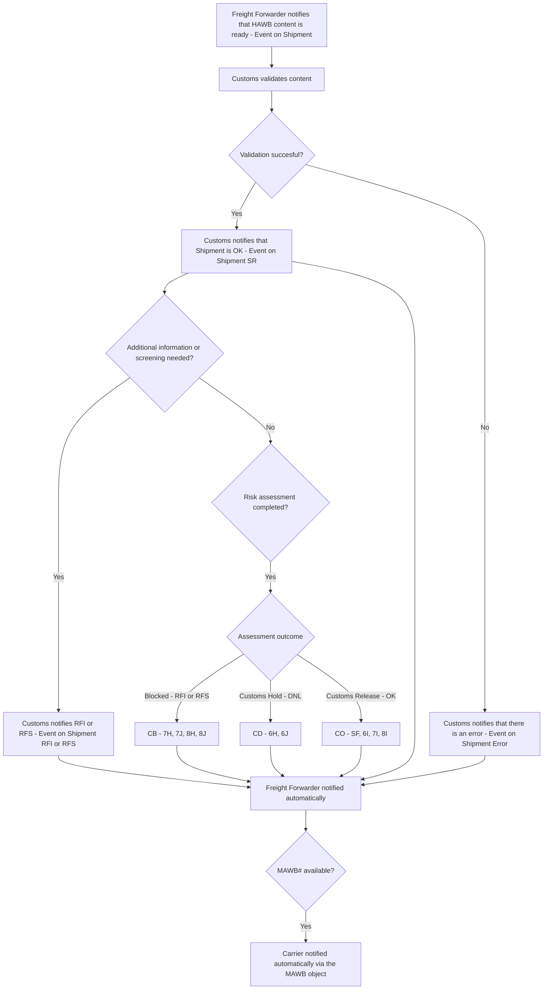

# PLACI programs

PreLoading Advance Cargo Information (PLACI) programs are being implemented throughout the world and impact operations of the industry stakeholders.

​IATA's Preloading Advance Cargo Information (PLACI) Guidelines provides harmonized and standardized procedures for advance cargo information filing in a unique, comprehensive manual. It enables users to improve procedural efficiency and empowers their compliance with the preloading advance cargo information regulatory requirements applicable in the United States, Europe, United Kingdom, United Arab Emirates and Canada.

Find out more on PLACI guidelines here: [https://www.iata.org/en/publications/manuals/placi-standard-procedures-for-preloading-advance-cargo-information](https://www.iata.org/en/publications/manuals/placi-standard-procedures-for-preloading-advance-cargo-information)

# PLACI and ONE Record

ONE Record as an IATA standard supports PLACI programs and aims to replace messaging standards to share relevant data with Customs and Authorities.

Business processes guidelines are detailed in the PLACI manual, the objective of this page is to give a version of the processes based on ONE Record.

## General comments applying to all processes

Current processes are based on messaging standards, more specifically on usage of XFWB, XFZB, XFHL and XCSN. These 4 messages provide details on the Master Waybill (XFWB), House Waybill (XFZB), the list of House contained within a Master (XFHL) and to convey details on Customs notifications (XCSN). In terms of data, ONE Record already has the capability to share all relevant information related to those 3 messages, what will differ is the way data is shared/exchanged.

1. **No OCI!** The OCI segment in CIMP and CXML standards is used to convey various Customs and Security information that are not included in the core of those messages. While we have kept a similar structure in ONE Record with the `CustomsInformation` object which is to be used for ONE Record <> CXML conversion only, it is not necessary for theses processes.

2.  PLACI processes we will mostly rely on the fact that **`Events`** can be used on different objects and that notifications can be automatically triggered to selected stakeholders.

3. It is considered that required information for PLACI purposes is already defined in ONE Record realm as House and Master Waybill data should already be recorded and shared between upstream stakeholders (Shipper, Freight Forwarder, Airline, GHA at least)

4. By design principle, the Freight Forwarder is the `Shipment` object owner (House and Master level). This means that any stakeholder that needs to create an `Event` will go through a Change Request (see ONE Record API Specifications for further explanations)

## Process #1: Freight forwarder filing pre-loading data for Consolidation shipment

Specificity of this process is that:
- Freight forwarder has an agreement with Airline to file data on its behalf.
- Data is filed at House level for consolidated shipment.

In this scenario, the Freight Forwarder notifies the Customs that data is ready to be processed via an Event on the Shipment object. Then based on Customs validation and risk assessment, different Events are added on the Shipment **by the Customs** via the Change Request mechanism.

If there is a MAWB number available, usually the Waybill objects of the House and the Master are already linked and the Airline can get notified automatically if Events are created.

## Process #2: Freight forwarder filing pre-loading data for non-consolidation shipment

Specificity of this process is that:
- Freight forwarder has an agreement with Airline to file data on its behalf.
- Data is filed at Master level.

In this scenario the mechanism is very similar, main difference is that information is shared on Master level. Notifications happen with the same mechanisms.

## Process #3: Associate Master with already filed HAWB

This process represents the scenario when House Waybill have been filed and the Freight Forwarder or the Airline provides sufficient information to Customs to make the link betweem House(s) and the Master.

With messaging standards, 2 scenarios are outlined based on XFZB update (addition of MAWB number) or XFHL (List of House(s) linked to one Master). 

With ONE Record, those messages are not necessary and updating the HAWB and/or MAWB objects should be sufficient. An Event on the Shipment or Waybill objects can also be used for more clarity.

We can have 4 different methods, or starting points for the process, depending on the stakeholder notifying the association of Master and House(s) or depending on the fact that the House or the Master is the starting point.

Below processes #3.1 and #3.3 can be equivalent to sending an update of XFZB while processes #3.2 and #3.4 are equivalent to generating and sending an XFHL message.

### Process #3.1: Freight forwarder updates HAWB with MAWB links
The Freight Forwarder updates HAWB objects by adding a link to the MAWB object. Customs get notified of the change OR and Event can be added on the HAWB to notify the association has been made.

### Process #3.2: Airline updates the HAWB with MAWB links
Difference with #3.1 is that the Airline initiates the change. A Change Request mechanism is started as the Freight Forwarder is the owner of the HAWB object. Once the HAWB objects are notified, process is the same to go through Customs.

### Process #3.3: Freight forwarder updates the MAWB with HAWB links
The Freight Forwarder updates the MAWB object with links to all HAWB objects. Customs get notified of the change OR and Event can be added on the MAWB to notify the association has been made.

### Process #3.4: Airline updates the MAWB with HAWB links
Difference with #3.1 is that the Airline initiates the change. A Change Request mechanism is started as the Freight Forwarder is the owner of the HAWB object. Once the HAWB objects are notified, process is the same to go through Customs.

## Process #4: Airline filing Pre-Loading data for Consolidation shipments

The process is overall similar to Process #1 except the MAWB number needs to be available for the Airline to initiate the process. 

Freight Forwarder is still the owner of HAWB and MAWB objects in ONE Record so all Events associated with any of these objects need to go through a Change Request.

As the Airline wants to notify Customs that HAWB data is ready for risk assessment, they create an Event on the House Shipment through a Change Request. Once the Event is created Customs are notified.

## Process #5: Airline filing Pre-Loading data for non-consolidation shipments

This process is overall similar to Process #2 except that the Airline initiates the process.

Freight Forwarder is still the owner of HAWB and MAWB objects in ONE Record so all Events associated with any of these objects need to go through a Change Request.

As the Airline wants to notify Customs that HAWB data is ready for risk assessment, they create an Event on the Master Shipment through a Change Request. Once the Event is created Customs are notified.

## Process #6: Airline filing Pre-Arrival data (including Pre-Loading data) at Pre-Loading

In this process the Airline transmits HAWB and MAWB data to Customs. First part of the process depicted below represents the assessment the Airline needs to make in order to share the right data to Customs. The second part of the process which is not depicted below is similar to previous processes where Customs validates data and provides the suitable status.

## Process #7: Customs status notification to Airline, Freight forwarder and Notify party

This process is based on usage of XCSN message towards the most relevant stakeholder (from Customs to Airline, Freight Forwarder or Notify party). 

With ONE Record the process is simplified as the Customs status is conveyed using an `Event` on the relevant `Shipment` object. By default the Freight forwader, owner of the `Shipment` object is notified and other stakeholders can be notified automatically according to chosen setup.

At the end of the process, action may be required depending on the Customs Status and who is the targeted stakeholder. Defining that in details requires identifying statuses and relevant actions.
