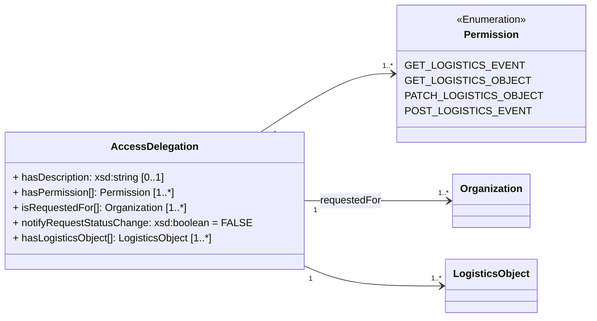

In ONE Record, parties can grant other parties access to their data (or parts of it). 
The ONE Record standard allows parties to change or revoke these access rights to their data whenever they wish.

Before an organization can access a LogisticsObject of another organization, it needs to be authorized to do so and the server that hosts the logistics objects will determine whether to grant access.
Typically, when an participant in the Internet of Logistics creates a LogisticsObject and makes it available via its ONE Record API, the IoL participant will share the URI of that LogisticsObject with another IoL participant and grant them access by default.

For example, a freight forwarder creates a [Shipment](https://onerecord.iata.org/ns/cargo#Shipment), grants read access to an airline, and then sends the URI of the Logistics Object via a ONE Record Notification or other channel to the airline.
At this point, only the forwarder and the airline can access this specific LogisticsObject, but no one else.

However, if a ground handling agent (GHA) also needs access to this logistics object, two options are considered in ONE Record:

1. the GHA MAY request the access delegation directly from the freight forwarder
2. the airline MAY request an access delegation for the GHA

If, as in this presented scenario, the airline already has a delegation of access to the logistics object, the concept of [Trust Chains](#trust-chains) takes effect.

!!! note
    The party granting access is referred to as the `Delegator` and the party receiving access is the `Delegate`. 
    The party requesting access is referred to as the `Requestor`.

**Guidelines for Access Delegations in ONE Record:**
- Only the Holder of a Logistics Object MAY delegate access to logistics objects.
- Any authenticated User of a Logistics Object CAN request a [AccessDelegation](https://onerecord.iata.org/ns/api#AccessDelegation) on a Logistics Object, which result in a [AccessDelegationRequest](https://onerecord.iata.org/ns/api#AccessDelegationRequest) with the status [REQUEST_PENDING](https://onerecord.iata.org/ns/api#REQUEST_PENDING).
- The implementer of the ONE record server MUST ensure that the requestor gets sufficient access to the resulting [AccessDelegationRequest](https://onerecord.iata.org/ns/api#AccessDelegationRequest) to query the status of the [AccessDelegationRequest](https://onerecord.iata.org/ns/api#AccessDelegationRequest) and revoke the [AccessDelegationRequest](https://onerecord.iata.org/ns/api#AccessDelegationRequest) (see also section on [revoking Action Requests](./action-requests.md#revoke-action-request)
- The Holder of a Logistics Object decides about the [AccessDelegationRequest](https://onerecord.iata.org/ns/api#AccessDelegationRequest) and changes the requestor's permissions to a Logistics Object unless there is a business or technical reason to reject it.

# Request Access Delegation

## Endpoint

``` 
 POST {{baseURL}}/access-delegations

```

## Request

The following HTTP header parameters MUST be present in the request:

| Header   | Description                         | Examples            |
| ---------------- |  --------------------------------- | ------------------- |
| **Accept**       | The content type that the ONE Record client wants the HTTP response to be formatted in.        | application/ld+json |
| **Content-Type** | The content type that is contained with the HTTP body. Valid content types. | application/ld+json |

The HTTP request body must contain a valid [AccessDelegation](https://onerecord.iata.org/ns/api#AccessDelegation) object in the format as specified by the Content-Type in the header.

The [AccessDelegation](https://onerecord.iata.org/ns/api#AccessDelegation) is a data class of the [ONE Record API ontology](https://onerecord.iata.org/ns/api).
The properties and relationships to other data classes are visualized in the diagram.



## Response

A successful request MUST return a `HTTP/1.1 201 Created` status code and the following HTTP headers parameters MUST be present in the response:


| Header | Description     | Examples          |
| --------------- |  ------------- |  ----------------------------------- |
| **Location**    | The URI of the newly created AccessDelegationRequest           | https://1r.example.com/action-requests/b6c24b63-405c-5cc3-ac88-9b109bb939ba |
| **Type**        | The type of the newly created AccessDelegationRequest as a URI | https://onerecord.iata.org/ns/api#AccessDelegationRequest |

The following HTTP status codes MUST be supported:

| Code    | Description                                                  | Response body    |
| ------- | ------------------------------------------------------------ | ---------------- |
| **201** | Request for delegation was successful                        | No response body |
| **400** | Invalid Access Delegation object                             | Error            |
| **401** | Not authenticated                                            | Error            |
| **403** | Not authorized to submit Delegation Request                  | Error            |
| **415** | Unsupported Content Type                                     | Error            |
| **500** | Internal Server Error                                        | Error            |


## Security
To engage with the "Request Access Delegation" endpoint, a client needs proper authentication. If requests lack proper authentication, the ONE Record server should respond with a `401 "Not Authenticated"` status.


## Example A1

An organization requests an access delegation for itself for the Piece with the URI https://1r.example.com/logistics-objects/1a8ded38-1804-467c-a369-81a411416b7c

Request: 

```http
POST /access-delegations HTTP/1.1
Content-Type: application/ld+json; version=2.0.0-dev
Accept: application/ld+json; version=2.0.0-dev

--8<-- "examples/AccessDelegation_example1.json"
```
_([examples/AccessDelegation_example1.json](examples/AccessDelegation_example1.json))_

Response:
```bash
HTTP/1.1 201 Created
Location: https://1r.example.com/action-requests/b6c24b63-405c-5cc3-ac88-9b109bb939ba
Content-Type: application/ld+json; version=2.0.0-dev
Type: https://onerecord.iata.org/ns/api#AccessDelegationRequest
```

!!! note
    The `Requestor` linked the [isRequestedBy](https://onerecord.iata.org/ns/api#isRequestedBy) property in the created [AccessDelegationRequest](https://onerecord.iata.org/ns/api#AccessDelegationRequest)
    and the `Delegate` linked in the [isRequestedFor](https://onerecord.iata.org/ns/api#isRequestedFor) property in the [AccessDelegation](https://onerecord.iata.org/ns/api#AccessDelegation) are the same.

## Example A2

An organization requests an access delegation for a business partner for the Piece with the URI https://1r.example.com/logistics-objects/1a8ded38-1804-467c-a369-81a411416b7c

Request: 

```http
POST /access-delegations HTTP/1.1
Content-Type: application/ld+json; version=2.0.0-dev
Accept: application/ld+json; version=2.0.0-dev

--8<-- "examples/AccessDelegation_example2.json"
```
_([examples/AccessDelegation_example2.json](examples/AccessDelegation_example2.json))_

Response:
```bash
HTTP/1.1 201 Created
Location: https://1r.example.com/action-requests/1d2d3807-5dd9-5b5b-acb6-26163a6d7411
Content-Type: application/ld+json; version=2.0.0-dev
Type: https://onerecord.iata.org/ns/api#AccessDelegationRequest
```

!!! note
    The `Requestor` linked the [isRequestedBy](https://onerecord.iata.org/ns/api#isRequestedBy) property in the created [AccessDelegationRequest](https://onerecord.iata.org/ns/api#AccessDelegationRequest)
    and the `Delegate` linked in the [isRequestedFor](https://onerecord.iata.org/ns/api#isRequestedFor) property in the [AccessDelegation](https://onerecord.iata.org/ns/api#AccessDelegation) are different.


# Trust Chains

Trust chains are based on business partnerships and trust in the transport chain. 
It ensures that the company who has shared a logistics object on the Internet of Logistics, always knows who MAY access the data and at any time, it can revoke all or part of the chain of trust.

Therefore, the concept described in the previous sections can be used by organizations to delegate access to their partners, which become 3rd parties.
In the example above, the airline can request that the forwarder gives access to their ground handler. 
The forwarder will grant the access on the basis that they trust the airline who trusts their ground handler.

However, if the holder of the logistics object withdraws access delegation to a second party, it MUST be ensured that the third party's access delegation is also withdrawn.

See also the section about [revoking Action Requests](action-requests.md#revoke-action-request).