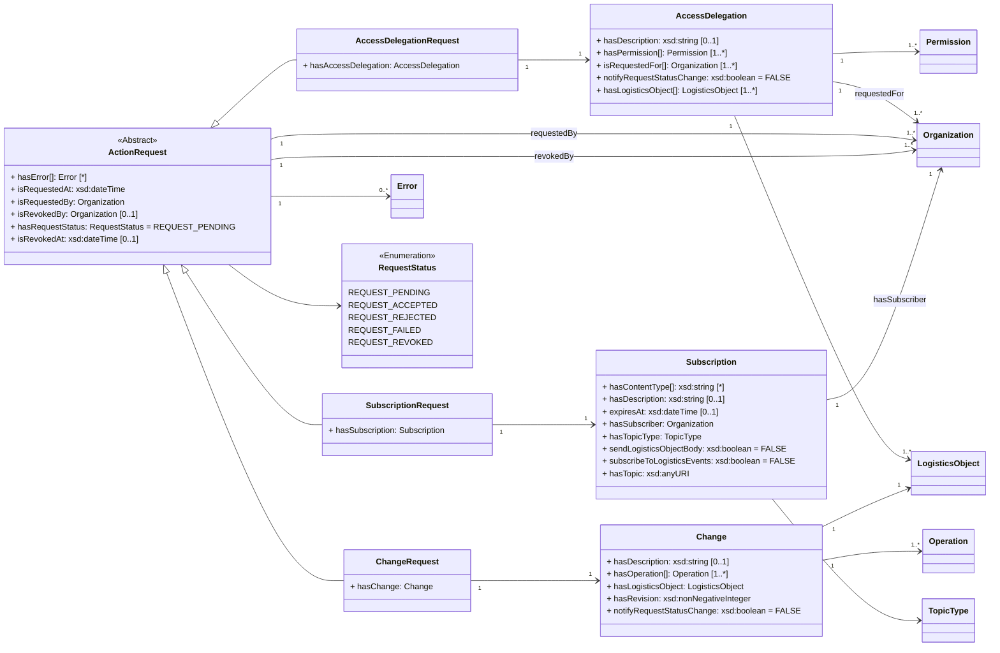

ONE Record uses a generic action request pattern to support the process of one organization requesting an action that must be approved by another organization. 
Examples include [SubscriptionRequest](https://onerecord.iata.org/ns/api/2.0.0-dev#SubscriptionRequest), where the subscriber asks the publisher to subscribe him/her on a LogisticsObject; or the [ChangeRequest](https://onerecord.iata.org/ns/api/2.0.0-dev#ChangeRequest), 
where a `User of a LogisticsObject` submits a [Change](https://onerecord.iata.org/ns/api/2.0.0-dev#Change) of a LogisticsObject that must be approved and applied by the `Owner of the LogisticsObject`.

While the creation of Action Requests by submitting Change, Subscription or Access Delegation objects is described in the previous sections, this section describes the managing of Action Requests.
This enables users and owners to view and revoke action requests, and enables owners to change the status of an ActionRequest, i.e. to accept or reject.

**Guidelines for Action Requests in ONE Record:**

- An [ActionRequest](https://onerecord.iata.org/ns/api/2.0.0-dev#ActionRequest) MUST be accessible via the URI of the [ActionRequest](https://onerecord.iata.org/ns/api/2.0.0-dev#ActionRequest) (requires sufficient permissions)
- An [ActionRequest](https://onerecord.iata.org/ns/api/2.0.0-dev#ActionRequest) MUST only be accepted or reject by the `Owner of the Logistics Object`
- An [ActionRequest](https://onerecord.iata.org/ns/api/2.0.0-dev#ActionRequest) where [isRequestedBy](https://onerecord.iata.org/ns/api/2.0.0-dev#requestedBy) is the `Owner of the Logistics Object` SHOULD be accepted and processed directly.
- A [ChangeRequest](https://onerecord.iata.org/ns/api/2.0.0-dev#ChangeRequest) MUST only be revoked as long as it is in `REQUEST_PENDING` status
- An [AccessDelegationRequest](https://onerecord.iata.org/ns/api/2.0.0-dev#AccessDelegationRequest) MUST only be revoked by the `Delegator` or the `Delegate`
- A [SubscriptionRequest](https://onerecord.iata.org/ns/api/2.0.0-dev#SubscriptionRequest) MUST only be revoked by the `Requestor`/`Subscriber` or the `Publisher`
- If errors occur while processing an accepted [ActionRequest](https://onerecord.iata.org/ns/api/2.0.0-dev#ActionRequest), the [hasRequestStatus](https://onerecord.iata.org/ns/api/2.0.0-dev#hasRequestStatus) of this [ActionRequest](https://onerecord.iata.org/ns/api/2.0.0-dev#ActionRequest) MUST be changed to [REQUEST_FAILED](https://onerecord.iata.org/ns/api/2.0.0-dev#REQUEST_FAILED)

**ActionRequest state diagram**


**ActionRequest data model**

The [ActionRequest](https://onerecord.iata.org/ns/api/2.0.0-dev#ActionRequest) is a data class of the [ONE Record API ontology](assets/ONE-Record-API-Ontology.ttl).
The properties and relationships to other data classes are visualized in the following class diagram.





# Get Action Request Details

## Example A1

Each [SubscriptionRequest](https://onerecord.iata.org/ns/api/2.0.0-dev#SubscriptionRequest) MUST have a URI that can be accessed by the requestor (subscriber) 
and the publisher to obtain the current status of the request and subscription details.

Request:

```http
GET /subscription-requests/599fea49-7287-42af-b441-1fa618d2aaed HTTP/1.1
Host: 1r.example.com
Accept: application/ld+json; version=2.0.0-dev
```

Response:

```bash
HTTP/1.1 200 OK
Content-Type: application/ld+json; version=2.0.0-dev
Content-Language: en-US
Location: https://1r.example.com/action-requests/599fea49-7287-42af-b441-1fa618d2aaed
Type: https://onerecord.iata.org/ns/api/2.0.0-dev#SubscriptionRequest
Last-Modified: Tue, 21 Feb 2023 07:28:00 GMT

--8<-- "examples/SubscriptionRequest_example2.json"
```
_([examples/SubscriptionRequest_example2.json](examples/SubscriptionRequest_example2.json))_

# Update an Action Request

This API action can be used the owner/publisher of a Logistics Object to approve or reject a pending [ActionRequest](https://onerecord.iata.org/ns/api/2.0.0-dev#ActionRequest).

For example, as a publisher, this API action is used to change the status of a received Subscription Request on a ONE Record server using the PATCH HTTP method. 

!!! note 
        Although the updating the state of of a Subscription Request is specified in the ONE Record API specification, 
        it is not required to expose an API endpoint for this API action to be compliant with the ONE Record standard. 
        The reason for this is that _only the owner of the logistics object_ MAY accept or reject a subscription request with any business logic or technology.         

        Nevertheless, this API action specification is included for reference, because in many cases, the use of HTTP PATCH is the preferred solution to update resources with REST APIs.


## Example B1

Request:

```http
PATCH /action-requests/733ed391-ad11-4c02-a2bf-c77ee7997c28 HTTP/1.1
Host: 1r.example.com
Content-Type: application/ld+json; version=2.0.0-dev
Accept: application/ld+json; version=2.0.0-dev

--8<-- "examples/ActionRequestChange_example1.json"
```

_([examples/ActionRequestChange_example1.json](examples/ActionRequestChange_example1.json))_

Response:

```bash
HTTP/1.1 204 No Content
Content-Type: application/ld+json; version=2.0.0-dev
Type: https://onerecord.iata.org/ns/api/2.0.0-dev#SubscriptionRequest
Location: https://1r.example.com/action-requests/733ed391-ad11-4c02-a2bf-c77ee7997c28
```

# Revoke Action Request

This API action MUST be used to revoke an Action Request MUST be revoked only by the original requestor of the ActionRequest or the owner/publisher of the Logistics Object.

## Example C1

Request:
```http
DELETE /action-requests/449661ee-fecf-465d-8eae-15bdaccb7080 HTTP/1.1
Host: 1r.example.com
```


Response:
```bash
HTTP/1.1 204 No Content
```


