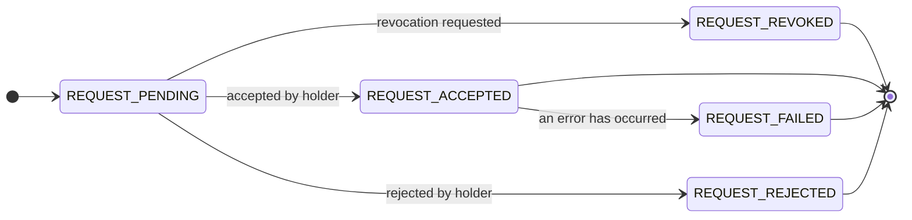
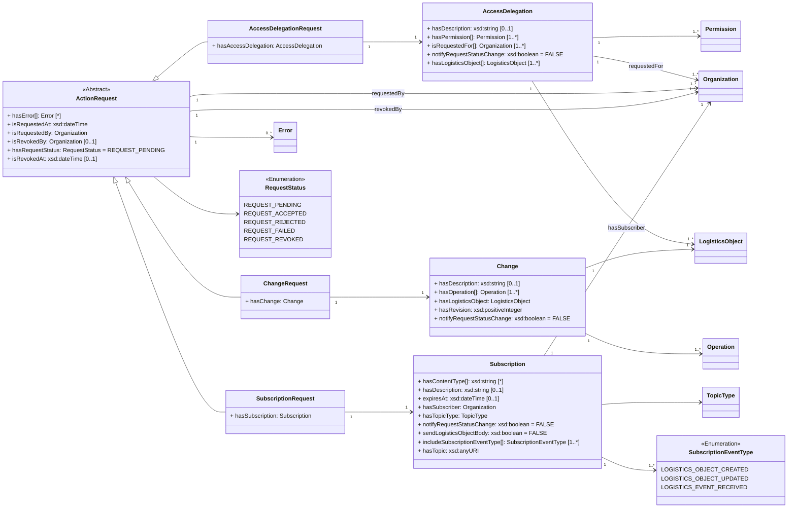

ONE Record uses a generic action request pattern to support the process of one organization requesting an action that must be approved by another organization. 
Examples include [SubscriptionRequest](https://onerecord.iata.org/ns/api#SubscriptionRequest), where the subscriber asks the publisher to subscribe him/her on a LogisticsObject; or the [ChangeRequest](https://onerecord.iata.org/ns/api#ChangeRequest), 
where a `User of a LogisticsObject` submits a [Change](https://onerecord.iata.org/ns/api#Change) of a LogisticsObject that must be approved and applied by the [`Holder of the LogisticsObject`](./concepts.md#holder-of-a-logistics-object).

While the creation of Action Requests by submitting Change, Subscription or Access Delegation objects is described in the previous sections, this section describes the managing of Action Requests.
This enables users and holders to view and revoke action requests, and enables holders to change the status of an ActionRequest, i.e. to accept or reject.

**Guidelines for Action Requests in ONE Record:**

- An [ActionRequest](https://onerecord.iata.org/ns/api#ActionRequest) MUST be accessible via the URI of the [ActionRequest](https://onerecord.iata.org/ns/api#ActionRequest) (requires sufficient permissions)
- An [ActionRequest](https://onerecord.iata.org/ns/api#ActionRequest) MUST only be accepted or reject by the [`Holder of the LogisticsObject`](./concepts.md#holder-of-a-logistics-object)
- An [ActionRequest](https://onerecord.iata.org/ns/api#ActionRequest) where [isRequestedBy](https://onerecord.iata.org/ns/api#requestedBy) is the [`Holder of the LogisticsObject`](./concepts.md#holder-of-a-logistics-object) SHOULD be accepted and processed directly.
- A [ChangeRequest](https://onerecord.iata.org/ns/api#ChangeRequest) MUST only be revoked as long as it is in `REQUEST_PENDING` status
- An [AccessDelegationRequest](https://onerecord.iata.org/ns/api#AccessDelegationRequest) MUST only be revoked by the `Delegator` or the `Delegate`
- A [SubscriptionRequest](https://onerecord.iata.org/ns/api#SubscriptionRequest) MUST only be revoked by the `Requestor`/`Subscriber` or the `Publisher`
- If errors occur while processing an accepted [ActionRequest](https://onerecord.iata.org/ns/api#ActionRequest), the [hasRequestStatus](https://onerecord.iata.org/ns/api#hasRequestStatus) of this [ActionRequest](https://onerecord.iata.org/ns/api#ActionRequest) MUST be changed to [REQUEST_FAILED](https://onerecord.iata.org/ns/api#REQUEST_FAILED)

**ActionRequest state diagram**



**ActionRequest data model**

The [ActionRequest](https://onerecord.iata.org/ns/api#ActionRequest) is a data class of the [ONE Record API ontology](assets/ONE-Record-API-Ontology.ttl).
The properties and relationships to other data classes are visualized in the following class diagram.





# Get Action Request Details

## Endpoint

``` 
 GET {{baseURL}}/action-requests/{{actionRequestId}}

```
## Request

The following HTTP header parameters MUST be present in the request:

| Header    | Description                                  | Examples                |
| ----------------- |    -------------------------------- |   ------------- |
| **Accept**        | The content type that a ONE Record client wants the HTTP response to be formatted in. This SHOULD include the version of the ONE Record API, otherwise the latest supported ONE Record API MAY be applied. | <ul><li>application/ld+json</li><li>application/ld+json; version=2.0.0-dev</li><li>application/ld+json; version=1.2</li></ul> |

## Response

A successful request MUST return a `HTTP/1.1 200 OK` status code. 
The body of the response includes the Action Request in the RDF serialization format that has been requested in the `Accept` header of the request.

The following HTTP headers parameters MUST be present in the response:

| Header                | Description                                  | Example   |
| -------------------- |    ---------- | ----------------------------- |
| **Content-Type**     | The content type that is contained with the HTTP body.                               | application/ld+json           |
| **Content-Language** | Describes the language(s) for which the requested resource is intended.              | en-US     |
| **Type**  | The type of the Action Request as a URI                     | https://onerecord.iata.org/ns/api#SubscriptionRequest         |
| **Last-Modified**    | he date and time of the most recent change to the Action Request. Syntax: `Last-Modified: <day-name>, <day> <month> <year> <hour>:<minute>:<second> GMT`. See https://developer.mozilla.org/en-US/docs/Web/               | Tue, 21 Feb 2023 07:28:00 GMT |

The following HTTP status codes MUST be supported:

| Code    | Description              | Response body    |
| ------- |  ---------------------- | ---------------- |
| **200** | The request to retrieve the Action Request has been successful       | Action Request   |
| **301** | The URI of the Action Request has permanently changed.               | No response body |
| **302** | The URI of the Action Request has temporarily moved.                 | No response body |
| **401** | Not authenticated                                                    | Error            |
| **403** | Not authorized to retrieve the Action Request                        | Error            |
| **404** | Action Request not found                                             | Error            |
| **415** | Unsupported Content Type                                             | Error            |
| **500** | Internal Server Error                                                | Error            |


## Security
To engage with the "Get Action Request Details" endpoint, a client needs proper authentication and authorization to access the designated resource. If requests lack proper authentication, the ONE Record server should respond with a `401 "Not Authenticated"` status. Conversely, for requests without proper authorization, a `403 "Not Authorized"` response should be provided.


## Example A1

Each [SubscriptionRequest](https://onerecord.iata.org/ns/api#SubscriptionRequest) MUST have a URI that can be accessed by the requestor (subscriber) 
and the publisher to obtain the current status of the request and subscription details.

Request:

```http
GET /action-requests/599fea49-7287-42af-b441-1fa618d2aaed HTTP/1.1
Host: 1r.example.com
Accept: application/ld+json; version=2.0.0-dev
```

Response:

```bash
HTTP/1.1 200 OK
Content-Type: application/ld+json; version=2.0.0-dev
Content-Language: en-US
Location: https://1r.example.com/action-requests/599fea49-7287-42af-b441-1fa618d2aaed
Type: https://onerecord.iata.org/ns/api#SubscriptionRequest
Last-Modified: Tue, 21 Feb 2023 07:28:00 GMT

--8<-- "examples/SubscriptionRequest_example2.json"
```
_([examples/SubscriptionRequest_example2.json](examples/SubscriptionRequest_example2.json))_

# Update an Action Request

This API action can be used the holder/publisher of a Logistics Object to approve or reject a pending [ActionRequest](https://onerecord.iata.org/ns/api#ActionRequest).

For example, as a publisher, this API action is used to change the status of a received Subscription Request on a ONE Record server using the PATCH HTTP method. 

!!! note 
    Although the updating the state of of a Subscription Request is specified in the ONE Record API specification, it is not required to expose an API endpoint for this API action to be compliant with the ONE Record standard. 
    The reason for this is that _only the holder of the logistics object_ MAY accept or reject a subscription request with any business logic or technology.         

    Nevertheless, this API action specification is included for reference, because in many cases, the use of HTTP PATCH is the preferred solution to update resources with REST APIs.


## Endpoint

``` 
 PATCH {{baseURL}}/action-requests/{{actionRequestId}}

```
## Request

The following query parameters MUST be supported:

| Query parameter   | Description                         | Valid values        |
| ----------------- |    -------------------------------- |   ------------- |
| **status**      | A parameter used to configure the status of an Action request. This operation modifies the status of the Action Request based on the value specified in the status parameter.  | <ul><li>https://onerecord.iata.org/ns/api#REQUEST_ACCEPTED or REQUEST_ACCEPTED</li><li>https://onerecord.iata.org/ns/api#REQUEST_REJECTED or REQUEST_REJECTED</li><li>https://onerecord.iata.org/ns/api#REQUEST_REVOKED or REQUEST_REVOKED</li></ul> |

The following HTTP header parameters MUST be present in the request:

| Header    | Description                                  | Examples                |
| ----------------- |    -------------------------------- |   ------------- |
| **Accept**        | The content type that a ONE Record client wants the HTTP response to be formatted in. This SHOULD include the version of the ONE Record API, otherwise the latest supported ONE Record API MAY be applied. | <ul><li>application/ld+json</li><li>application/ld+json; version=2.0.0-dev</li><li>application/ld+json; version=1.2</li></ul> |
| **Content-Type** | The content type that is contained with the HTTP body.               | <ul><li>application/ld+json</li><li>application/ld+json; version=2.0.0-dev</li><li>application/ld+json; version=1.2</li></ul> |

## Response

A successful request MUST return a `HTTP/1.1 204 No Content` status code and the following HTTP headers parameters MUST be present in the response:

| Header | Description                 | Example                |
| -------------------- |  ----- |   -------------------------------- |
| **Location**         | The URI of the Action Request          | https://1r.example.com/action-requests/6b948f9b-b812-46ed-be39-4501453da99b |
| **Type**             | The type of the Action Request as a URI | https://onerecord.iata.org/ns/api#ChangeRequest                   |

Otherwise, an `Error` object with `ErrorDetail` as response body MUST be returned with the following HTTP headers:

| Header | Description                     | Example             |
| -------------------- |  ----------------------------- | ------------------- |
| **Content-Type**     | The content type that is contained with the HTTP body.                  | application/ld+json |
| **Content-Language** | Describes the language(s) for which the requested resource is intended. | en-US               |

The following HTTP status codes MUST be supported:

| Code    | Description | Response body    |
| ------- | ----------- | ---------------- |
| **204** | The Action Request was successfully updated                     | No body required |
| **400** | The update request body is invalid                              | Error            |
| **401** | Not authenticated                                               | Error            |
| **403** | Not authorized to update the Action Request                     | Error            |
| **404** | Action Request not found                                        | Error            |
| **415** | Unsupported Content Type, response when the client sends a PATCH document format that the server does not support for the resource identified by the Request-URI.            | Error            |
| **422** | Unprocessable request, when the server understands the PATCH document and the syntax of the PATCH document appears to be valid, but the server is incapable of processing the request. | Error            |
| **500** | Internal Server Error                                           | Error            |


## Security

Access to the Action Request update endpoint should be restricted to internal usage only, and it must not be made available to external entities.


## Example B1

Request:

```http
PATCH /action-requests/733ed391-ad11-4c02-a2bf-c77ee7997c28?status=https://onerecord.iata.org/ns/api#REQUEST_ACCEPTED HTTP/1.1
Host: 1r.example.com
Content-Type: application/ld+json; version=2.0.0-dev
Accept: application/ld+json; version=2.0.0-dev

```


Response:

```bash
HTTP/1.1 204 No Content
Content-Type: application/ld+json; version=2.0.0-dev
Type: https://onerecord.iata.org/ns/api#SubscriptionRequest
Location: https://1r.example.com/action-requests/733ed391-ad11-4c02-a2bf-c77ee7997c28
```

# Revoke Action Request

This API action MUST be used to revoke an Action Request MUST be revoked only by the original requestor of the ActionRequest or the holder/publisher of the Logistics Object.

## Endpoint

``` 
 DELETE {{baseURL}}/action-requests/{{actionRequestId}}

```
## Request

Revoking an Action Rquest does not require any mandatory HTTP headers.

## Response

A successful request MUST return a `HTTP/1.1 204 No Content` status code. 

The following HTTP status codes MUST be supported:

| Code    | Description | Response body    |
| ------- | ----------- | ---------------- |
| **204** | The Action Request was successfully deleted                 | No body required |
| **401** | Not authenticated                                           | Error            |
| **403** | Not authorized to update the Action Request                 | Error            |
| **404** | Action Request not found                                    | Error            |
| **500** | Internal Server Error                                       | Error            |


## Security

To engage with the "Revoke Action Request" endpoint, a client needs proper authentication and authorization to access the designated resource. If requests lack proper authentication, the ONE Record server should respond with a `401 "Not Authenticated"` status. Conversely, for requests without proper authorization, a `403 "Not Authorized"` response should be provided.

## Example C1

Request:
```http
DELETE /action-requests/449661ee-fecf-465d-8eae-15bdaccb7080 HTTP/1.1
Host: 1r.example.com
```


Response:
```bash
HTTP/1.1 204 No Content
```


