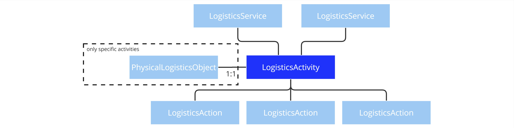
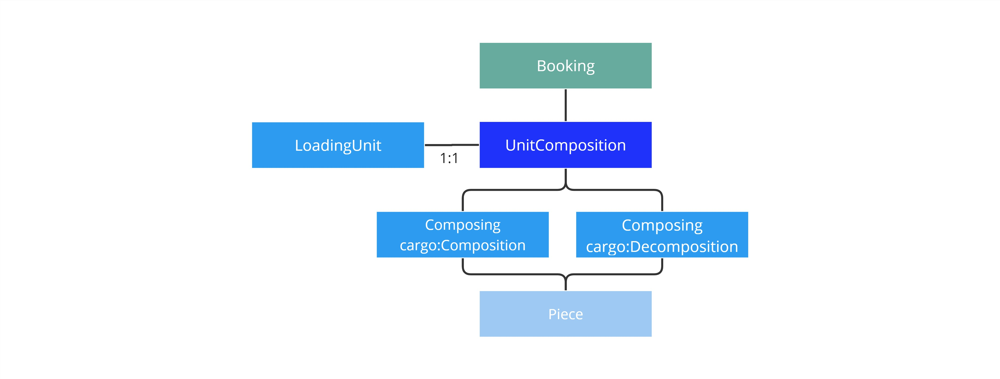

ONE Record data model 3.0 introduced an activity model. It is built on the superclasses [LogisticsService](https://onerecord.iata.org/ns/cargo#LogisticsService), [LogisticsActivity](https://onerecord.iata.org/ns/cargo#LogisticsActivity), [LogisticsAction](https://onerecord.iata.org/ns/cargo#LogisticsAction), and [PhysicalLogisticsObject](https://onerecord.iata.org/ns/cargo#PhysicalLogisticsObject).
The activity model is developed based the design principles Single Source of Truth and Physics-orientation. Further emphasis lays on practicality over abstractation.
This page details the core concepts including examples.

# LogisticsServices

A `LogisticsService` (a subtype of `LogisticsObject`) describes a set of scheduled and sequenced `LogisticsActivities` provided by one party to another.
The properties are described [here](https://onerecord.iata.org/ns/cargo#LogisticsService).

<figure markdown>
  
  <figcaption>LogisticsService and connected objects</figcaption>
</figure>

## Booking

- TBD

# LogisticsActivities

A `LogisticsActivity` (a subtype of `LogisticsObject`) describes an activity or process state which is scheduled and executed by an orchestrating party.
It involves a set of dedicated tasks in the form of specific `LogisticsActions` to be performed on `PhysicalLogisticsObjects`. 
Some activities are directly bound to a specific `PhysicalLogisticsObject`. 
It can be part of one or multiple `LogisticsServices`. 
It has an execution status that is actively maintained.
The properties are described [here](https://onerecord.iata.org/ns/cargo#LogisticsActivity).

<figure markdown>
  
  <figcaption>LogisticsActivity and connected objects</figcaption>
</figure>

## UnitComposition

An `UnitComposition` (a subtype of `LogisticsActivity`) describes the process state of a packed/loaded LoadingUnit (Container, ULD, Pallet, ...). 
It requires a 1:1 connection to a `LoadingUnit` as long as its execution status is Active. 
Composing (a `LogisticsAction`) is used to model the tasks of composing (cargo:Composition) or decomposing (cargo:Decomposition) Pieces for the UnitComposition. 
An `UnitComposition` typically begins with a Composition at one location (eg. warehouse of origin) and ends with a Decomposition at another location (eg. warehouse of departure).
The properties are described [here](https://onerecord.iata.org/ns/cargo#UnitComposition).

<figure markdown>
  
  <figcaption>UnitComposition and connected objects</figcaption>
</figure>

## TransportMovement

- TBD

## Storage

- TBD

# LogisticsActions

A `LogisticsAction` (a subtype of `LogisticsObject`) describes a specific task performed on one or a set of `PhysicalLogisticsObjects` in the context of a `LogisticsActivity`.
`LogisticsActions` serve the purpose of connecting different `PhysicalLogisticsObjects` to each other and to an `LogisticsActivity`.
It is set at a specific point in time. This can also be a time frame (start and end time). The time type can be either requested, planned or actual.
The properties are described [here](https://onerecord.iata.org/ns/cargo#LogisticsAction).

<figure markdown>
  
  <figcaption>LogisticsAction and connected objects</figcaption>
</figure>

## Composing

- TBD

## Loading

- TBD

## Storing

- TBD

## Check

- TBD

# PhysicalLogisticsObjects

A `PhysicalLogisticsObject` (a subtype of `LogisticsObject`) is the digital twin of a physically distinguishable object in the air cargo supply chain. 
It interacts with other `PhysicalLogisticsObjects` and `LogisticsActivities` through `LogisticsActions`.
Some `PhysicalLogisticsObjects` are directly connected to an `LogisticsActivity` describing its state.
The properties are described [here](https://onerecord.iata.org/ns/cargo#PhysicalLogisticsObject).

<figure markdown>
  
  <figcaption>PhysicalLogisticsObject and connected objects</figcaption>
</figure>

## Piece

- TBD

## LoadingUnit

- TBD

## TransportMeans

- TBD

# Examples