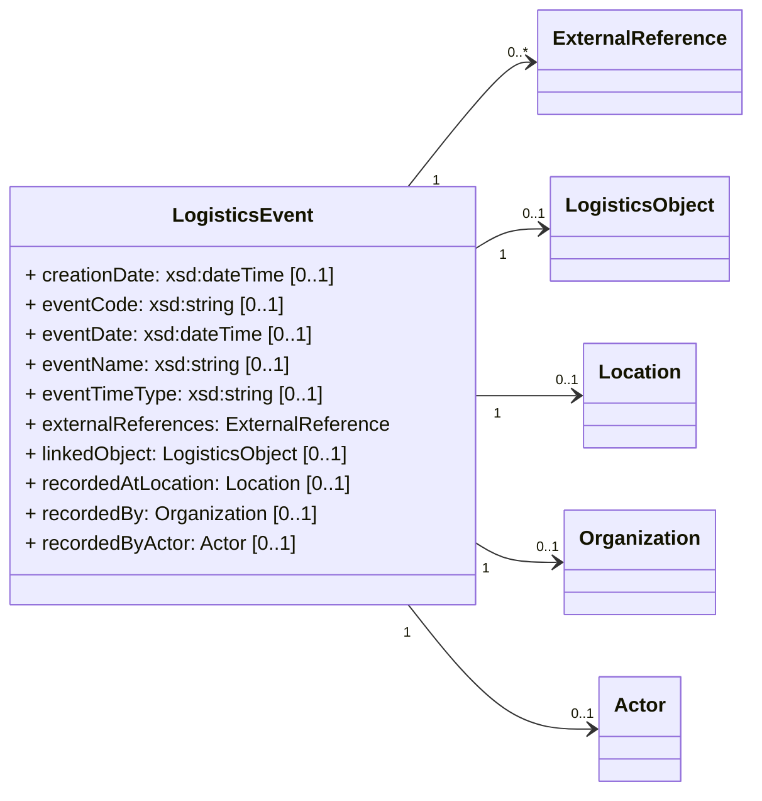
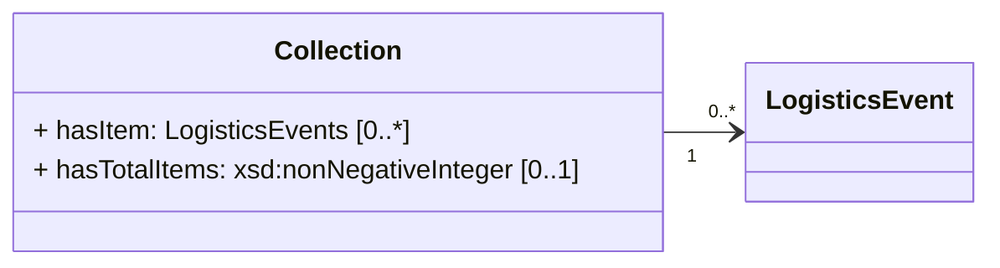

Logistics events are events related to the management and execution of transport and logistics services and document the occurrence of actions, discrepancies, or status changes. These events can be either internal or external to an organization and can include transportation, warehousing, inventory management, supply chain optimization, and other related activities. Examples of logistics events include the departure of an aircraft or the acceptance of shipments in a warehouse.

**Guidelines for Logistics Events in ONE Record:**

- Logistics Events are immutable. They MUST NOT be changed after creation.
- List of logistics Events attached to Logistics Objects are event stores. This event store is an append-only log. Events CAN be added by using the HTTP POST method (see [Create a Logistics Event](#create-a-logistics-event)) but MUST NOT be changed or deleted.
- Logistics Events are neither logistics objects nor embedded object
- Every Logistics Events MUST an URI, that follows the following structure: 
    - {{baseURL}}/logistics-object/{{logisticsObjectId}}/logistics-events/{{logisticsEventId}} where {{logisticsEventId}} is an identifier which can be globally unique and must be unique in the context of its parent Logistics Object
- A Logistics Event MUST be linked to exactly one Logistics Object
- Every Logistics Event MUST have a property `occuredAt (xsd:dateTime)`

# Logistics Events URI

Each Logistics Event MUST have globally unique IRI and MUST have a unique identifier in the context of its parent Logistics Object. The implementor can use the same algorithm as the Logistics Object ids. For more information check the section [Logistics Objects URI](./concepts.md#logistics-object-uri)


# Create a Logistics Event

Logistics Events (also known as status updates) in ONE Record can be added to any Logistics Objects 
by sending a HTTP POST request containing a [LogisticsEvent](https://onerecord.iata.org/ns/cargo#LogisticsEvent) object to the `/logistics-events` endpoint of a LogisticsObject.

As for all API interactions, the ONE Record client must be authenticated and have the access rights to perform this action.

As Logistics Events MUST be associated with a specific Logistics Object, creating Logistics Events requires the existence of a Logistics Object. 

## Endpoint

``` 
 POST {{baseURL}}/logistics-objects/{{logisticsObjectId}}/logistics-events
```

## Request

The following HTTP header parameters MUST be present in the request:

| Request Header   | Description                         | Examples            |
| ---------------- |  --------------------------------- | ------------------- |
| **Accept**       | The content type that the ONE Record client wants the HTTP response to be formatted in.        | application/ld+json |
| **Content-Type** | The content type that is contained with the HTTP body. Valid content types. | application/ld+json |

The HTTP request body must contain a valid [LogisticsEvent](https://onerecord.iata.org/ns/cargo#LogisticsEvent) in the format as specified by the Content-Type in the header.

The LogisticsEvent is a data class of the [ONE Record cargo ontology](https://onerecord.iata.org/ns/cargo/3.0.0).
The properties and relationships to other data classes are visualized in the following class diagram.



## Response

One of the following HTTP response codes MUST be present in the response:

| Code    | Description                             | Response body |
| ------- |  -------------------------------------- | ------------- |
| **201** | Logistics Event has been created            | No content    |
| **400** | Invalid Logistics Event                     | Error         |
| **401** | Not authenticated, invalid or expired token | Error         |
| **403** | Not authorized to perform action            | Error         |
| **404** | Logistics Object not found                  | Error         |
| **415** | Unsupported Content Type                    | Error         |
| **500** | Internal Server Error                       | Error         |


A successful request MUST return a `HTTP/1.1 201 Created` status code and the following HTTP headers parameters MUST be present in the response:

The following HTTP headers parameters MUST be present in the response:

| Response Header | Description     | Examples          |
| --------------- |  ------------- |  ----------------------------------- |
| Location    | The URI of the newly created Logistics Event           | https://1r.example.com/logistics-objects/1a8ded38-1804-467c-a369-81a411416b3c/logistics-events/afb4b8cf-288a-459c-97fd-ccd538ec527f |
| Type        | The type of the newly created Logistics Object as a URI | https://onerecord.iata.org/ns/cargo#LogisticsEvent                    |

## Security

To engage with the "Create a Logistics Event" endpoint, a client needs proper authentication and authorization to access the designated resource. If requests lack proper authentication, the ONE Record server should respond with a `401 "Not Authenticated"` status. Conversely, for requests without proper authorization, a `403 "Not Authorized"` response should be provided.

The implementor has the option to allow all authenticated users the capability to create a Logistics Event. This implies that there would be no access control enforced for this particular endpoint.

## Example A1

Request:

```http
POST /logistics-objects/1a8ded38-1804-467c-a369-81a411416b3c/logistics-events HTTP/1.1
Host: 1r.example.com

Content-Type: application/ld+json; version=2.0.0-dev
Accept: application/ld+json; version=2.0.0-dev

--8<-- "examples/LogisticsEvent.json"
```

_([examples/LogisticsEvent.json](examples/LogisticsEvent.json))_

Response:

```bash
HTTP/1.1 201 Created
Location: https://1r.example.com/logistics-objects/1a8ded38-1804-467c-a369-81a411416b3c/logistics-events/afb4b8cf-288a-459c-97fd-ccd538ec527f
Content-Type: application/ld+json; version=2.0.0-dev
Type: https://onerecord.iata.org/ns/cargo#LogisticsEvent
```

## Example A2

In the following example, a ONE Record client tries to submit a Logistics Event to a non existing Logistics Object.

Request:

```http
POST /logistics-objects/1a8ded38-1804-467c-c369-81a411416b7c/logistics-events HTTP/1.1
Host: 1r.example.com

Content-Type: application/ld+json; version=2.0.0-dev
Accept: application/ld+json; version=2.0.0-dev

--8<-- "examples/LogisticsEvent.json"
```

_([examples/LogisticsEvent.json](examples/LogisticsEvent.json))_

Response:

```bash
HTTP/1.1 404 Not Found
Content-Language: en-US
Content-Type: application/ld+json; version=2.0.0-dev

--8<-- "examples/Error_404.json"
```

_([examples/Error_404.json](examples/Error_404.json))_

# Get a Logistics Event

Each Logistics Event in the Internet of Logistics MUST be accessible via its [Logistics Event URI](#logistics-events-uri) using the HTTP GET method.
This enables the Holder of the Logistics Object to manage access on the level of individual Logistics Event (see [Access Control page](./security/access-control.md) for more information).
If the requester is authorized to access this Logistics Event then the response body MUST include the requested Logistics Event.

## Endpoint 

``` 
 GET {{baseURL}}/logistics-objects/{{logisticsObjectId}}/logistics-events/{{logisticsEventId}}
```

## Request

The following HTTP header MUST be present in the request:

| Header    | Description                                  | Examples                |
| ----------------- |    -------------------------------- |   ------------- |
| **Accept**        | The content type that a ONE Record client wants the HTTP response to be formatted in. This SHOULD include the version of the ONE Record API, otherwise the latest supported ONE Record API MAY be applied. | <ul><li>application/ld+json</li><li>application/ld+json; version=2.0.0-dev</li><li>application/ld+json; version=1.2</li></ul> |

## Response

A successful request MUST return a `HTTP/1.1 200 OK` status code. 
The body of the response includes the Logistics Object in the RDF serialization format that has been requested in the `Accept` header of the request.

The following HTTP headers parameters MUST be present in the response:

| Header                | Description                                  | Example   |
| -------------------- |    ---------- | ----------------------------- |
| **Content-Type**     | The content type that is contained with the HTTP body.                               | application/ld+json           |
| **Content-Language** | Describes the language(s) for which the requested resource is intended.              | en-US     |
| **Last-Modified**    | Date and time when the Logistics Object was last time changed. See https://developer.mozilla.org/en-US/docs/Web/               | Tue, 21 Feb 2023 07:28:00 GMT |

The following HTTP status codes MUST be supported:

| Code    | Description              | Response body    |
| ------- |  ---------------------- | ---------------- |
| **200** | The request to retrieve the Logistics Event has been successful     | Logistics Event |
| **301** | The URI of the Logistics Object has permanently changed.            | No response body |
| **302** | The URI of the Logistics Object has temporarily moved.              | No response body |
| **401** | Not authenticated                                                   | Error            |
| **403** | Not authorized to retrieve the Logistics Object                     | Error            |
| **404** | Logistics Object or Logistics Event not found                       | Error            |
| **500** | Internal Server Error                                               | Error            |

## Security

To engage with the "Get a Logistics Event" endpoint, a client needs proper authentication and authorization to access the designated resource. If requests lack proper authentication, the ONE Record server should respond with a `401 "Not Authenticated"` status. Conversely, for requests without proper authorization, a `403 "Not Authorized"` response should be provided.

It's crucial to emphasize that the authorization for logistics events can differ from that of the logistics objects they are associated with. A client might possess access to a logistics event while not having authorization for the corresponding logistics object.

## Example B1

Request:

```http
GET /logistics-objects/1a8ded38-1804-467c-a369-81a411416b3c/logistics-events/afb4b8cf-288a-459c-97fd-ccd538ec527f HTTP/1.1
Host: 1r.example.com
Accept: application/ld+json; version=2.0.0-dev
```

Response:

```bash
HTTP/1.1 200 OK
Content-Type: application/ld+json
Content-Language: en-US
Location: https://1r.example.com/logistics-objects/1a8ded38-1804-467c-a369-81a411416b3c/logistics-events/afb4b8cf-288a-459c-97fd-ccd538ec527f
Type: https://onerecord.iata.org/ns/cargo#LogisticsEvent
Last-Modified: Tue, 19 Apr 2023 07:28:00 GMT

--8<-- "examples/LogisticsEvent_with_id.json"
```

_([examples/LogisticsEvent_with_id.json](examples/LogisticsEvent_with_id.json))_

## Example B2

In the following example, a ONE Record client tries to get a non-existing Logistics Event

Request:

```http
GET /logistics-objects/1a8ded38-1804-467c-c369-81a411416b7c/logistics-events/afb4b8cf-288a-459c-97fd-ccd538ec527f HTTP/1.1
Host: 1r.example.com
Accept: application/ld+json; version=2.0.0-dev
```

Response:

```bash
HTTP/1.1 404 Not Found
Content-Language: en-US
Content-Type: application/ld+json; version=2.0.0-dev
Type: https://onerecord.iata.org/ns/api/2.0.0dev#Error

--8<-- "examples/Error_404.json"
```

_([examples/Error_404.json](examples/Error_404.json))_

# Get Logistic Events of a Logistics Object

Logistics events that are linked to a logistics object CAN be retrieved by doing a HTTP GET request to the the `/logistics-events` endpoint of a logistics object.
In addition, only a subset of all linked logistics events can optionally be retrieved by setting filter parameters.

## Endpoint 

``` 
 GET {{baseURL}}/logistics-objects/{{logisticsObjectId}}/logistics-events/
```

## Request

The following HTTP header parameters MUST be present in the request:

| Request Header   | Description                         | Examples            |
| ---------------- |  --------------------------------- | ------------------- |
| **Accept**       | The content type that the ONE Record client wants the HTTP response to be formatted in.        | application/ld+json |
| **Content-Type** | The content type that is contained with the HTTP body. Valid content types. | application/ld+json |

The following HTTP query parameters MUST be supported:

| Query parameter               | Description                                                                           | Valid values                       |
| ----------------------------- | ------------------------------------------------------------------------------------- | ---------------------------------- |
| **eventType** (optional)      | Optional parameter that can be used to filter the logistics events by event type, the values MUST be comma separated | <ul><li>FOH</li><li>DEP</li></ul>  |
| **created_after** (optional)  | Optional parameter that can be used to filter the logistics events           | <ul><li>20190926T075830Z</li></ul> |
| **created_before** (optional) | Optional parameter that can be used to filter the the logistics events           | <ul><li>20190926T075830Z</li></ul> |
| **occurred_after** (optional) | Optional parameter that can be used to filter the the logistics events           | <ul><li>20190926T075830Z</li></ul> |
| **occurred_before** (optional)| Optional parameter that can be used to filter the the logistics events           | <ul><li>20190926T075830Z</li></ul> |

## Response

A successful request MUST return a `HTTP/1.1 200 OK` status code. 
The response body is formatted accordingly to the format that has been requested in the `Accept` request header.
The body of the response is composed by a [Collection](https://onerecord.iata.org/ns/api#Collection) object containing all [LogisticsEvent](https://onerecord.iata.org/ns/cargo#LogisticsEvent) matching the specified query parameters.




The ONE Record API employs the [Collection](https://onerecord.iata.org/ns/api#Collection) class to return an array of objects. This class encompasses two properties:

- [api:hasItem](https://onerecord.iata.org/ns/api#hasItem) returns the array of objects.
- [api:hasTotalItem](https://onerecord.iata.org/ns/api#hasTotalItem) returns the count of elements within the returned array.

In this particular case, @id property in the response body MUST be equal to the Endpoint defined in the [Endpoint section](#endpoint_2) (i.e.: https://1r.example.com/logistics-objects/2a7d1338-9033-13xc-b665-81a411418978/logistics-events). 


!!! note

    The ONE Record standard fully adopts the JSON-LD specification, and as a result, the presence of the [api:hasItem](https://onerecord.iata.org/ns/api#hasItem) property of [Collection](https://onerecord.iata.org/ns/api#Collection) is contingent on the number of Logistics Events returned byt the specified query. Specifically:
        
    - If the specified query returns zero Logistics Events, [api:hasItem](https://onerecord.iata.org/ns/api#hasItem) may not appear in the JSON, and [api:hasTotalItem](https://onerecord.iata.org/ns/api#hasTotalItem) must be 0.
    - When the specified query returns exactly one Logistics Event, [api:hasItem](https://onerecord.iata.org/ns/api#hasItem) will directly represent that Logistics Event, and [api:hasTotalItem](https://onerecord.iata.org/ns/api#hasTotalItem) must be 1.
    - In cases where the specified query returns multiple Logistics Events, [api:hasItem](https://onerecord.iata.org/ns/api#hasItem) will be an array containing those Logistics Events, and [api:hasTotalItem](https://onerecord.iata.org/ns/api#hasTotalItem) must be equal to the number of Logistics Events retrieved by the specified query.

    During the implementation phase, it is highly recommended to utilize a JSON-LD library for parsing responses.
    To discover JSON-LD libraries for various programming languages, consult the [implementation guidelines](./implementation-guidelines.md#serialization-and-data-formats).

The following HTTP headers parameters MUST be present in the response:

| Header                | Description                                  | Example   |
| -------------------- |    ---------- | ----------------------------- |
| **Content-Type**     | The content type that is contained with the HTTP body.                               | application/ld+json           |
| **Content-Language** | Describes the language(s) for which the requested resource is intended.              | en-US     |

The following HTTP status codes MUST be supported:

| Code    | Description              | Response body    |
| ------- |  ---------------------- | ---------------- |
| **200** | The request to retrieve all Logistics Events has been successful    | List of Logistics Event |
| **301** | The URI of the Logistics Object has permanently changed.            | No response body |
| **302** | The URI of the Logistics Object has temporarily moved.              | No response body |
| **401** | Not authenticated                                                   | Error            |
| **403** | Not authorized to retrieve the Logistics Object                     | Error            |
| **404** | Logistics Object not found                                          | Error            |
| **500** | Internal Server Error                                               | Error            |


## Security

To engage with the "Get Logistics Events of a Logistics Object" endpoint, a client needs proper authentication and authorization to access the designated resource. If requests lack proper authentication, the ONE Record server should respond with a `401 "Not Authenticated"` status. Conversely, for requests without proper authorization, a `403 "Not Authorized"` response should be provided.

The authorization to access the logistics events should be derived from the logistics objects. However, the implementor of a ONE Record server can decide to separate the control access between a logistics object and its logistics events.

## Example C1

Request:

```http
GET /logistics-objects/1a8ded38-1804-467c-a369-81a411416b7c/logistics-events HTTP/1.1
Host: 1r.example.com
Accept: application/ld+json; version=2.0.0-dev
```

Response:

```bash
HTTP/1.1 200 OK
Content-Type: application/ld+json; version=2.0.0-dev
Content-Language: en-US

--8<-- "examples/LogisticsEvents_list.json"
```
_([examples/LogisticsEvents_list.json](examples/LogisticsEvents_list.json))_


## Example C2

Get a filtered list of events. Filtered by eventType that needs to be DEP.

Request:

```http
GET /logistics-objects/1a8ded38-1804-467c-a369-81a411416b7c/logistics-events?eventType=DEP HTTP/1.1
Host: 1r.example.com
Accept: application/ld+json; version=2.0.0-dev
```

Response:

```bash
HTTP/1.1 200 OK
Content-Type: application/ld+json; version=2.0.0-dev
Content-Language: en-US

--8<-- "examples/LogisticsEvents_filtered_list.json"
```
_([examples/LogisticsEvents_filtered_list.json](examples/LogisticsEvents_filtered_list.json))_

## Example C3

Get an empty list of events.

Request:

```http
GET /logistics-objects/2a7d1338-9033-13xc-b665-81a411418978/logistics-events HTTP/1.1
Host: 1r.example.com
Accept: application/ld+json; version=2.0.0-dev
```

Response:

```bash
HTTP/1.1 200 OK
Content-Type: application/ld+json; version=2.0.0-dev
Content-Language: en-US

--8<-- "examples/LogisticsEvents_empty_list.json"
```
_([examples/LogisticsEvents_empty_list.json](examples/LogisticsEvents_empty_list.json))_