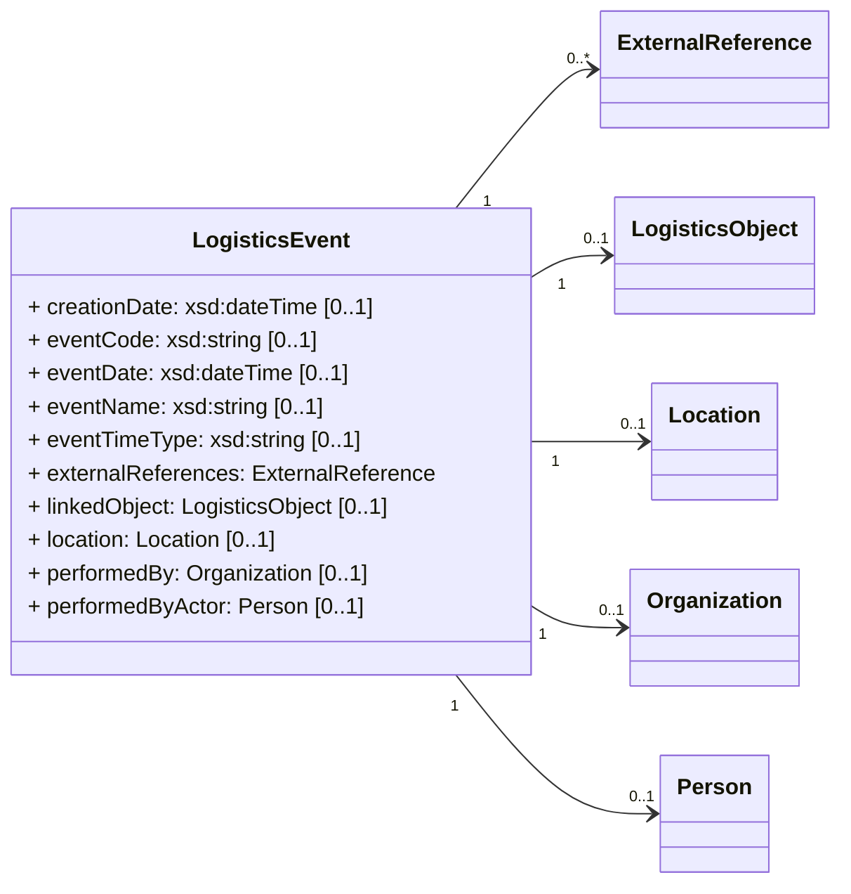

Logistics events are events related to the management and execution of transport and logistics services and document the occurrence of actions, discrepancies, or status changes. These events can be either internal or external to an organization and can include transportation, warehousing, inventory management, supply chain optimization, and other related activities. Examples of logistics events include the departure of an aircraft or the acceptance of shipments in a warehouse.

**Guidelines for Logistics Events in ONE Record:**

- Logistics Events are immutable. They MUST NOT be changed after creation.
- List of logistics Events attached to Logistics Objects are event stores. This event store is an append-only log. Events CAN be added by using the HTTP POST method (see [Create a Logistics Event](#create-a-logistics-event)) but MUST NOT be changed or deleted.
- Logistics Events are neither logistics objects nor embedded object
- Every Logistics Events MUST an URI, that follows the following structure:
<LogisticsObject>/events/<logisticsEventId> where <logisticsEventId> is
- A Logistics Event MUST BE linked to exactly one Logistics Object
- Every Logistics Event MUST have a property `occuredAt (xsd:dateTime)`

# Logistics Events URI

Every Logistics Event MUST have globally unique identifier, a 


# Create a Logistics Event

Logistics Events (also known as status updates) in ONE Record can be added to any Logistics Objects 
by sending a HTTP POST request containing a [LogisticsEvent](https://onerecord.iata.org/ns/cargo/3.0.0#LogisticsEvent) object to the `/logistics-events` endpoint of a LogisticsObject.

As for all API interactions, the ONE Record client must be authenticated and have the access rights to perform this action.

As Logistics Events MUST be associated with a specific Logistics Object, creating Logistics Events requires the existence of a Logistics Object. 

## Request

The following HTTP header parameters MUST be present in the request:

| Request Header   | Description                         | Examples            |
| ---------------- |  --------------------------------- | ------------------- |
| **Accept**       | The content type that the ONE Record client wants the HTTP response to be formatted in.        | application/ld+json |
| **Content-Type** | The content type that is contained with the HTTP body. Valid content types. | application/ld+json |

The HTTP request body must contain a valid [LogisticsEvent](https://onerecord.iata.org/ns/cargo/3.0.0#LogisticsEvent) in the format as specified by the Content-Type in the header.

The LogisticsEvent is a data class of the [ONE Record cargo ontology](https://onerecord.iata.org/ns/cargo/3.0.0).
The properties and relationships to other data classes are visualized in the following class diagram.



<!-- | LogisticsEvent           | Description        | Required | Class                 |
| ---------------------- |  ------------------------------------ | -------- | ----------------------------------------- |
| **linkedObject**       | Logistics object the event applies to                      | y        | w3c:String            |
| **performedBy**        | Company that is adding the event       | y        | https://onerecord.iata.org/ns/cargo/3.0.0#Company  |
| **eventCode**          | Movement or milestone code. Refer cXML Code List 1.18, e.g. DEP, ARR, FOH, RCS | y        | w3c:String            |
| **eventName**          | If no EventCode provided, event name - e.g. Security clearance                 | y        | w3c:String            |
| **eventTypeIndicator** | Type of event being created: "Actual" , "Expected" , "Planned" or "Requested"  | y        | w3c:String            |
| **dateTime**           | Date and time when the event occurred                      | y        | w3c:DateTime          |
| **location**           | Location of where the event occurred                       | y        | https://onerecord.iata.org/ns/cargo/3.0.0#Location | -->

## Response

One of the following HTTP response codes MUST be present in the response:

| Code    | Description                             | Response body |
| ------- |  -------------------------------------- | ------------- |
| 201 | Logistics Event has been created            | No content    |
| 400 | Invalid Logistics Event                     | Error         |
| 401 | Not authenticated, invalid or expired token | Error         |
| 403 | Not authorized to perform action            | Error         |
| 404 | Logistics Object not found                  | Error         |
| 415 | Unsupported Content Type                    | Error         |
| 500 | Internal Server Error                       | Error         |


A successful request MUST return a `HTTP/1.1 201 Created` status code and the following HTTP headers parameters MUST be present in the response:

The following HTTP headers parameters MUST be present in the response:

| Response Header | Description     | Examples          |
| --------------- |  ------------- |  ----------------------------------- |
| Location    | The URI of the newly created Logistics Event           | https://1r.example.com/logistics-objects/1a8ded38-1804-467c-a369-81a411416b3c/logistics-events/afb4b8cf-288a-459c-97fd-ccd538ec527f |
| Type        | The type of the newly created Logistics Object as a URI | https://onerecord.iata.org/ns/cargo/3.0.0#LogisticsEvent                    |


## Example A1

Request:

```http
POST /logistics-objects/1a8ded38-1804-467c-a369-81a411416b3c/logistics-events HTTP/1.1
Host: 1r.example.com

Content-Type: application/ld+json; version=2.0.0-dev
Accept: application/ld+json; version=2.0.0-dev

--8<-- "examples/LogisticsEvent.json"
```

_([examples/LogisticsEvent.json](examples/LogisticsEvent.json))_

Response:

```bash
HTTP/1.1 201 Created
Location: https://1r.example.com/logistics-objects/1a8ded38-1804-467c-a369-81a411416b3c/logistics-events/afb4b8cf-288a-459c-97fd-ccd538ec527f
Content-Type: application/ld+json; version=2.0.0-dev
Type: https://onerecord.iata.org/ns/cargo/3.0.0#LogisticsEvent
```

## Example A2

In the following example, a ONE Record client tries to submit a Logistics Event to a non existing Logistics Object.

Request:

```http
POST /logistics-objects/1a8ded38-1804-467c-c369-81a411416b7c/logistics-events HTTP/1.1
Host: 1r.example.com

Content-Type: application/ld+json; version=2.0.0-dev
Accept: application/ld+json; version=2.0.0-dev

--8<-- "examples/LogisticsEvent.json"
```

_([examples/LogisticsEvent.json](examples/LogisticsEvent.json))_

Response:

```bash
HTTP/1.1 404 Not Found
Content-Language: en-US
Content-Type: application/ld+json; version=2.0.0-dev

--8<-- "examples/Error_404.json"
```

_([examples/Error_404.json](examples/Error_404.json))_

# Get a Logistics Event

Each Logistics Event in the Internet of Logistics MUST be accessible via its [Logistics Event URI](#logistics-events-uri) using the HTTP GET method.
This enables the Owner of the Logistics Object to manage access on the level of individual Logistics Event (see [#access-control] for more information).
If the requester is authorized to access this Logistics Event then the response body MUST include the requested Logistics Event.

## Request

The following query parameters MUST be supported:

| Query parameter   | Description                         | Valid values        |
| ----------------- |    -------------------------------- |   ------------- |
| **embedded** (optional)      | Optional parameter that can be used to request an embedded version of a Logistics Object, if the parameter is not set, a linked version of the Logistics Object is returned  | <ul><li>true</li><li>false</li></ul> |
| **at** (optional)      | Optional parameter that can be used to request a historical version of Logistics Object, if the parameter is not set,   | - |


The following HTTP header MUST be present in the request:

| Header    | Description                                  | Examples                |
| ----------------- |    -------------------------------- |   ------------- |
| **Accept**        | The content type that a ONE Record client wants the HTTP response to be formatted in. This SHOULD include the version of the ONE Record API, otherwise the latest supported ONE Record API MAY be applied. | <ul><li>application/ld+json</li><li>application/ld+json; version=2.0.0-dev</li><li>application/ld+json; version=1.2</li></ul> |

## Response

A successful request MUST return a `HTTP/1.1 200 OK` status code. 
The body of the response includes the Logistics Object in the RDF serialization format that has been requested in the `Accept` header of the request.

The following HTTP headers parameters MUST be present in the response:

| Header                | Description                                  | Example   |
| -------------------- |    ---------- | ----------------------------- |
| **Content-Type**     | The content type that is contained with the HTTP body.                               | application/ld+json           |
| **Content-Language** | Describes the language(s) for which the requested resource is intended.              | en-US     |
| **Last-Modified**    | Date and time when the Logistics Object was last time changed. See https://developer.mozilla.org/en-US/docs/Web/               | Tue, 21 Feb 2023 07:28:00 GMT |

The following HTTP status codes MUST be supported:

| Code    | Description              | Response body    |
| ------- |  ---------------------- | ---------------- |
| **200** | The request to retrieve the Logistics Object has been successful | Logistics Object |
| **301** | The URI of the Logistics Object has permanently changed.           | No response body |
| **302** | The URI of the Logistics Object has temporarily moved.             | No response body |
| **401** | Not authenticated        | Error            |
| **403** | Not authorized to retrieve the Logistics Object                  | Error            |
| **404** | Logistics Object or Logistics Event not found                   | Error            |

## Example B1

Request:

```http
GET /logistics-objects/1a8ded38-1804-467c-a369-81a411416b3c/logistics-events/afb4b8cf-288a-459c-97fd-ccd538ec527f HTTP/1.1
Host: 1r.example.com
Accept: application/ld+json; version=2.0.0-dev
```

Response:

```bash
HTTP/1.1 200 OK
Content-Type: application/ld+json
Content-Language: en-US
Location: https://1r.example.com/logistics-objects/1a8ded38-1804-467c-a369-81a411416b3c/logistics-events/afb4b8cf-288a-459c-97fd-ccd538ec527f
Type: https://onerecord.iata.org/ns/cargo/3.0.0#LogisticsEvent
Last-Modified: Tue, 19 Apr 2023 07:28:00 GMT

--8<-- "examples/LogisticsEvent_with_id.json"
```

_([examples/LogisticsEvent_with_id.json](examples/LogisticsEvent_with_id.json))_

## Example B2

In the following example, a ONE Record client tries to get a non-existing Logistics Event

Request:

```http
GET /logistics-objects/1a8ded38-1804-467c-c369-81a411416b7c/logistics-events/afb4b8cf-288a-459c-97fd-ccd538ec527f HTTP/1.1
Host: 1r.example.com
Accept: application/ld+json; version=2.0.0-dev
```

Response:

```bash
HTTP/1.1 404 Not Found
Content-Language: en-US
Content-Type: application/ld+json; version=2.0.0-dev
Type: https://onerecord.iata.org/ns/api/2.0.0dev#Error

--8<-- "examples/Error_404.json"
```

_([examples/Error_404.json](examples/Error_404.json))_

# Get Logistic Events of a Logistics Object

Logistics events that are linked to a logistics object CAN be retrieved by doing a HTTP GET request to the the `/logistics-events` endpoint of a logistics object.
In addition, only a subset of all linked logistics events can optionally be retrieved by setting filter parameters.

As for all API interactions, the ONE Record client must be authenticated and have the access rights to perform this action.

## Request

The following HTTP header parameters MUST be present in the request:

| Request Header   | Description                         | Examples            |
| ---------------- |  --------------------------------- | ------------------- |
| **Accept**       | The content type that the ONE Record client wants the HTTP response to be formatted in.        | application/ld+json |
| **Content-Type** | The content type that is contained with the HTTP body. Valid content types. | application/ld+json |

The following HTTP query parameters MUST be supported:

| Query parameter               | Description                                                                           | Valid values                       |
| ----------------------------- | ------------------------------------------------------------------------------------- | ---------------------------------- |
| **eventType** (optional)      | Optional parameter that can be used to filter the logistics events by event type, the values MUST be comma separated | <ul><li>FOH</li><li>DEP</li></ul>  |
| **created_after** (optional)  | Optional parameter that can be used to filter the logistics events           | <ul><li>20190926T075830Z</li></ul> |
| **created_before** (optional) | Optional parameter that can be used to filter the the logistics events           | <ul><li>20190926T075830Z</li></ul> |
| **occurred_after** (optional) | Optional parameter that can be used to filter the the logistics events           | <ul><li>20190926T075830Z</li></ul> |
| **occurred_before** (optional)| Optional parameter that can be used to filter the the logistics events           | <ul><li>20190926T075830Z</li></ul> |

## Response

A successful request MUST return a `HTTP/1.1 200 OK` status code. 
The body of the response includes all logistics events matching the specified query parameters.
The response body is formatted accordingly to the format that has been requested in the `Accept` request header.

!!! note
        The response body contains the keyword `@set` to indicate the ordering of the logistics events.
        This is a preparation for future sorting and pagination filters.
        (cf. [https://www.w3.org/TR/json-ld11/#sets](https://www.w3.org/TR/json-ld11/#sets))


The following HTTP headers parameters MUST be present in the response:

| Header                | Description                                  | Example   |
| -------------------- |    ---------- | ----------------------------- |
| **Content-Type**     | The content type that is contained with the HTTP body.                               | application/ld+json           |
| **Content-Language** | Describes the language(s) for which the requested resource is intended.              | en-US     |

The following HTTP status codes MUST be supported:

| Code     | Description                       | Response body            |
| -------- | --------------------------------- | ------------------------ |
| **200**  | Events retrieved successfully     | List of LogisticsEvents  |
| **200**  | Bad Request                       | Error                    |
| **401**  | Not authenticated                 | Error                    |
| **403**  | Not authorized to retrieve Events | Error                    |
| **404**  | Logistics Object Not Found        | Error                    |

## Example C1

Request:

```http
GET /logistics-objects/1a8ded38-1804-467c-a369-81a411416b7c/logistics-events HTTP/1.1
Host: 1r.example.com
Accept: application/ld+json; version=2.0.0-dev
```

Response:

```bash
HTTP/1.1 200 OK
Content-Type: application/ld+json; version=2.0.0-dev
Content-Language: en-US

--8<-- "examples/LogisticsEvents_list.json"
```
_([examples/LogisticsEvents_list.json](examples/LogisticsEvents_list.json))_


## Example C2

Get a filtered list of events. Filtered by eventType that needs to be DEP.

Request:

```http
GET /logistics-objects/1a8ded38-1804-467c-a369-81a411416b7c/logistics-events?eventType=DEP HTTP/1.1
Host: 1r.example.com
Accept: application/ld+json; version=2.0.0-dev
```

Response:

```bash
HTTP/1.1 200 OK
Content-Type: application/ld+json; version=2.0.0-dev
Content-Language: en-US

--8<-- "examples/LogisticsEvents_filtered_list.json"
```
_([examples/LogisticsEvents_filtered_list.json](examples/LogisticsEvents_filtered_list.json))_