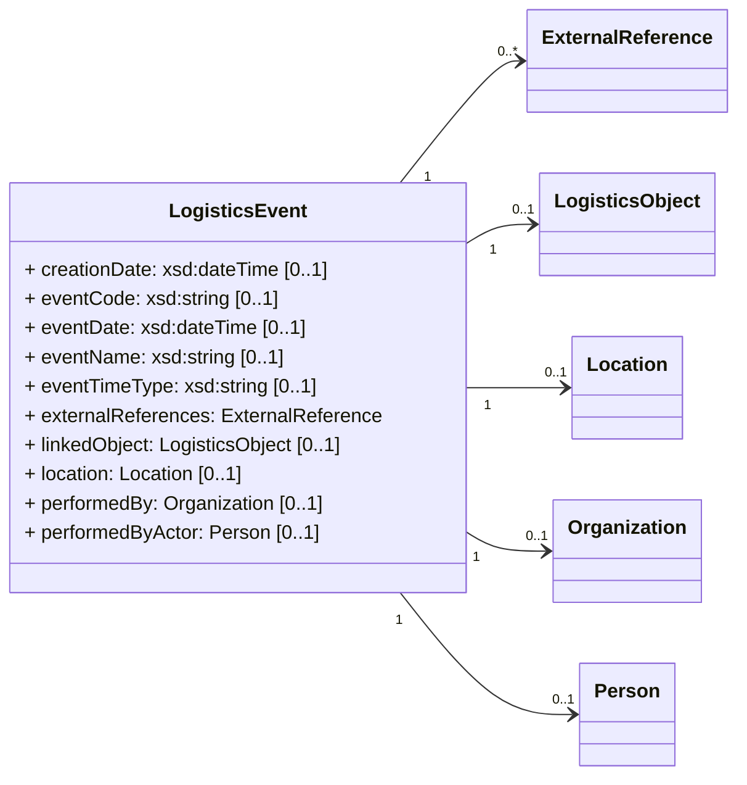

TODO: What are Logistics Events?

# Create a Logistics Event

Logistics Events (also known as status updates) in ONE Record can be added to any Logistics Objects 
by posting a [LogisticsEvent](https://onerecord.iata.org/ns/cargo/3.0.0#LogisticsEvent) object to the `/logistics-events` endpoint of a LogisticsObject.

As for all API interactions, the submitter must be authenticated and have the access rights to perform this action.
As Logistics Events MUST be associated with a specific Logistics Object, creating Logistics Events requires the existence of a Logistics Object. 

## Request

The following HTTP header parameters MUST be present in the request:

| Request Header   | Description                         | Examples            |
| ---------------- |  --------------------------------- | ------------------- |
| **Accept**       | The content type that the ONE Record client wants the HTTP response to be formatted in.        | application/ld+json |
| **Content-Type** | The content type that is contained with the HTTP body. Valid content types. | application/ld+json |

The HTTP request body must contain a valid [LogisticsEvent](https://onerecord.iata.org/ns/cargo/3.0.0#LogisticsEvent) in the format as specified by the Content-Type in the header.

The LogisticsEvent is a data class of the [ONE Record cargo ontology](https://onerecord.iata.org/cargo).
The properties and relationships to other data classes in visualized in the following class diagram.



<!-- | LogisticsEvent           | Description        | Required | Class                 |
| ---------------------- |  ------------------------------------ | -------- | ----------------------------------------- |
| **linkedObject**       | Logistics object the event applies to                      | y        | w3c:String            |
| **performedBy**        | Company that is adding the event       | y        | https://onerecord.iata.org/ns/cargo/3.0.0#Company  |
| **eventCode**          | Movement or milestone code. Refer cXML Code List 1.18, e.g. DEP, ARR, FOH, RCS | y        | w3c:String            |
| **eventName**          | If no EventCode provided, event name - e.g. Security clearance                 | y        | w3c:String            |
| **eventTypeIndicator** | Type of event being created: "Actual" , "Expected" , "Planned" or "Requested"  | y        | w3c:String            |
| **dateTime**           | Date and time when the event occurred                      | y        | w3c:DateTime          |
| **location**           | Location of where the event occurred                       | y        | https://onerecord.iata.org/ns/cargo/3.0.0#Location | -->

## Response

One of the following HTTP response codes MUST be present in the response:

| Code    | Description          | Response body |
| ------- |  ------------------ | ------------- |
| **201** | Logistics Event has been created        | No content    |
| **400** | Invalid Logistics Object                 | Error         |
| **401** | Not authenticated    | Error         |
| **403** | Not authorized to publish the Logistics Object to the server | Error         |
| **404** | Logistics Object not found                 | Error         |
| **415** | Unsupported Content Type                 | Error         |

A successful request MUST return a `HTTP/1.1 201 Created` status code and the following HTTP headers parameters MUST be present in the response:

The following HTTP headers parameters MUST be present in the response:

| Response Header | Description     | Examples          |
| --------------- |  ------------- |  ----------------------------------- |
| **Location**    | The URI of the newly created Logistics Event           | https://1r.example.com/logistics-objects/1a8ded38-1804-467c-a369-81a411416b7c |
| **Type**        | The type of the newly created Logistics Object as a URI | https://onerecord.iata.org/ns/cargo/3.0.0#LogisticsEvent                    |


## Example 1

Request:

```http
POST /logistics-objects/1a8ded38-1804-467c-a369-81a411416b7c/logistics-events HTTP/1.1
Host: 1r.example.com

Content-Type: application/ld+json;version=2.0.0-dev
Accept: application/ld+json;version=2.0.0-dev

--8<-- "examples/LogisticsEvent.json"
```

_([examples/LogisticsEvent.json](examples/LogisticsEvent.json))_

Response:

```bash
HTTP/1.1 201 Created
Location: https://1r.example.com/logistics-objects/1a8ded38-1804-467c-a369-81a411416b7c/logistics-events/afb4b8cf-288a-459c-97fd-ccd538ec527f
Content-Type: application/ld+json;version=2.0.0-dev
Type: https://onerecord.iata.org/ns/cargo/3.0.0#LogisticsEvent
```


```
{
  "@type": "iata-api:Event",
  "@context": {
     "iata-cargo": "https://onerecord.iata.org/ns/cargo/3.0.0#",
     "iata-api": "https://onerecord.iata.org/api/",
  },
  "iata-api:Event#dateTime": "2020-08-25T13:44:49.399Z",
  "iata-api:Event#eventCode": "DEP",
  "iata-api:Event#eventName": "Flight departure",
  "iata-api:Event#eventTypeIndicator": "Actual",
  "iata-api:Event#location": {"...Location object..."}
  "iata-api:Event#linkedObject": "http://wwww.myhost.com/Sensor_715823",
  "iata-api:Event#performedBy": {"...Company object..."}
  "id": "string"
}
```

# Get a List of Logistic Events

## Request

The following HTTP header parameters MUST be present in the request:

| **Header** | Description                       |
| ---------- |    ----- |
| **Accept** | The content type that you want the HTTP response to be formatted in. Valid content types include: ▪ application/x-turtle or text/turtle ▪ application/ld+json |

## Response

A positive HTTP 200 response is expected to a GET request. The body of the response is expected to be the events list in the format that has been requested in the Accept header of the request.

| Code |     | Description                           | Response body |
| -------- | --- | --------------------------------- | ----------------- |
| **200**  |     | Events retrieved successfully     | List of Events    |
| **401**  |     | Not authenticated                 | Error model       |
| **403**  |     | Not authorized to retrieve Events | Error model       |
| **404**  |     | Logistics Object Not Found        | Error model       |

## Example 3

Request:

```http
GET /logistics-objects/1a8ded38-1804-467c-a369-81a411416b7c/logistics-events HTTP/1.1
Host: 1r.example.com
Accept: application/ld+json
```

Response:

```bash
HTTP/1.1 200 OK
Content-Type: application/ld+json
Content-Language: en-US
[
{
   "@context": {
     "api": "https://onerecord.iata.org/api/",
     "@language": "en-US"
   },
    "@type": "https://onerecord.iata.org/ns/cargo/3.0.0#Piece",
    "@id": " https://1r.example.com/logistics-objects/1a8ded38-1804-467c-a369-81a411416b7c",
    "https://onerecord.iata.org/ns/cargo/3.0.0#Piece#goodsDescription": "ONE Record Advertisement Materials",
    "https://onerecord.iata.org/ns/cargo/3.0.0#Piece#handlingInstructions": [
        {
            "@type": "https://onerecord.iata.org/ns/cargo/3.0.0#HandlingInstructions",
            "https://onerecord.iata.org/ns/cargo/3.0.0#HandlingInstructions#serviceType": "SPH",
            "https://onerecord.iata.org/ns/cargo/3.0.0#HandlingInstructions#serviceDescription": "Valuable Cargo",
            "https://onerecord.iata.org/ns/cargo/3.0.0#HandlingInstructions#serviceTypeCode": "VAL"
        }
    ]
}
]
```

## Example 4
Filtered list of Logistics Events

## Example 5
Error Logistics Object not found 404

**Filtering and sorting Logistics Events list**
Specify query parameters in a comma separated list:

Filtering
Limit and offset parameters, default limit is RECOMMENDED to 25
offset=10 means skip the first 10 records
limit=10 means that a maximum of 10 records will be returned.

# Get a Logistics Event

## Request

## Response

## Example 6
200 

## Example 7
404 Error
