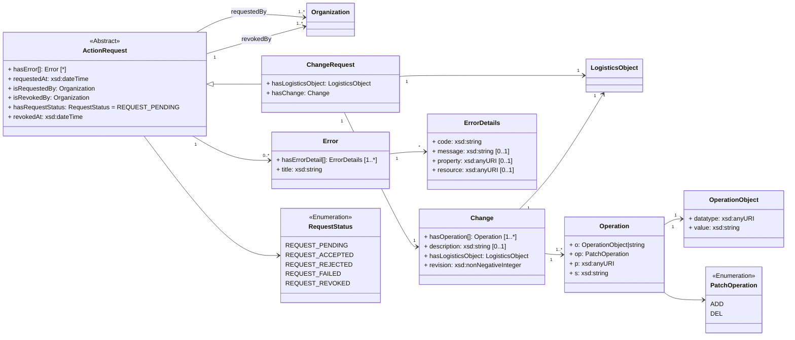

# Create a Logistics Object

This API action is used to create a Logistics Object on a ONE Record server using the POST HTTP method.
This particular Logistics Object MUST be a type of Logistics Object, i.e. data classes that inherit from the class Logistics Object, that is specified in the ONE Record data model.
A list of all possible data classes that inherit from Logistics Object can be found [here](https://onerecord.iata.org/ns/cargo/3.0.0#LogisticsObject).

!!! note 
        Although the creation of a Logistics Object is specified in the ONE Record API specification, it is not required to expose an API endpoint for this API action to be compliant with the ONE Record standard. 
        The reason for this is that _only the owner of the logistics object_ MAY create a logistics object with any business logic or technology. 
        However, it is important that the Logistics Object is created with a [Logistics Object URI](#logistics-object-uri) that is accessible on the internet of logistics.

         Nevertheless, this API action specification is included for reference, because in many cases, the use of HTTP POST is the preferred solution to create resources with REST APIs.

As for all API interactions, the ONE Record client must be authenticated and have the access rights to perform this action.

## Request

The following HTTP header parameters MUST be present in the request

| Header   | Description                         | Examples            |
| ---------------- |  --------------------------------- | ------------------- |
| Accept       | The content type that the ONE Record client wants the HTTP response to be formatted in.        | application/ld+json |
| Content-Type | The content type that is contained with the HTTP body. Valid content types. | application/ld+json |

The HTTP request ody must contain a valid Logistics Object in the format as specified by the Content-Type in the header.

## Response

A successful request MUST return a `HTTP/1.1 201 Created` status code and the following HTTP headers parameters MUST be present in the response:

| Header | Description     | Examples          |
| --------------- |  ------------- |  ----------------------------------- |
| **Location**    | The URI of the newly created Logistics Object           | https://1r.example.com/logistics-objects/1a8ded38-1804-467c-a369-81a411416b7c |
| **Type**        | The type of the newly created Logistics Object as a URI | https://onerecord.iata.org/ns/cargo/3.0.0#Piece                    |

The following HTTP status codes MUST be supported:

| Code    | Description                                                  | Response body    |
| ------- | ------------------------------------------------------------ | ---------------- |
| **201** | Logistics Object has been created                            | No response body |
| **400** | Invalid Logistics Object                                     | Error            |
| **401** | Not authenticated                                            | Error            |
| **403** | Not authorized to publish the Logistics Object to the server | Error            |
| **409** | Logistics object with specified ID already exists            | Error            |
| **415** | Unsupported Content Type                                     | Error            |

## Example A1

Creating a [LogisticsObject](https://onerecord.iata.org/ns/cargo/3.0.0#LogisticsObject) of type [Piece](https://onerecord.iata.org/ns/cargo/3.0.0#Piece)

Request:

```http
POST /logistics-objects HTTP/1.1
Host: 1r.example.com
Content-Type: application/ld+json; version=2.0.0-dev
Accept: application/ld+json; version=2.0.0-dev

--8<-- "examples/Piece.json"
```

_([examples/Piece.json](examples/Piece.json))_

Response:

```bash
HTTP/1.1 201 Created
Location: https://1r.example.com/logistics-objects/1a8ded38-1804-467c-a369-81a411416b7c
Content-Type: application/ld+json; version=2.0.0-dev
Type: https://onerecord.iata.org/ns/cargo/3.0.0#Piece
```

## Example A2

Creating a [LogisticsObject](https://onerecord.iata.org/ns/cargo/3.0.0#LogisticsObject) of type [Company](https://onerecord.iata.org/ns/cargo/3.0.0#Company) with an embedded Logistics Object of type [Person](https://onerecord.iata.org/ns/cargo/3.0.0#Person)

Request:

```http
POST /logistics-objects HTTP/1.1
Host: 1r.example.com
Content-Type: application/ld+json; version=2.0.0-dev
Accept: application/ld+json; version=2.0.0-dev

--8<-- "examples/Company.json"
```

_([examples/Company.json](examples/Company.json))_

Response:

```bash
HTTP/1.1 201 Created
Location: https://1r.example.com/logistics-objects/957e2622-9d31-493b-8b8f-3c805064dbda
Content-Type: application/ld+json; version=2.0.0-dev
Type: https://onerecord.iata.org/ns/cargo/3.0.0#Company
```

## Example A3

Creating a [LogisticsObject](https://onerecord.iata.org/ns/cargo/3.0.0#LogisticsObject) of type [Shipment](https://onerecord.iata.org/ns/cargo/3.0.0#Shipment) that links the previously created Piece (see [Example 1](#example-1))

Request:

```http
POST /logistics-objects HTTP/1.1
Host: 1r.example.com
Content-Type: application/ld+json; version=2.0.0-dev
Accept: application/ld+json; version=2.0.0-dev

--8<-- "examples/Shipment_with_Piece.json"
```

_([examples/Shipment.json](examples/Shipment_with_Piece.json))_

Response:

```bash
HTTP/1.1 201 Created
Location: https://1r.example.com/logistics-objects/1a8ded38-1804-467c-a369-81a411416b3c
Content-Type: application/ld+json; version=2.0.0-dev
Type: https://onerecord.iata.org/ns/cargo/3.0.0#Shipment
```

Three different logistics objects have been published, i.e. they have been created and are accessible via their URIs:

- Piece with the [Logistics Object URI](#logistics-object-uri-louri) `https://1r.example.com/logistics-objects/1a8ded38-1804-467c-a369-81a411416b7c`
- Shipment with the [Logistics Object URI](#logistics-object-uri-louri) `https://1r.example.com/logistics-objects/1a8ded38-1804-467c-a369-81a411416b3c`, 
- Company with the [Organization URI](#organization-uri) `https://1r.example.com/logistics-objects/957e2622-9d31-493b-8b8f-3c805064dbda`

This Logistics Objects will be used for the following examples.

# Get a Logistics Object

Each Logistics Object in the Internet of Logistics MUST be accessible via its [Logistics Objects URI](concepts.md#logistics-object-uri) using the HTTP GET method.
This enables the Owner of the Logistics Object to manage access on the level of individual Logistics Objects (see [#access-control] for more information).
If the requester is authorized to access this Logistics Object then the response body MUST include the requested Logistics Object.

If not a historical version is explicitly requested (see [(Retrieve a historical Logistics Object](#retrieve-a-historical-logistics-object)),
the ONE Record server MUST return the latest version of the requested Logistics Object.

Because of Linked Data as a core concept of ONE Record, it could be possible that the requested Logistics Object contains links to other Logistics Object (see Shipment in [Example 3](#example-3)),
If the User of the Logistics Object is interested in this linked data objects (which not necessary have to be on the same ONE Record server) and has the necessary access permissions, the User of the Logistics Object can request those Logistics Objects via their linked Logistics Object URIs.

Although linking logistics objects instead of embedding logistics objects is the preferred and RECOMMENDED approach,
to reduce the number of GET requests, it can be helpful to request an embedded version of a Logistics Object by setting the optional query parameter `embedded=true`. 
The ONE Record server SHOULD then replace the linked Logistics Objects with the actual Logistics Objects by resolving the Logistics Object URIs (see [Example 6](#example-6)).

!!! note 
        The ONE Record server MAY only resolve and replace linked Logistics Objects that are published on the same ONE Record server.       Furthermore, there ONE Record server MAY not resolve and replace linked Logistics Events. 
        Logistics Events MUST be accessed using the `/logistics-events` endpoint. (see [Logistics Events](logistics-events.md))

## Request

The following query parameters MUST be supported:

| Query parameter   | Description                         | Valid values        |
| ----------------- |    -------------------------------- |   ------------- |
| **embedded** (optional)      | Optional parameter that can be used to request an embedded version of a Logistics Object, if the parameter is not set, a linked version of the Logistics Object is returned  | <ul><li>true</li><li>false</li></ul> |
| **at** (optional)      | Optional parameter that can be used to request a historical version of Logistics Object, if the parameter is not set,   | - |


The following HTTP header parameters MUST be present in the request:

| Header    | Description                                  | Examples                |
| ----------------- |    -------------------------------- |   ------------- |
| **Accept**        | The content type that a ONE Record client wants the HTTP response to be formatted in. This SHOULD include the version of the ONE Record API, otherwise the latest supported ONE Record API MAY be applied. | <ul><li>application/ld+json</li><li>application/ld+json; version=2.0.0-dev</li><li>application/ld+json; version=1.2</li></ul> |

## Response

A successful request MUST return a `HTTP/1.1 200 OK` status code. 
The body of the response includes the Logistics Object in the RDF serialization format that has been requested in the `Accept` header of the request.

The following HTTP headers parameters MUST be present in the response:

| Header                | Description                                  | Example   |
| -------------------- |    ---------- | ----------------------------- |
| **Content-Type**     | The content type that is contained with the HTTP body.                               | application/ld+json           |
| **Content-Language** | Describes the language(s) for which the requested resource is intended.              | en-US     |
| **Revision**         | The revision of the requested Logistics Object as a non-negative numerical value. This is particularly relevant if the query parameter `at=` is set to request a historical version of the Logistics Object. | 3         |
| **Latest-Revision**  | The latest revision number of the Logistics Object as non-negative numerical value.                      | 3         |
| **Last-Modified**    | Date and time when the Logistics Object was last time changed. Syntax: `Last-Modified: <day-name>, <day> <month> <year> <hour>:<minute>:<second> GMT`. See https://developer.mozilla.org/en-US/docs/Web/               | Tue, 21 Feb 2023 07:28:00 GMT |

The following HTTP status codes MUST be supported:

| Code    | Description              | Response body    |
| ------- |  ---------------------- | ---------------- |
| **200** | The request to retrieve the Logistics Object has been successful | Logistics Object |
| **301** | The URI of the Logistics Object has permanently changed.           | No response body |
| **302** | The URI of the Logistics Object has temporarily moved.             | No response body |
| **401** | Not authenticated        | Error            |
| **403** | Not authorized to retrieve the Logistics Object                  | Error            |
| **404** | Logistics Object not found                   | Error            |

## Example B1

Request:

```http
GET /logistics-objects/1a8ded38-1804-467c-a369-81a411416b7c HTTP/1.1
Host: 1r.example.com
Accept: application/ld+json; version=2.0.0-dev
```

Response:

```bash
HTTP/1.1 200 OK
Content-Type: application/ld+json
Content-Language: en-US
Location: https://1r.example.com/logistics-objects/1a8ded38-1804-467c-a369-81a411416b7c
Type: https://onerecord.iata.org/ns/cargo/3.0.0#Piece
Revision: 1
Latest-Revision: 1
Last-Modified: Tue, 21 Feb 2023 07:28:00 GMT

--8<-- "examples/Piece_with_id.json"
```

_([examples/Piece_with_id.json](examples/Piece_with_id.json))_

## Example B2
This is an example for an unsuccessful HTTP GET request that results in an error.

Request:

```http
GET /logistics-objects/11ccfb7c-3643-41db-8098-740fccd97c93 HTTP/1.1
Host: 1r.example.com
Content-Type: application/ld+json
Accept: application/ld+json
```

Response:

```bash
HTTP/1.1 403 Forbidden
Content-Language: en-US
Content-Type: application/ld+json

--8<-- "examples/Error_403.json"
```

_([examples/Error_403.json](examples/Error_403.json))_

## Example B3

This is an example for a HTTP GET request that asks the ONE Record server to embed the linked Logistics Objects.

Request:

```http
GET /logistics-objects/1a8ded38-1804-467c-a369-81a411416b7c?embedded=true HTTP/1.1
Host: 1r.example.com
Content-Type: application/ld+json
Accept: application/ld+json
```

Response:

```bash
HTTP/1.1 200 OK
Content-Type: application/ld+json
Content-Language: en-US
Location: https://1r.example.com/logistics-objects/1a8ded38-1804-467c-a369-81a411416b7c
Type: https://onerecord.iata.org/ns/cargo/3.0.0#Piece
Revision: 1
Latest-Revision: 1
Last-Modified: Tue, 21 Feb 2023 07:28:00 GMT

--8<-- "examples/Piece_with_id.json"
```

_([examples/Piece.json](examples/Piece_with_id.json))_

## Example B4 
==TODO: examples for 301 and 302 and 307 HTTP Status Code==

# Update a Logistics Object

In ONE Record, logistics objects MAY be updated. 
However, only the `Owner of a LogisticsObject` can update the data, 
while `Users of the LogisticsObject` can only request changes following a structure described in this section.

Technically, the HTTP PATCH method is used to request an update to a LogisticsObject.
According to the W3C HTTP standard, PATCH is used for partial changes to a resource.
This differs from the HTTP PUT method, which is used for the complete replacement of a resource.

**Linked Data PATCH Format**

Although ONE Record API specification does not put much emphasis on the use of [RDF](https://www.iata.org/contentassets/a1b5532e38bf4d6284c4bf4760646d4e/one_record_tech_insight_the_power_of_ontologies.pdf),
it is important that the specification of RDF is fully respected to ensure that ONE Record remains compatible with RDF technologies, such as the use of graph queries.

W3C has developed the [Linked Data PATCH Format](https://www.w3.org/TR/ldpatch/) for describing changes to Linked Data.
It defines a list of operations to be performed against a Linked Data resource, namely the addition or removal of RDF triples in a graph representation of the resource.

This Linked Data PATCH Format provides many options for updating RDF but since ONE Record uses JSON-LD as the RDF Serialization,
the ONE Record API specification follows the [JSON-LD PATCH](https://github.com/digibib/ls.ext/wiki/JSON-LD-PATCH) specification and limits the options for changing Logistics Objects to two actions only: delete and add.

The combination of delete and add is equivalent to replace.
Thus, any property in a Logistics Object can be _deleted_, _added_, or _replaced_.

**Guidelines for updating Logistics Objects in ONE Record:**

- Only the Owner of a Logistics Object MAY make the changes to logistics objects.
- Any User of a Logistics Object CAN request a [Change](https://onerecord.iata.org/ns/api/2.0.0-dev#Change) on a Logistics Object, which result in a [ChangeRequest](https://onerecord.iata.org/ns/api/2.0.0-dev#ChangeRequest) with the status [REQUEST_PENDING](https://onerecord.iata.org/ns/api/2.0.0-dev#REQUEST_PENDING).
- The Owner of a Logistics Object decides about the [ChangeRequest](https://onerecord.iata.org/ns/api/2.0.0-dev#ChangeRequest) and applies changes to a Logistics Object unless there is a business or technical reason to reject it.
- Evaluation and Application of a [ChangeRequest](https://onerecord.iata.org/ns/api/2.0.0-dev#ChangeRequest) MUST occur as a single (atomic) event. Operations are sorted and processed as two groups of (1) delete operations and (2) add operations until all operations are applied, or else the entire update fails. Meaning, 
- If a field update fails, the entire [ChangeRequest](https://onerecord.iata.org/ns/api/2.0.0-dev#ChangeRequest) is unsuccessful. Partial updates MUST NOT be accepted. The ONE Record server MUST use the property [hasError](https://onerecord.iata.org/ns/cargo/3.0.0#hasError) of the [ChangeRequest](https://onerecord.iata.org/ns/api/2.0.0-dev#ChangeRequest) to document the errors.
- If the update is successful, the revision number in a Logistics Object's [AuditTrail](https://onerecord.iata.org/ns/api/2.0.0-dev#AuditTrail) is incremented and the changes are recorded in the Audit Trail. Please refer to the sections on [Historical Logistics Objects](#retrieve-a-historical-logistics-object) and [Audit Trail of Logistics Objects](#get-audit-trail-of-a-logistics-object) for more details.
- It is RECOMMENDED to get the latest version of Logistics Object before requesting a [Change](https://onerecord.iata.org/ns/api/2.0.0-dev#Change) to ensure that the update is made to the latest version of the Logistics Object.
- If a [ChangeRequest](https://onerecord.iata.org/ns/api/2.0.0-dev#ChangeRequest) is rejected by the Owner of the Logistics Object, the revision number of the Logistics Object is not incremented but the request is added to the [AuditTrail](https://onerecord.iata.org/ns/api/2.0.0-dev#AuditTrail) of this Logistics Object, marked with the status [REQUEST_REJECTED](https://onerecord.iata.org/ns/api/2.0.0-dev#REQUEST_REJECTED). A rejected [ChangeRequest](https://onerecord.iata.org/ns/api/2.0.0-dev#ChangeRequest) is kept in the [AuditTrail](https://onerecord.iata.org/ns/api/2.0.0-dev#AuditTrail) of the Logistics Object.
- After a [ChangeRequest](https://onerecord.iata.org/ns/api/2.0.0-dev#ChangeRequest) is accepted, other pending ChangeRequests that affect the same revision MUST be rejected.
- The PATCH operation MUST NOT be used to create logistics objects; only linking to an existing object is allowed in a [ChangeRequest](https://onerecord.iata.org/ns/api/2.0.0-dev#ChangeRequest).
- The PATCH operation MUST NOT be used to link a [LogisticsEvent](https://onerecord.iata.org/ns/cargo/3.0.0#LogisticsEvent) to a Logistics Object. The ONE Record server MUST reject requested changes that contain operations to the [hasLogisticsEvent](https://onerecord.iata.org/ns/cargo/3.0.0#hasLogisticsEvent) property.
- The ONE Record server MUST check that the property [referencesLogisticsObject](https://onerecord.iata.org/ns/api/2.0.0-dev#referencesLogisticsObject) matches the URI/endpoint used for the PATCH request. 
- If [datatype](https://onerecord.iata.org/ns/api/2.0.0-dev#datatype) in [OperationObject](https://onerecord.iata.org/ns/api/2.0.0-dev#OperationObject) is an IRI of the ONE Record cargo ontology and is not a data class that inherits from LogisticsObject, then the ONE Record Server MUST generate an embeddedObjectId for the object in the `value` property of `OperationObject` (see section about [Blank Nodes and Embedded Objects](implementation-guidelines.md#serialization-and-data-formats))


Logistics Objects MUST have a revision number, which is a non negative integer to be incremented after every applied change.
The audit trail contains a field latestRevision which defines the latest revision of the Logistics Object.

## Request

The following HTTP header parameters MUST be present in the PATCH request:

| Request Header   | Description                  | Examples            |
| ---------------- |  -------------------------- | ------------------- |
| **Accept**       | The content type that you want the HTTP response to be formatted in. | application/ld+json |
| **Content-Type** | The content type that is contained with the HTTP body.               | application/ld+json |

The HTTP request body must contain a valid [Change](https://onerecord.iata.org/ns/api/2.0.0-dev#Change) object in the format as specified by the Content-Type in the header.

The [Change](https://onerecord.iata.org/ns/api/2.0.0-dev#Change) is a data class of the [ONE Record API ontology](assets/ONE-Record-API-Ontology.ttl).
The properties and relationships to other data classes are visualized in the following class diagram.



## Response

A successful request MUST return a `HTTP/1.1 201 Created` status code and the following HTTP headers parameters MUST be present in the response:

| Header | Description                 | Example                |
| -------------------- |  ----- |   -------------------------------- |
| **Location**         | The URI of the submitted ChangeRequest          | https://1r.example.com/logistics-objects/1a8ded38-1804-467c-a369-81a411416b7c/audit-trail/change-requests/6b948f9b-b812-46ed-be39-4501453da99b |
| **Type**             | The type of the newly created resource as a URI | https://onerecord.iata.org/api/ChangeRequest                   |

Otherwise, an `Error` object with `ErrorDetails` as response body MUST be returned with the following HTTP headers:

| Header | Description                     | Example             |
| -------------------- |  ----------------------------- | ------------------- |
| **Content-Type**     | The content type that is contained with the HTTP body.                  | application/ld+json |
| **Content-Language** | Describes the language(s) for which the requested resource is intended. | en-US               |

The following HTTP status codes MUST be supported:

| Code    | Description | Response body    |
| ------- | ----------- | ---------------- |
| **201** | The change was successfully requested | No body required |
| **400** | The update request body is invalid                             | Error            |
| **401** | Not authenticated                          | Error            |
| **403** | Not authorized to update the Logistics Object                  | Error            |
| **404** | Logistics Object not found                 | Error            |
| **415** | Unsupported Content Type, response when the client sends a PATCH document format that the server does not support for the resource identified by the Request-URI.  | Error            |
| **422** | Unprocessable request, when the server understands the PATCH document and the syntax of the PATCH document appears to be valid, but the server is incapable of processing the request. | Error            |

## Example C1

In the example below, a [Piece](https://onerecord.iata.org/ns/cargo/3.0.0#Piece) is modified by setting the property [goodsDescription](https://onerecord.iata.org/ns/cargo/3.0.0#goodsDescription) to `"BOOKS"` and change the property [coload](https://onerecord.iata.org/ns/cargo/3.0.0#coload) from `TRUE` to `FALSE`.
This results in the following operations that MUST to be part of the [ChangeRequest](https://onerecord.iata.org/api#ChangeRequest):

1. add the value `"BOOKS"` (xsd:string) to the property [goodsDescription](https://onerecord.iata.org/ns/cargo/3.0.0#goodsDescription) of [Piece](https://onerecord.iata.org/ns/cargo/3.0.0#Piece)
2. delete the value `TRUE` (xsd:boolean) from property [coload](https://onerecord.iata.org/ns/cargo/3.0.0#coload) of [Piece](https://onerecord.iata.org/ns/cargo/3.0.0#Piece)
3. add the value `FALSE` (xsd:boolean) to property [coload](https://onerecord.iata.org/ns/cargo/3.0.0#coload) of [Piece](https://onerecord.iata.org/ns/cargo/3.0.0#Piece)

Request:

```http
PATCH /logistics-objects/1a8ded38-1804-467c-a369-81a411416b7c HTTP/1.1
Host: 1r.example.com
Content-Type: application/ld+json
Accept: application/ld+json

--8<-- "examples/ChangeRequest_example1.json"
```

_([examples/ChangeRequest_example1.json](examples/ChangeRequest_example1.json))_

Response:

```bash
HTTP/1.1 204 No Content
Content-Type: application/ld+json
Type: https://onerecord.iata.org/api/ChangeRequest
Location: https://1r.example.com/logistics-objects/1a8ded38-1804-467c-a369-81a411416b7c/audit-trail/change-requests/6b948f9b-b812-46ed-be39-4501453da99b
```

## Example C2

In the example below, Piece#grossWeight is added.
This results in the following operations that MUST to be part of the ChangeRequest:

1. add the embedded object [Value](https://onerecord.iata.org/ns/cargo/3.0.0#Value)(unit="KGM", value=20.0) to the property Piece#grossWeight

Request:

```http
PATCH /logistics-objects/1a8ded38-1804-467c-a369-81a411416b7c HTTP/1.1
Host: 1r.example.com
Content-Type: application/ld+json
Accept: application/ld+json

--8<-- "examples/ChangeRequest_example2.json"
```

_([examples/ChangeRequest_example2.json](examples/ChangeRequest_example2.json))_

Response:

```bash
HTTP/1.1 204 No Content
Content-Type: application/ld+json
Type: https://onerecord.iata.org/api/ChangeRequest
Location: https://1r.example.com/logistics-objects/1a8ded38-1804-467c-a369-81a411416b7c/audit-trail/change-requests/6b948f9b-b812-46ed-be39-4501453da99c
```

## Example C3

In the example below, Piece#grossWeight is changed from 20.0 KGM to 25.0 KGM .
This results in the following operations that MUST to be part of the ChangeRequest:

1. delete the property value of embedded object [Value](https://onerecord.iata.org/ns/cargo/3.0.0#Value)(unit="KGM", value=20.0) within the property Piece#grossWeight
1. add the property value `25.0` to the embedded object [Value](https://onerecord.iata.org/ns/cargo/3.0.0#Value)(unit="KGM") within the property Piece#grossWeight

!!! note
        The `@id` of the bNode for grossWeight in [Example C2](#example-c2) was replaced by the ONE Record server with `1r:7fc81d1d-6c75-568b-9e47-48c947ed2a07`  after the ChangeRequest was accepted.

Request:

```http
PATCH /logistics-objects/1a8ded38-1804-467c-a369-81a411416b7c HTTP/1.1
Host: 1r.example.com
Content-Type: application/ld+json
Accept: application/ld+json

--8<-- "examples/ChangeRequest_example3.json"
```

_([examples/ChangeRequest_example3.json](examples/ChangeRequest_example3.json))_

Response:

```bash
HTTP/1.1 204 No Content
Content-Type: application/ld+json
Type: https://onerecord.iata.org/api/ChangeRequest
Location: https://1r.example.com/logistics-objects/1a8ded38-1804-467c-a369-81a411416b7c/audit-trail/change-requests/6b948f9b-b812-46ed-be39-4501453da99d
```

## Example C4

In the example below, Piece#grossWeight is deleted.
This results in the following operations that MUST to be part of the ChangeRequest:

1. delete the embedded object [Value](https://onerecord.iata.org/ns/cargo/3.0.0#Value)(unit="KGM", value=20.0) from the property Piece#grossWeight

Request:

```http
PATCH /logistics-objects/1a8ded38-1804-467c-a369-81a411416b7c HTTP/1.1
Host: 1r.example.com
Content-Type: application/ld+json
Accept: application/ld+json

--8<-- "examples/ChangeRequest_example4.json"
```

_([examples/ChangeRequest_example4.json](examples/ChangeRequest_example4.json))_

Response:

```bash
HTTP/1.1 204 No Content
Content-Type: application/ld+json
Type: https://onerecord.iata.org/api/ChangeRequest
Location: https://1r.example.com/logistics-objects/1a8ded38-1804-467c-a369-81a411416b7c/audit-trail/change-requests/6b948f9b-b812-46ed-be39-4501453da99d
```

## Example C5

In the example below, CustomsInformations are added to Piece#customsInfo.
This results in following the workflow:

**1. Create two [CustomsInformation](https://onerecord.iata.org/ns/cargo/3.0.0#CustomsInformation) objects (see [Create a Logistics Object](#create-a-logistics-object))**

Request:

```http
POST /logistics-objects HTTP/1.1
Host: 1r.example.com

Content-Type: application/ld+json; version=2.0.0-dev
Accept: application/ld+json; version=2.0.0-dev

--8<-- "examples/CustomsInformation.json"
```

_([examples/CustomsInformation.json](examples/CustomsInformation.json))_

Response:

```bash
HTTP/1.1 201 Created
Location: https://1r.example.com/logistics-objects/4d73acf0-3073-4ec9-8aee-b82d64ba3805
Content-Type: application/ld+json; version=2.0.0-dev
Type: https://onerecord.iata.org/ns/cargo/3.0.0#CustomsInformation
```

Request:

```http
POST /logistics-objects HTTP/1.1
Host: 1r.example.com

Content-Type: application/ld+json; version=2.0.0-dev
Accept: application/ld+json; version=2.0.0-dev

--8<-- "examples/CustomsInformation_2.json"
```

_([examples/CustomsInformation_2.json](examples/CustomsInformation_2.json))_

Response:

```bash
HTTP/1.1 201 Created
Location: https://1r.example.com/logistics-objects/ba1c2194-2442-400b-b26b-466a01dda8b5
Content-Type: application/ld+json; version=2.0.0-dev
Type: https://onerecord.iata.org/ns/cargo/3.0.0#CustomsInformation
```

**2. Add the URI of the newly created CustomsInformation objects to the property Piece#customsInfos**
Request:

```http
PATCH /logistics-objects/1a8ded38-1804-467c-a369-81a411416b7c HTTP/1.1
Host: 1r.example.com
Content-Type: application/ld+json
Accept: application/ld+json

--8<-- "examples/ChangeRequest_example5.json"
```

_([examples/ChangeRequest_example5.json](examples/ChangeRequest_example5.json))_

Response:

```bash
HTTP/1.1 204 No Content
Content-Type: application/ld+json
Type: https://onerecord.iata.org/api/ChangeRequest
Location: https://1r.example.com/logistics-objects/1a8ded38-1804-467c-a369-81a411416b7c/audit-trail/change-requests/6b948f9b-b812-46ed-be39-4501453da99e
```


==TODO: Add example for changing property in bNode==

!!! note
    Removing a bNode, the ONE Record server implementors should handle the cleansing of the triples.
    ONE Record allows the cutting of branches.
    If you want to delete the whole object.

## Example C6
In the example below, the [referencesLogisticsObject](https://onerecord.iata.org/ns/api/2.0.0-dev#referencesLogisticsObject) in the Change object differs from the Logistics URI that is used as the endpoint for the PATCH request. The ONE Record server returns a `400 Bad Request`.

Request:

```http
PATCH /logistics-objects/1a8ded38-1804-467c-a369-81a411416b7c HTTP/1.1
Host: 1r.example.com
Content-Type: application/ld+json; version=2.0.0-dev
Accept: application/ld+json; version=2.0.0-dev

--8<-- "examples/Change_example6.json"
```

_([examples/Change_example6.json](examples/Change_example6.json))_

Response:

```bash
HTTP/1.1 400 Bad Request
Content-Type: application/ld+json; version=2.0.0-dev

--8<-- "examples/Error_400.json"
```
_([examples/Error_400.json](examples/Error_400.json))_

## Example C7

In the example below, the Change object contains an illegal operation, i.e. an ADD operation that affects the disallowed property [hasLogisticsEvent](https://onerecord.iata.org/ns/cargo/3.0.0#hasLogisticsEvent). The ONE Record server returns a `400 Bad Request`.

Request:

```http
PATCH /logistics-objects/1a8ded38-1804-467c-a369-81a411416b7c HTTP/1.1
Host: 1r.example.com
Content-Type: application/ld+json; version=2.0.0-dev
Accept: application/ld+json; version=2.0.0-dev

--8<-- "examples/Change_example7.json"
```

_([examples/Change_example7.json](examples/Change_example7.json))_

Response:

```bash
HTTP/1.1 400 Bad Request
Content-Type: application/ld+json; version=2.0.0-dev

--8<-- "examples/Error_400_example2.json"
```
_([examples/Error_400_example2.json](examples/Error_400_example2.json))_

# Get Audit Trail of a Logistics Object

Every time a Logistics Object is requested to be updated as described in the previous section, the details of this request are added to an AuditTrail of a Logistics Object. 
Before a ChangeRequest is processed by the owner of a Logistics Object, the status of the ChangeRequest MUST be changed from [REQUEST_PENDING](https://onerecord.iata.org/ns/api/2.0.0-dev#REQUEST_PENDING) to [REQUEST_ACCEPTED](https://onerecord.iata.org/ns/api/2.0.0-dev#REQUEST_ACCEPTED) or [REQUEST_REJECTED](https://onerecord.iata.org/ns/api/2.0.0-dev#REQUEST_REJECTED).

The ChangeRequest data class object details about the success or failure of this request, e.g. timestamps, any errors that occurred, in addition to the operations to be applied to a LogisticsObject.

The AuditTrail is a data class of the [ONE Record API ontology](assets/ONE-Record-API-Ontology.ttl).
The properties and relationships to other data classes are visualized in the following class diagram.


!!! note
        `Users of the Logistics Object` can retrieve the AuditTrail of the LogisticsObject. 
        `Owner of the Logistics Object` is responsible for updating the AuditTrail.


The AuditTrail of a Logistics Object can be retrieved by performing a GET request to the Logistics Object URI appended by: "/audit-trail", e.g.
[https://1r.example.com/logistics-objects/11ccfb7c-3643-41db-8098-740fccd97c93/audit-trail](https://1r.example.com/logistics-objects/11ccfb7c-3643-41db-8098-740fccd97c93/audit-trail)

In order to retrieve the history of a Logistics Object between two dates, a query parameter should be added to the request URL as follows: "?updated-from=YYYYMMDDThhmmssZ&updated-to=YYYYMMDDThhmmssZ". The ONE Record client MUST specify this date-time window.

## Request

The following query parameters MUST be supported:

| Query parameter   | Description | Valid values |
| ------------------| ----------- | ------------ |
| **updated-from**  |             |              | 
| updated-to        |             |              |
| **status** (optional) |             | <ul><li>PENDING</li><li>ACCEPTED</li><li>REJECTED</li> |


The following HTTP header parameters MUST be present in the request:

| **Request Header**       | Description                       |
| ---------------- |    ----- |
| **Accept**       | The content type that you want the HTTP response to be formatted in. Valid content types include: ▪ application/x-turtle or text/turtle ▪ application/ld+json |
| **Content-Type** | The content type that is contained with the HTTP body. Valid content types include: ▪ application/x-turtle or text/turtle ▪ application/ld+json               |

## Response

A successful GET request MUST return the following response body.

<!-- The response body follows the API AuditTrail class structure.

| AuditTrail | Description                           | Required | Class                 |
| ---------------------------- |  --- ---------- | -------- | --------------------- |
| **affectedLogisticsObject**  | Logistics Object that is affected by ChangeRequests in AuditTrail              | y        | cargo:LogisticsObject |
| **changeRequests**           | List of change requests that were sent as PATCH for a Logistics Object        | y        | api:ChangeRequest     |
| - requestedBy                | The party that has requested the change request, i.e. the person or department within the company | y        | cargo:Organization    |
| - status                     | PENDING or ACCEPTED or REJECTED       | y        | Enumeration           |
| - requestedAt                | Timestamp of the change request       | y        | w3c:DateTime          |
| - affectedLogisticsObject    | Logistics Object that is affected by ChangeRequests        | y        | cargo:LogisticsObject |
| - operations                 | Logistics Object that is affected by ChangeRequests        | y        | api:Operation         |
| **errors**                   | Mandatory only if patchRequest was rejected. Otherwise Optional               | y/n      | api:Error             |
| - title  | Brief description of the error        | y        | w3c:String            |
| - details                    | error details                         | n        | api:ErrorDetails      |
| -- attribute                 | Field of the object for which the error applies           | n        | vw3c:String           |
| -- code  | Error code        | y        | w3c:String            |
| -- message                   | Detailed error message                | n        | w3c:String            |
| -- resource                  | Object for which the error applies                        | n        | w3c:String            | -->

## Example D1

The following example shows an AuditTrail including a ChangeRequest. 

Request:

```http
GET /logistics-objects/11ccfb7c-3643-41db-8098-740fccd97c93/audit-trail HTTP/1.1
Host: 1r.example.com
Content-Type: application/ld+json
Accept: application/ld+json
```

Response:

```bash
HTTP/1.1 200 OK
Content-Type: application/ld+json
Content-Language: en-US

--8<-- "examples/AuditTrail.json"
```
_([examples/AuditTrail.json](examples/AuditTrail.json))_

## Example D2
An example of an AuditTrail with ChangeRequests with Errors

> 🚧🚧🚧 TODO 🚧🚧🚧

# Retrieve a historical Logistics Object

In ONE Record, data is updated in real time and every time a ChangeRequest is applied successfully, a new version of the Logistics Object and only the latest content is available via its URI.
However, there is a need to retrieve a specific version of a data object at a specific point in time, for example the [Master Air Waybill (MAWB)](https://onerecord.iata.org/ns/cargo/3.0.0#Waybill).

> Note: Reverting to a previous version of a Logistics Object with PATCH is not supported as out of scope of ONE Record.

An ONE Record server MUST enable the ONE Record client to request an historical version of a Logistics Object using the `?at=` query parameter of the Logistics Object GET endpoint.
This `?at=` parameter MUST accept past datetime strings in ISO 8601 UTC using the following format: `YYYYMMDDThhmmssZ`

Example: [https://1r.example.com/logistics-objects/1a8ded38-1804-467c-a369-81a411416b7c?at=20190926T075830Z](https://1r.example.com/logistics-objects/1a8ded38-1804-467c-a369-81a411416b7c?at=20190926T075830Z)

This datetime value MUST be in the past.
If this parameter is before the creation date of the Logistics Object, `404 Not Found` is returned.
If this parameter is in the future, `400 Bad Request` is returned.

To ensure consistency when following the linked objects in a response, all linked Logistics Object, i.e. their Logistics Object URIs. in the response body MUST also contain the `?at=`query parameter with the same provided datetime value.

## Example E1

Request:

```http
GET /logistics-objects/1a8ded38-1804-467c-a369-81a411416b7c?at=20190926T075830Z HTTP/1.1
Host: 1r.example.com
Content-Type: application/ld+json
Accept: application/ld+json
```

Response:

```bash
HTTP/1.1 200 OK
Content-Type: application/ld+json
Content-Language: en-US
Location: https://1r.example.com/logistics-objects/1a8ded38-1804-467c-a369-81a411416b7c?at=20190926T075830Z
Type: https://onerecord.iata.org/ns/cargo/3.0.0#Piece
Revision: 3
Latest-Revision: 4

--8<-- "examples/Piece_with_id.rev3.json"
```

_([examples/Piece_with_id.json](examples/Piece_with_id.rev3.json))_
