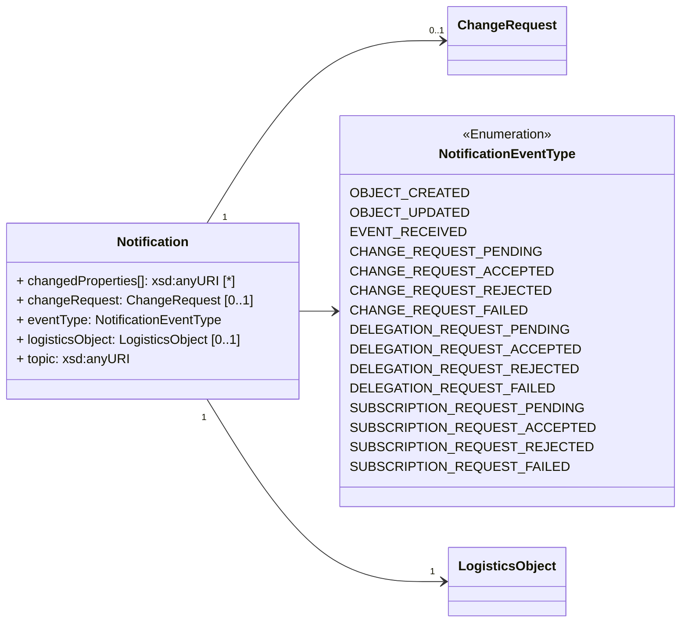

ONE Record utilizes a Publish & Subscribe pattern to enable exchanging data updates in a distributed network of ONE Record compliant platforms.

This chapter describes the Publish & Subscribe concept, its implementation and the requirements of a Notifications API which a ONE Record server MUST implement to receive Notifications about new created or updated Logistics Objects from other ONE Record servers through Subscriptions.

## Notifications API

Notifications API Requirements
The Notifications API is required to receive data from ONE Record Servers via a Subscription. Unlike the Server API, which can be accessed by any Internet of Logistics participant with adequate rights, the Notifications API is only exposed to ONE Record Servers with whom the company has set up a Subscription to agreed Logistics Objects.

The Notifications API:

-	MUST support HTTP 1.1
-	MUST support TLS 1.2
-	MUST support the POST request on the endpoint.
-	MUST expect a Logistics Object in the POST request. Note only the content types that you specify in the subscription request need to be supported.
-	MUST respond with a 2XX response when it receives the Logistics Object.
-	MUST verify either the HMAC signature or API key to ensure only authorized requests are processed. 
    -	The HMAC (https://tools.ietf.org/html/rfc6151) signature (in the header property X-Hub-Signature) with a shared subscription secret can be used to authorize the request. If the signature does not match, subscribers must locally ignore the message as invalid. Subscribers may still acknowledge this request with a 2xx response code in order to be able to process the message asynchronously and/or prevent brute-force attempts of the signature.
    ‒	The API key (x-api-key) can also be used to authorize requests to the subscription endpoint.

The Notifications API expects to receive the following HTTP Headers in the request:

| Header | Description | Required |
| ------ | ----------- | -------- |    		
| X-Hub-Signature | 	If a secret has been provided in the subscription, a HMAC signature MUST be present in this header, see https://www.w3.org/TR/websub	 | NO | 
| Authorization	| The ONE Record Access token of the ONE Record Server - to be discussed. This would require sender binding to make sense. There is also a discussion in that the owner of this API is not owning the security which may be an issue. The API Key or HMAC signature in contrast would be based on security information provided by the owner of the endpoint.	|  TO DISCUSS | 

POST Notification Request
The publisher sends a notification request to the subscriber when a logistics object is created or updated. If the subscriber chose to receive the entire logistics object body via sendLogisticsObjectBody=true field, then the whole object is sent.
Request
HTTP Request type: POST
HTTP Headers
The following HTTP header parameters MUST be present in the request:
Header	Description
Accept	The content type that you want the HTTP response to be formatted in. Valid content types include:
▪	application/x-turtle or text/turtle
▪	application/ld+json 
Content-Type	The content type that is contained with the HTTP body. Valid content types include:
▪	application/x-turtle or text/turtle
▪	application/ld+json 

Request body for notification without the content of the object:
{
  "@type": [
    "https://onerecord.iata.org/api/Notification"
  ],
  "https://onerecord.iata.org/api/Notification#eventType": "OBJECT_CREATED",
  "https://onerecord.iata.org/api/Notification#logisticsObject": {
    "https://onerecord.iata.org/api/LogisticsObject#companyIdentifier": "http://localhost:8080/companies/iata",
    "id": "http://localhost:8080/companies/iata/los/lo1"
  },
  "https://onerecord.iata.org/api/Notification#topic": "https://onerecord.iata.org/api/ WayBill"
}

Where:
Field	Description	Required
eventType	OBJECT_CREATED or OBJECT_UPDATED	YES
topic	Type of Logistics Object	YES
logisticsObject	Logistics Object for which the notification is sent	YES

Response
Code		Description	Response body
204		Notification received successfully	No response body
400		Notification format is invalid	Error model
401		Not authenticated 	Error model
403		Not authorized to send a notification request	Error model

 
