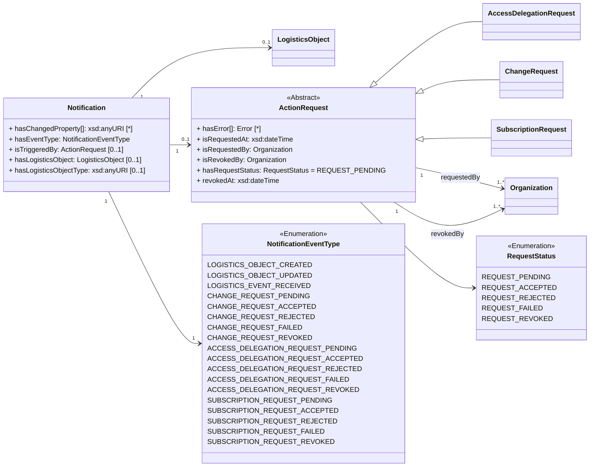

ONE Record utilizes a Publish & Subscribe pattern to enable exchanging data updates in a distributed network of ONE Record compliant platforms.

A key pillar of the implementation of this concept is asynchronous communication via HTTP. 
To enable asynchronous communication via HTTP, every ONE Record server MUST provide a Notification REST API endpoint that can be used by ONE Record clients to submit Notifications about data changes and updates.

This chapter describes the the requirements of a Notifications API which a ONE Record server MUST implement (1) to receive information about new created or updated Logistics Objects, (2) or to receive status updates of action requests from other ONE Record nodes.

For the former, the initialization of this data exchange channel is described in the [Subscription](subscriptions.md) chapter.
The latter is set up when [notifyRequestStatusChange](https://onerecord.iata.org/ns/api#notifyRequestStatusChange) is set to `true` in the request for a Change, AccessDelegation , or Subscription.

**Guidelines for Notifications in ONE Record:**

- Every ONE Record server MUST implement a Notifications endpoint to receive data from ONE Record clients
- The ONE Record Notifications endpoint MUST be accessible to any authenicated ONE Record client
- The ONE Record Notificatons endpoint MUST expect a [Notification](https://onerecord.iata.org/ns/api#Notification) object in the POST request body
- The ONE Record Notificatons MUST respond with a HTTP response when it receives the Notification
- The ONE Record Notificatons MUST support HTTP 1.1
- The ONE Record Notificatons MUST support TLS 1.2

**Notification Data Model**

The Notification is a data class of the [ONE Record API ontology](assets/ONE-Record-API-Ontology.ttl).
The properties and relationships to other data classes are visualized in the following class diagram.



# Send Notification

## Endpoint 
``` 
 POST {{baseURL}}/notifications

```

## Request

The following HTTP header parameters MUST be present in the request:

| Header | Description | Examples |
| ------ | ----------- | -------- |    		
| Accept       | The content type in which the ONE Record client wants the HTTP response formatted.        | application/ld+json |


The HTTP body must contain a valid [Notification](https://onerecord.iata.org/ns/api#Notification) in the format as specified by the Content-Type in the header.

The publisher sends a notification request to the subscriber when a logistics object is created or updated. 
If the subscriber chose to receive the entire logistics object body via sendLogisticsObjectBody=true field, then the whole object is sent.

!!! note
        If the embedded object of a LogisticsObject changed, the Notification#[hasChangedProperty](https://onerecord.iata.org/ns/api#hasChangedProperty) will contain the IRI of the embeddedObject, for example: 
        The [hasGrossWeight](https://onerecord.iata.org/ns/cargo#hasGrossWeight) property - which is of type [Value](https://onerecord.iata.org/ns/cargo#Value) - of a Piece is changed via ChangeRequest, the [hasChangedProperty](https://onerecord.iata.org/ns/api#hasChangedProperty) of the Notification will contain https://onerecord.iata.org/ns/cargo#hasGrossWeight

## Response

One of the following HTTP status codes MUST be present in the response:

| Code    | Description               | Response body     |
| ------- |  ----------------------- | ----------------- |
| 204 |     The request has been successful | - |
| 400 |     Notification format is invalid    | Error         |
| 401 |     Not authenticated, invalid or expired token    | Error         |
| 403 | 	Not authorized to perform action | Error       |
| 404 | 	Resource Not Found | Error       |
| 405 | 	Method not allowed | Error       |
| 415 | 	Unsupported content type | Error       |
| 500 |     Internal Server Error | Error       |

A successful request MUST return a `HTTP/1.1 204 No Content` status code.


## Security 

To engage with the "Send Notifications" endpoint, a client needs to be authenticated. If requests lack proper authentication, the ONE Record server should respond with a `401 "Not Authenticated"` status.


## Example 1A

The following example shows a `LOGISTICS_OBJECT_CREATED` Notification without the content of the object, 
because `sendLogisticsObjectBody` in Subscription is set to `False`.

Request:

```http
POST /notifications HTTP/1.1
Content-Type: application/ld+json; version=2.0.0-dev
Accept: application/ld+json; version=2.0.0-dev

--8<-- "examples/Notification_example1.json"
```
_([examples/Notification_example1.json](examples/Notification_example1.json))_

Response:
```http
HTTP/1.1 204 No Content
```

## Example 1B

The following example shows a `LOGISTICS_OBJECT_CREATED` Notification with the content of the object, 
because `sendLogisticsObjectBody` in Subscription is set to `True`.

```http
POST /notifications HTTP/1.1
Content-Type: application/ld+json; version=2.0.0-dev
Accept: application/ld+json; version=2.0.0-dev

--8<-- "examples/Notification_example2.json"
```
_([examples/Notification_example2.json](examples/Notification_example2.json))_

Response:
```http
HTTP/1.1 204 No Content
```


## Example 1C

The following example shows a `LOGISTICS_OBJECT_UPDATED` Notification without the content of the object, 
because `sendLogisticsObjectBody` in Subscription is set to `False`.
```http
POST /notifications HTTP/1.1
Content-Type: application/ld+json; version=2.0.0-dev
Accept: application/ld+json; version=2.0.0-dev

--8<-- "examples/Notification_example3.json"
```
_([examples/Notification_example3.json](examples/Notification_example3.json))_

Response:
```http
HTTP/1.1 204 No Content
```

## Example 1D

The following example shows a `LOGISTICS_EVENT_RECEIVED` Notification after a LogisticsEvent is submitted.  

!!! note
        Notifications will be triggered for the creation of a new Logistics Event on a Logistics Object solely when the subscription property ['includeSubscriptionEventType'](https://onerecord.iata.org/ns/api#includeSubscriptionEventType) contains the value ['LOGISTICS_EVENT_RECEIVED'](https://onerecord.iata.org/ns/api#LOGISTICS_EVENT_RECEIVED). On the contrary, this notification will be omitted.

```http
POST /notifications HTTP/1.1
Content-Type: application/ld+json; version=2.0.0-dev
Accept: application/ld+json; version=2.0.0-dev

--8<-- "examples/Notification_example4.json"
```
_([examples/Notification_example4.json](examples/Notification_example4.json))_

Response:
```http
HTTP/1.1 204 No Content
```

## Example 1E

The following example shows a `CHANGE_REQUEST_ACCEPTED` Notification after the ChangeRequest is accepted by the holder of the logistics object.

```http
POST /notifications HTTP/1.1
Content-Type: application/ld+json; version=2.0.0-dev
Accept: application/ld+json; version=2.0.0-dev

--8<-- "examples/Notification_example5.json"
```
_([examples/Notification_example5.json](examples/Notification_example5.json))_

Response:
```http
HTTP/1.1 204 No Content
```