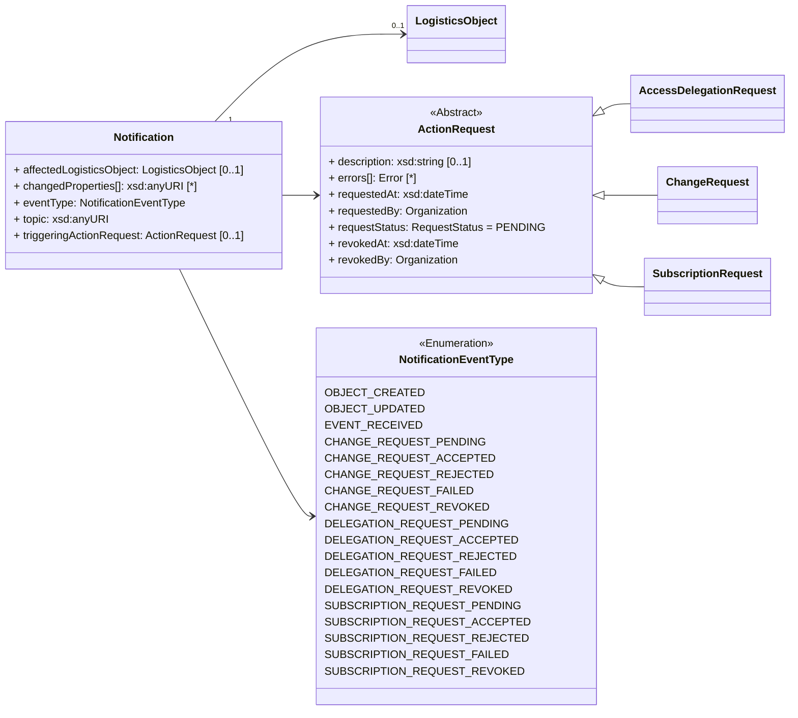

ONE Record utilizes a Publish & Subscribe pattern to enable exchanging data updates in a distributed network of ONE Record compliant platforms.

A key pillar of the implementation of this concept is asynchronous communication via HTTP. 
To enable asynchronous communication via HTTP, every ONE Record server MUST provide a Notification REST API endpoint that can be used by ONE Record clients to submit Notifications about data changes and updates.

This chapter describes the the requirements of a Notifications API which a ONE Record server MUST implement to receive Notifications about new created or updated Logistics Objects from other ONE Record nodes.

The initialization of this data exchange channel is described in the [Subscription](subscriptions.md) chapter.

## Notifications API



**Notifications API Requirements**
The Notifications API is required to receive data from ONE Record Servers via a Subscription. Unlike the Server API, which can be accessed by any Internet of Logistics participant with adequate rights, the Notifications API is only exposed to ONE Record Servers with whom the company has set up a Subscription to agreed Logistics Objects.

Rules and recommendations related to the Notifications API:

- MUST support HTTP 1.1
- MUST support TLS 1.2
- MUST support the POST request on the endpoint.
- MUST expect a Notification object in the POST request. 
- MUST support the content types that are specified in the Subscription information
- MUST respond with a HTTP response when it receives the Notification
- MUST verify incoming requests by the HMAC signature to ensure only authorized requests are processed 

!!! note 
    The HMAC signature (in the HTTP header property `X-Hub-Signature`) with a shared subscription secret can be used to authorize the request. If the signature does not match, Subscriber's ONE Record servers MUST locally ignore the message as invalid. Subscribers's ONE Record server may still acknowledge this request with a 2xx response code in order to be able to process the message asynchronously and/or prevent brute-force attempts of the signature. [(see RFC 6151)](https://tools.ietf.org/html/rfc6151)
    
## Request

The following HTTP header parameters MUST be present in the request:

| Header | Description | Required |
| ------ | ----------- | -------- |    		
| X-Hub-Signature | 	If a secret has been provided in the Subscription, a HMAC signature MUST be present in this header, see https://www.w3.org/TR/websub	 | NO | 
| Authorization	| The ONE Record Access token of the ONE Record Server - to be discussed. This would require sender binding to make sense. There is also a discussion in that the owner of this API is not owning the security which may be an issue. The API Key or HMAC signature in contrast would be based on security information provided by the owner of the endpoint.	|  TO DISCUSS | 
| Accept       | The content type in which the ONE Record client wants the HTTP response formatted.        | application/ld+json |


The HTTP body must contain a valid [Notification](https://onerecord.iata.org/ns/api/2.0.0#Notification) in the format as specified by the Content-Type in the header.
The Notification is a data class of the [ONE Record api ontology](https://onerecord.iata.org/ns/api/2.0.0). 

The publisher sends a notification request to the subscriber when a logistics object is created or updated. 
If the subscriber chose to receive the entire logistics object body via sendLogisticsObjectBody=true field, then the whole object is sent.

## Response

One of the following HTTP status codes MUST be present in the response:

| Code    | Description               | Response body     |
| ------- |  ----------------------- | ----------------- |
| 204 |     The request has been successful | - |
| 400 |     Notification format is invalid    | Error         |
| 401 |     Not authenticated, invalid or expired token    | Error         |
| 403 | 	Not authorized to perform action | Error model       |
| 404 | 	Resource Not Found | Error model       |
| 405 | 	Method not allowed | Error model       |
| 415 | 	Unsupported content type | Error model       |
| 500 |     Internal Server Error | Error model       |

A successful request MUST return a `HTTP/1.1 204 No Content` status code and the following HTTP headers parameters MUST be present in the response:

## Example 1A

The following example shows a OBJECT_CREATED Notification without the content of the object, because `sendLogisticsObjectBody` in Subscription is set to `False`.

Request:

```http
POST /notifications HTTP/1.1

Content-Type: application/ld+json; version=2.0.0-dev
Accept: application/ld+json; version=2.0.0-dev

--8<-- "examples/Notification_example1.json"
```
_([examples/Notification_example1.json](examples/Notification_example1.json))_

Response:
```http
HTTP/1.1 204 No Content
```


## Example 1B

The following example shows a OBJECT_UPDATED Notification with the content of the object, because `sendLogisticsObjectBody` in Subscription is set to `True`.

```http
POST /notifications HTTP/1.1

Content-Type: application/ld+json; version=2.0.0-dev
Accept: application/ld+json; version=2.0.0-dev

--8<-- "examples/Notification_example2.json"
```
_([examples/Notification_example2.json](examples/Notification_example2.json))_

Response:
```http
HTTP/1.1 204 No Content
```


## Example 1C

The following example shows a CHANGE_REQUEST_ACCEPTED Notification after the ChangeRequest is accepted by the owner of the logistics object.

```http
POST /notifications HTTP/1.1

Content-Type: application/ld+json; version=2.0.0-dev
Accept: application/ld+json; version=2.0.0-dev

--8<-- "examples/Notification_example3.json"
```
_([examples/Notification_example3.json](examples/Notification_example3.json))_

Response:
```http
HTTP/1.1 204 No Content
```