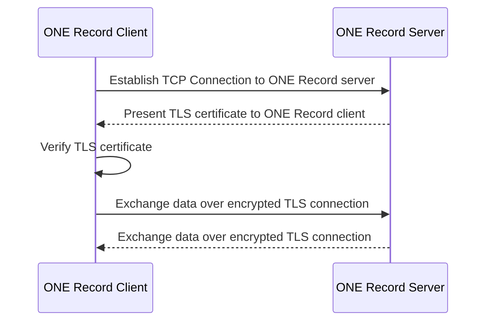
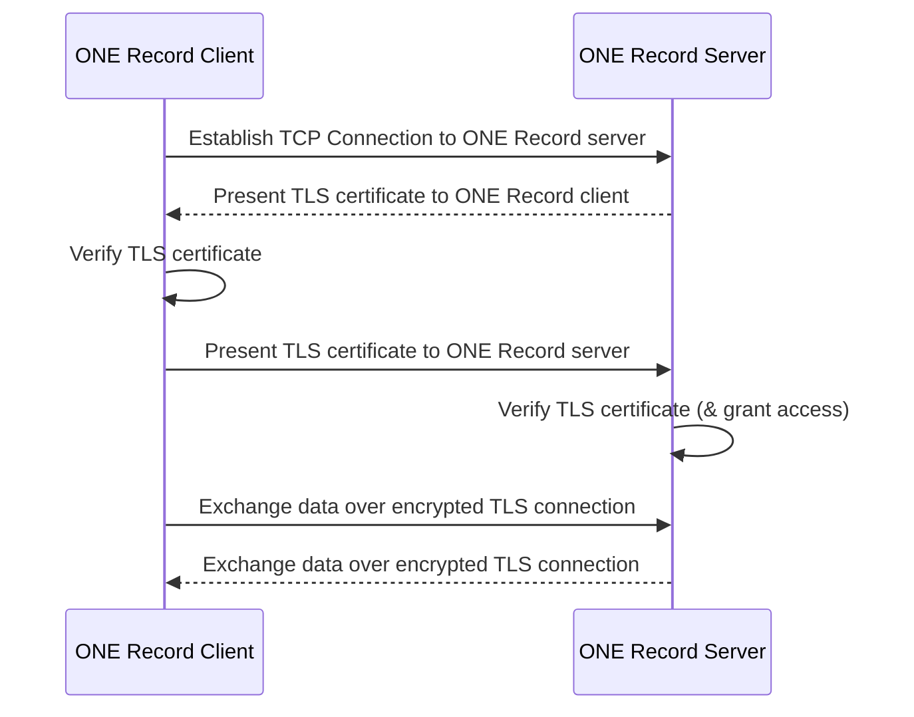

# Transport Layer Security (TLS)
Securing data exchange in the ONE Record network is NOT optional. 
One way to secure the communication channel on transport layer is using TLS.
TLS stands for Transport Layer Security. It is a cryptographic protocol that provides secure communication over the internet. 
TLS is the successor to the earlier SSL (Secure Sockets Layer) protocol, and is used to secure a wide range of internet communications, including email, instant messaging, virtual private networks (VPNs), and e-commerce transactions. 
TLS is an essential component of public internet security, as it helps to protect sensitive information such as passwords, credit card numbers, and personal data from interception and theft by hackers and other malicious actors.

It is used to encrypt data sent between a client (such as a web browser or a ONE Record client) and a server (such as a website, a REST API or a ONE Record server) to prevent unauthorized access or tampering of the data while it is in transit.
It works by establishing a secure, encrypted connection between the client and server, which is authenticated using digital certificates.

Without TLS, a third party could intercept and read sensitive information such as API credentials and private data as it is transmitted. However, relying solely on TLS encryption, does not ensure security.

**Workflow:**

1. A ONE Record client connects to the ONE Record server
2. The ONE Record server presents its TLS certificate (issued by a trusted authority)
3. The ONE Record client verifies the ONE Record server's certificate
4. ONE Record client and ONE Record server exchange data over an encrypted TLS connection

**Guidelines on the usage of TLS in ONE Record:**

- Every ONE Record server MUST force the use of TLS for every ONE Record endpoint.
- Eery ONE Record MUST support TLS 1.2 or newer. Furthermore, every ONE Record MUST set the minium TLS version to 1.2. A minimum TLS version only accepts incoming HTTPS connections from ONE Record clients that support the selected TLS protocol version or a newer version.

!!! note
    Because the certificates used for TLS are only as trustworthy as the Certificate Authority (CA) that issues them, IATA maintains a list of trusted CAs. 
    The CAs on this list are subject to rigorous audits.

# Mutual Transport Layer Security (mTLS)

Mutual Transport Layer Security (mTLS) is an end-to-end mutual authentication security method that ensures that the client and server exchange information about their claimed identities and that traffic is secure and trusted in both directions. This is an extension of [TLS](#transport-layer-security-tls), which only proves the identity of the server to the client and leaves the authentication of the client to the server to the application layer, e.g., using oAUTH2.

mTLS is often used in a 0-trust environment because it strictly limits which clients are allowed to connect to a server, regardless of where the client is located (e.g., VPN, internal network, etc.) and regardless of any credentials.
mTLS is more commonly used in (closed) environments where a limited number of services and servers communicate with each other. This has limited applicability to the ONE Record open data ecosystem approach.

**Workflow:**

1. A ONE Record client connects to the ONE Record server
2. The ONE Record server presents its TLS server certificate to the ONE Record client
3. The ONE Record client verifies the ONE Record server's certificate
4. The ONE Record client presents its TLS client certificate to the ONE Record server
5. The ONE Record server verified the ONE Record client's certificate
6. THE ONE Record server grants access
7. ONE Record client and ONE Record server exchange data over an encrypted TLS connection

**Advantages of mTLS:**

- More secure than TLS, because it validates not only server's certificate, but also client'certificate
- Authentication of client on protocol layer.

**Note on disadvantages of mTLS:** 

- Complex to implement, rollout for high number of clients/server. Requires an additional secure communication channel to exchange certificates (inl. private key).
- Complex to manage, because ONE Record server and ONE Record client must maintain certificates of all ONE Record applications with which they exchange data, considering expiry dates, revocations, drop of root CAs
- Computationally costly and slower than TLS, because of the extra mTLS handshake for every connection
- TLS and mTLS works best when an open connection is used for multiple requests
- Less user-friendly and rarely used in end-user API applications
- Depending on setup, termination of mTLS may hinder the passing of authentication details to ONE Record server for authorization.

**Guidelines for the usage of mTLS in ONE Record:**

- mTLS is RECOMMENDED for highly sensitive data exchange using ONE Record
