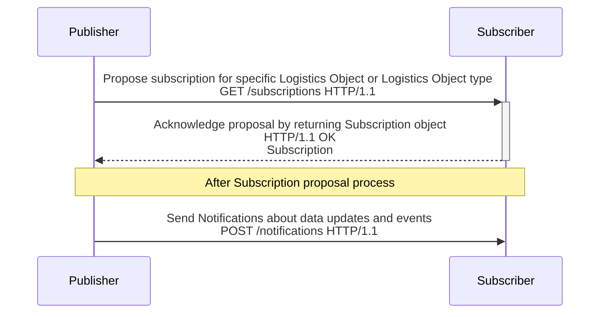
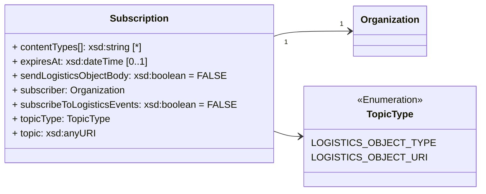
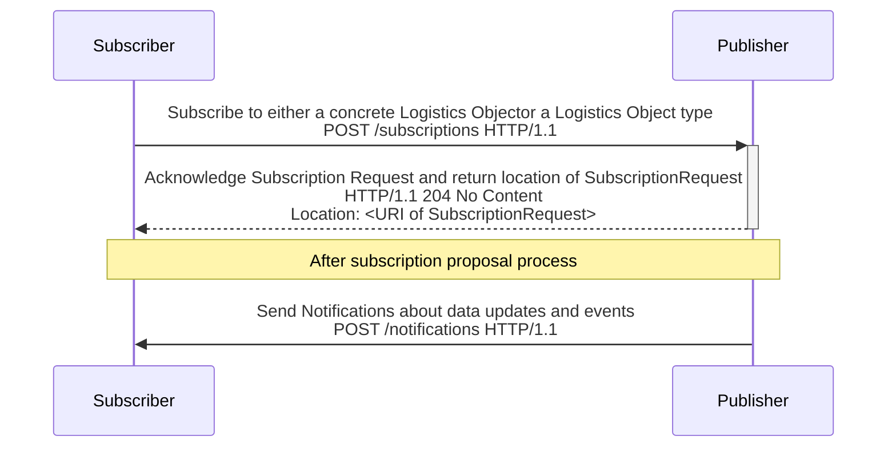

ONE Record utilizes a Publish & Subscribe pattern to enable exchanging data updates in a distributed network of ONE Record compliant platforms.

This chapter describes the Publish & Subscribe concept, its implementation and the requirements of a Notifications API which a ONE Record server MUST implement to receive Notifications about new created or updated Logistics Objects from other ONE Record servers through Subscriptions.

# Publish & Subscribe in ONE Record

**Publish/subscribe topics and guaranteed delivery queue**

Data is exchanged between applications using a notion of topics and delivery queues. While in transit, data is kept in message queues that ensure integrity and availability of the system. If a subscribing application is unavailable, messages are safely retained until the subscribing application returns to be available.

The publisher MUST ensure the guaranteed delivery. That means keeping data until the subscriber confirms it has received a particular Notification. For each subscriber and each topic, a message queue SHOULD be maintained by the publisher.

Two scenarios were identified for initiating the publish/subscribe process:

1) [Subscription initiated by Publisher](#subscription-initiated-by-publisher): After creating and publishing an Logistics Object to the Internet of Logistics, the publisher wants to subscribe another organization to receive Notifications about the Logistics Object.

2) [Subscription initiated by Subscriber](#subscription-initiated-by-subscriber) An organization wants to receive Notifications about a specific 

Both scenarios are described with examples below. For simplicity reasons, the security part was not detailed in the following diagrams.

<!-- TODO: add Notifications data model -->


# Subscription initiated by Publisher

If the publisher of a Logistics Object wants to subscribe a user of a Logistics Object - also called `Subscriber` in this scenario  - to send [Notifications](https://onerecord.iata.org/api#Notification) about data updates and/or Logistics Events, the publisher can request the potential subscriber to provide subscription information. 


In the first use case, the subscription process is initiated by the owner of the Logistics Object.

There are two different shapes of the scenario:

- The publisher wants to notify the subscriber about changes to Logistics Objects of a certain type (e.g. Waybills or Pieces)
- The publisher wants to notify the subscriber about changes to a specific Logistics Object

## Workflow

As result, for both scenarios the interaction between two ONE Record participants follows the following workflow:



**(Optional) Step 0 - Create and Publish a Logistics Object**

This step is optional, as a subscription SHOULD also be possible to initiate for already existing Logistics Objects.

**Step 1 - Retrieve Subscription information**

The publisher MAY propose a Subscription to a subscriber by requesting the Subscription information from the potential subscriber. 
If the subscription proposal targets a specific Logistics Object, i.e. setting topicType=LOGISTICS_OBJECT_URI, this Logistics Object MUST be accessible via its Logistics Object URI.

**Step 2 - Acknowledge Subscription request**
In order to acknowledge a proposal the subscriber response to the request with the Subscription information.

**Step 3 - Send Notification to Subscribers**

Once the subscription information is received the publisher sends notifications to the Subscriber using the details provided. 
If a subscriber was not available at the time, then the publisher MUST need to queue and retry to notify the Subscriber.

## Request

To specify receive the Subscription Information about a specific LogisticsObject or a Logistics Object type, the publisher sends a GET request to the subscription endpoint of Subscriber with the proposed Logistics Object type or a specific Logistics Object URI using the query parameters `topicType` and `topic`.
This parameters MUST be provided by the publisher.

The following HTTP query parameters MUST be present in the GET request:

| Query parameter | Description | Valid values / Examples |
| --------------- | ----------- | ------------ |
| topicType       | Used by the publisher to specify if Subscription information for a specific Logistics Object or a data class should be in the response body. | <ul><li>LOGISTICS_OBJECT_TYPE</li><li>LOGISTICS_OBJECT_URI</li></ul> |
| topic       | Used by the publisher to specify the data class or Logistics Object URI the Subscription information should be related to. topic MUST be a valid URI | <ul><li>https://onerecord.iata.org/ns/cargo/3.0.0#Piece</li><li>https://1r.example.com/logistics-objects/1a8ded38-1804-467c-a369-81a411416b7c</li></ul> |

## Response

The following HTTP status codes MUST be supported:

| Code    | Description | Response body    |
| ------- | ----------- | ---------------- |
| **200** | Subscription information for given parameters found. | Subscription |
| **400** | The update request body is invalid                             | Error            |
| **401** | Not authenticated                          | Error            |
| **403** | Not authorized to update the Logistics Object                  | Error            |
| **404** | Subscription information for given parameters not found                 | Error            |



<!-- | Subscription             | Description                       | Required                     |                 |
| ------------------------ |   ----------------------- | ---------------------------- |  ------------- |
| contentTypes             | content types that the subscriber wants to receive in the notifications                       | n        | http://www.w3.org/2001/XMLSchema#string                 |
| cacheFor                 | duration of the period to cache the subscription information in seconds                       | n        | http://www.w3.org/2001/XMLSchema#int                    |
| callbackUrl              | callback URL of the Client Subscription API where the subscriber wants to receive Logistics Objects               | y        |                 |
| errors                   | any non HTTP errors related to this request           | no, unless there is an error |                 |
| myCompanyIdentifier      | company identifier of the subscriber                  | y        | http://www.w3.org/2001/XMLSchema#string                 |
| secret                   | a secret string or API Key that ensures that only companies with this secret information can POST to the subscriber callback endpoint | n        | w3c:String      |
| sendLogisticsObjectBody  | Flag specifying if the publisher should send the whole Logistics Object or only the Logistics Object URI in the notification object   | n        | w3c:Boolean     |
| subscribeToStatusUpdates | Flag specifying if the subscriber wants to receive updates for a Logistics Object             | n        | w3c:Boolean     |
| subscribedTo             | Company Identifier of the company the subscriber wants to subscribe to (used delegation scenario).                | y        | w3c:URI         |
| topic                    | The Logistics Object type to which the subscriber wants subscribe to      | y        | https://onerecord.iata.org/ns/cargo/3.0.0#LogisticsObject (list) | -->

## Example A1

Request:

```http
GET /subscriptions?topicType=LOGISTICS_OBJECT_TYPE&topic=https://onerecord.iata.org/ns/cargo/3.0.0#Piece
Host: 1r.example.com
Accept: application/ld+json
```

Response:
```json

```
## Example A2

```http
GET /subscriptions?topicType=LOGISTICS_OBJECT_URI&topic=https://1r.example.com/logistics-objects/1a8ded38-1804-467c-a369-81a411416b7c

Host: 1r.example.com
Accept: application/ld+json
```

## Example A3
If the subscriber created subscription information for the provided parameters, the response body includes the following elements:
Otherwise, a `404 Not Found` Error must be returned.

## Example A4
If parameter is missing, or combination is not allowed, topic is not supported "Server does not support requested Logistics Object Type"

```
Request header:
GET /subscriptions?topicType=LOGISTICS_OBJECT_TYPE&topic=https://onerecord.iata.org/ns/cargo/3.0.0#Waybill HTTP/1.1
Host: 1r.example.com
Accept: application/ld+json
```

Response: 

```bash
HTTP/1.1 200 OK
Content-Type: application/ld+json

{
  "@context": {
    "cargo": "https://onerecord.iata.org/ns/cargo/3.0.0#",
    "api": "https://onerecord.iata.org/ns/api/2.0.0-dev#"
  },
  "@type": "api:Subscription",
  "api:contentTypes": "application/ld+json",
  "api:expiresAt": "2024-03-25T16:23:59Z",
  "api:secret": "111C9AB6CB2111EDA47BFAFFC25F33EB",
  "api:sendLogisticsObjectBody": false,
  "api:subscribeToLogisticsEvents": true,
  "api:subscriber": {
    "@id": "https://1r.example.com/logistics-objects/957e2622-9d31-493b-8b8f-3c805064dbda",
    "@type": "cargo:Organization"
  },
  "api:topicType": "https://onerecord.iata.org/ns/cargo/3.0.0#Waybill"
}
```

<!--- Further development proposal: A subscriber could also send specific field filter to which it wants to subscribe to. (e.g. destination countries).  -->


| Code     |     | Description                  | Response body |
| -------- | --- |  ------------------------------ | ----------------- |
| **200**  |     | The request to retrieve the Subscription Information has been successful | Subscription      |
| **204**  |     | Request has been successful, but the server does not subscribe           | No response body  |
| **401**  |     | Not authenticated                | Error             |
| **403**  |     | Not authorized to retrieve the Subscription Information                  | Error             |
| **404**  |     | Subscription Information not found                   | Error             |

# Subscription initiated by Subscriber

In the second scenario, the subscriber initiates the subscription process by actively sending subscription information to the publisher. 
The subscription information can either target a type of Logistics Object or a specific Logistics Object.



# Subscription initiated by 3rd party

Making it possible to subscribe a 3rd party to receive Notifications can raise an security issue. 
For example, if Error happen during the Subscription request process or a malicious Subscription is requested, this can result in unwanted Notification spam.

Therefore, a subscriber MUST subscribe only themselves, after receiving access to a Logistics Object or get subscribed by the publisher (after access is granted). 
